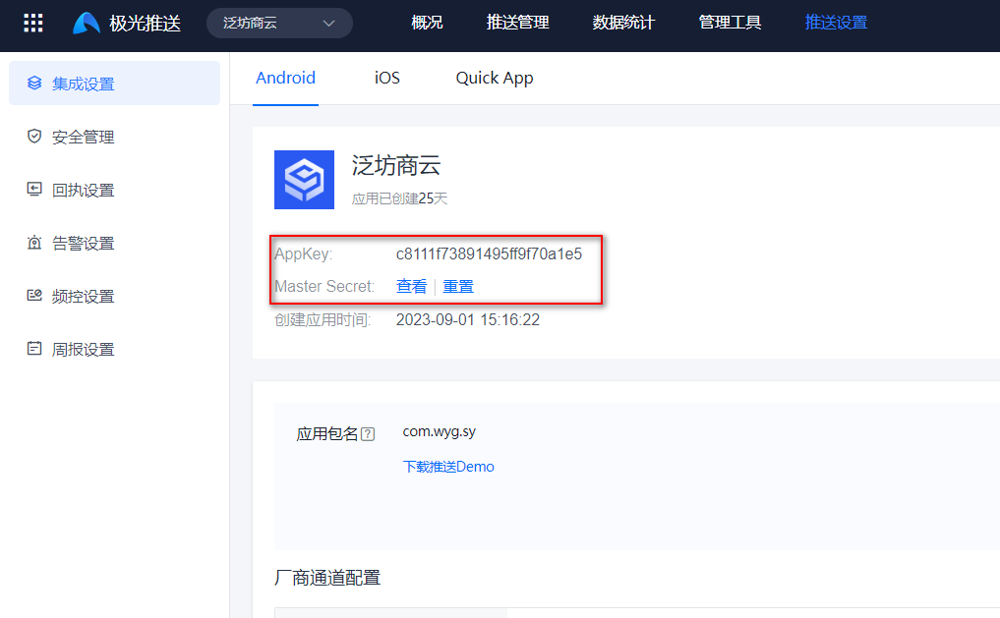
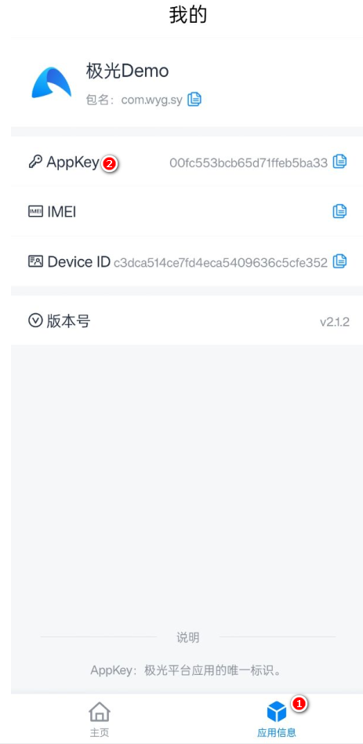
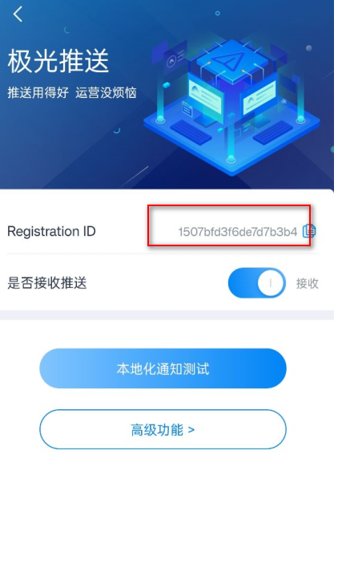
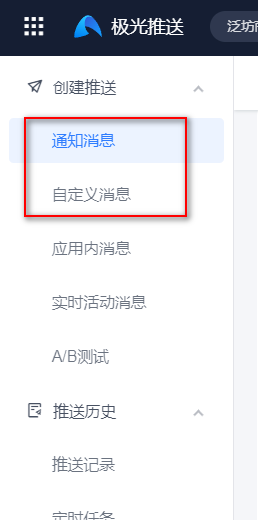

资料来源:<br/>
[SpringBoot集成极光推送完整实现代码](https://blog.csdn.net/weixin_39255905/article/details/132181104)<br/>
[极光消息推送如何使用别名与标签？](https://www.yimenapp.com/kb-yimen/15875/)


## 介绍

工作中经常会遇到服务器App推送消息的需求，一般企业中选择用极光推送的比较多，在集成极光时发现极光的文档并不完整，网上的文章也很多不能直接使用，这里列出我在工作中集成极光的全部代码，只需要按照如下代码保证一次性实现。

## 申请账号

打开[极光推送后台](https://www.jiguang.cn/console/push/#)后台，注册账号，提交app申请。过程省略



在这个页面上，可以看到`appkey`和`Master Secret`这个账号信息，开发中需要使用到

还可以看到有一个下载推送demo。极光推送app会生成一个apk的安卓测试包



在应用信息— appkey是否和账号的一致。如果不一致是无法收到的



`registration ID` 是极光推送设备的`ID`

客户端初始化 JPush 成功后，JPush 服务端会分配一个 Registration ID，作为此设备的标识（同一个手机不同 App 的 Registration ID 是不同的），因此排查时需要获取 Registration ID 定位问题，获取方法：[Android](https://docs.jiguang.cn/jpush/client/Android/android_api#获取-registrationid-api)、[iOS](https://docs.jiguang.cn/jpush/client/iOS/ios_api#获取-registrationid)。

官方文档[别名](https://docs.jiguang.cn/jpush/console/config_manage/alias_manage)  [标签](https://docs.jiguang.cn/jpush/console/config_manage/tag_manage)


## 为什么使用别名与标签

推送消息时，要指定推送的对象：全部，某一个人，或者某一群人。
全部指针对某应用“广播所有人”，控制台与 API 都支持向指定的 AppKey 广播消息。
要指定向某一个特定的人，或者某一群特定的人，则相对复杂。因为对于 JPush 来说，某一个人就是一个注册 ID（Registration ID），这个注册 ID 与开发者 App 没有任何关系，或者说对开发者 App 是没有意义的。
如果要对开发者 App 有意义的某个特定的用户推送消息，则需要：把 JPush 注册用户与开发者 App 用户绑定起来。
这个绑定有两个基本思路：

- 把绑定关系保存到 JPush 服务器端
- 把绑定关系保存到开发者应用服务器中

前者，就是这里要说到的：别名与标签的功能。这个机制简单易用，适用于大多数开发者。
后者，则是 JPush 提供的另外一套 Registration ID 机制。这套机制开发者需要有应用服务器来维护绑定关系，不适用于普通开发者。Android SDK 1.6.0 版本开始支持。

别名与标签的机制，其工作方式是：

- 客户端开发者 App 调用 setAlias 或者 setTags API 来设置注册用户和 App 用户的关系。
- JPush SDK 把该关系设置保存到 JPush Server 上。
- 在服务器端推送消息时，指定向之前设置过的别名或者标签推送。

别名：可以近似地被认为，是用户帐号里的昵称。使用别名推送指给某特定用户推送消息。
标签：类似于博客里为文章打上 tag ，即为某资源分类。使用标签推送指给某一群人推送消息。

## springboot 集成

集成官方`jdk`

```xml

<!-- 极光推送 begin -->
  <!-- 极光推送 -->
        <dependency>
            <groupId>cn.jpush.api</groupId>
            <artifactId>jpush-client</artifactId>
            <version>3.3.9</version>
        </dependency>
<!-- 极光推送 end -->
```

发送的代码

```java
import cn.jiguang.common.resp.APIConnectionException;
import cn.jiguang.common.resp.APIRequestException;
import cn.jpush.api.JPushClient;
import cn.jpush.api.push.PushResult;
import cn.jpush.api.push.model.Options;
import cn.jpush.api.push.model.Platform;
import cn.jpush.api.push.model.PushPayload;
import cn.jpush.api.push.model.audience.Audience;
import cn.jpush.api.push.model.notification.AndroidNotification;
import cn.jpush.api.push.model.notification.IosNotification;
import cn.jpush.api.push.model.notification.Notification;
import org.slf4j.Logger;
import org.slf4j.LoggerFactory;

public class PushUtil {
 
    private static PushUtil instance;
    private JPushClient jpushClient;
    //日志记录
    private static Logger logger = LoggerFactory.getLogger(PushUtil.class);

    /**
     * 极光账户初始化
     */
    private PushUtil() {
        //这里是账户 key 与masterSecret 建议从配置文件中读取
        String appKey = "c8111f73891495ff9f70a1e5";
        String masterSecret = "e5dcb1fbc4d6071e1106ca9d";
 
        if (appKey == null || masterSecret == null) {
            throw new RuntimeException("极光推送账户初始化失败");
        }
        jpushClient = new JPushClient(masterSecret, appKey);
    }
 
    public static PushUtil getInstance() {
        if (null == instance) {
            synchronized (PushUtil.class) {
                if (null == instance) {
                    instance = new PushUtil();
                }
            }
        }
        return instance;
    }
//    Device===================================================
 
    /**
     * 推送给指定设备标识参数的用户（自定义消息通知）
     * @param alias 设备标识 用户ID 别名
     * @param notification_title 通知内容标题
     * @param msg_title 消息内容标题
     * @param msg_content 消息内容
     * @param extrasparam 扩展字段（通常传跳转的链接）
     * @return 0推送失败，1推送成功
     */
    public int sendToRegistrationId(String alias, String notification_title, String msg_title, String msg_content, String extrasparam) {
        int result = 0;
        try {
            PushPayload pushPayload= this.buildPushObject_all_alias_alertWithTitle(alias, notification_title, msg_title, msg_content, extrasparam);
            PushResult pushResult = jpushClient.sendPush(pushPayload);
            if(pushResult.getResponseCode() == 200){
                result=1;
            }
            logger.info("[极光推送]PushResult result is " + pushResult);
        } catch (APIConnectionException e) {
            logger.error("[极光推送]Connection error. Should retry later. ", e);
        } catch (APIRequestException e) {
            logger.error("[极光推送]Error response from JPush server. Should review and fix it. ", e);
            logger.info("[极光推送]HTTP Status: " + e.getStatus());
            logger.info("[极光推送]Error Code: " + e.getErrorCode());
            logger.info("[极光推送]Error Message: " + e.getErrorMessage());
        }
        return result;
    }
 
    /**
     * 推送自定义消息 指定别名推送
     * @param alias
     * @param notification_title
     * @param msg_title
     * @param msg_content
     * @param extrasparam
     * @return
     */
    private PushPayload buildPushObject_all_alias_alertWithTitle(String registrationId, String notification_title, String msg_title, String msg_content, String extrasparam) {
        //创建一个IosAlert对象，可指定APNs的alert、title等字段
        //IosAlert iosAlert =  IosAlert.newBuilder().setTitleAndBody("title", "alert body").build();
        return PushPayload.newBuilder()
                //指定要推送的平台，all代表当前应用配置了的所有平台，也可以传android等具体平台
                .setPlatform(Platform.all())
                //指定推送的接收对象，all代表所有人，也可以指定已经设置成功的tag或alias或该应应用客户端调用接口获取到的registration id
//                .setAudience(Audience.alias(alias))
                //.setAudience(Audience.all()) //所有人
                .setAudience(Audience.registrationId(registrationId)) //注册ID
                //jpush的通知，android的由jpush直接下发，iOS的由apns服务器下发，Winphone的由mpns下发
                .setNotification(Notification.newBuilder()
                        //指定当前推送的android通知
                        .addPlatformNotification(AndroidNotification.newBuilder()
                                .setAlert(msg_content)
                                .setTitle(notification_title)
                                //此字段为透传字段，不会显示在通知栏。用户可以通过此字段来做一些定制需求，如特定的key传要指定跳转的页面（value）
                                .addExtra("url", extrasparam)
                                .build())
                        //指定当前推送的iOS通知
                        .addPlatformNotification(IosNotification.newBuilder()
                                //传一个IosAlert对象，指定apns title、title、subtitle等
                                .setAlert(msg_content)
                                //直接传alert
                                //此项是指定此推送的badge自动加1
                                .incrBadge(1)
                                //此字段的值default表示系统默认声音；传sound.caf表示此推送以项目里面打包的sound.caf声音来提醒，
                                // 如果系统没有此音频则以系统默认声音提醒；此字段如果传空字符串，iOS9及以上的系统是无声音提醒，以下的系统是默认声音
                                .setSound("sound.caf")
                                //此字段为透传字段，不会显示在通知栏。用户可以通过此字段来做一些定制需求，如特定的key传要指定跳转的页面（value）
                                .addExtra("url", extrasparam)
                                //此项说明此推送是一个background推送，想了解background看：http://docs.jpush.io/client/ios_tutorials/#ios-7-background-remote-notification
                                //取消此注释，消息推送时ios将无法在锁屏情况接收
                                // .setContentAvailable(true)
                                .build())
                        .build())
                //Platform指定了哪些平台就会像指定平台中符合推送条件的设备进行推送。 jpush的自定义消息，
                // sdk默认不做任何处理，不会有通知提示。建议看文档http://docs.jpush.io/guideline/faq/的
                // [通知与自定义消息有什么区别？]了解通知和自定义消息的区别
//                .setMessage(Message.newBuilder()
//                        .setMsgContent(msg_content)
//                        .setTitle(msg_title)
////                                .setMsgContent("自定义消息！！")
//                        //.addExtra("url", extrasparam) //释放该字段会发送两次消息，第二次消息内容是扩展字段
//                        .build())
                .setOptions(Options.newBuilder()
                        //此字段的值是用来指定本推送要推送的apns环境，false表示开发，true表示生产；对android和自定义消息无意义
                        .setApnsProduction(true)
                        //此字段是给开发者自己给推送编号，方便推送者分辨推送记录
                        .setSendno(1)
                        //此字段的值是用来指定本推送的离线保存时长，如果不传此字段则默认保存一天，最多指定保留十天； 秒为单位
                        .setTimeToLive(1 * 60 * 60 * 24)
                        .build())
                .build();


 
    }
 
}
```

- 测试的demo

```java
    /**
     * 推送给指定设备标识参数的用户（自定义消息通知）
     * @param alias 设备标识 用户ID 别名
     * @param notification_title 通知内容标题
     * @param msg_title 消息内容标题
     * @param msg_content 消息内容
     * @param extrasparam 扩展字段（通常传跳转的链接）
     * @return 0推送失败，1推送成功
     */
    @Test
    public void test01(){
        PushUtil instance = PushUtil.getInstance();
        int i = instance.sendToRegistrationId("1507bfd3f6da71d17aa", "第52次推送", "标题", "消息内容2", "扩展字段");
        System.out.println(i);
    }
```

## 推送和自定义消息



极光推送包括。通知消息，就是常见的推送的通知栏

一种是自定义消息。app收到推送的消息后，打开指定的页面。比如效果，微信的点击登录，打开微信app会进入，确认登录页面

## 厂商通道介绍

如果app 进入后台，是无法收到极光推送的消息。这个时候需要走厂商通道

大部分厂商支持通知消息，只有华为、荣耀支持自定义消息