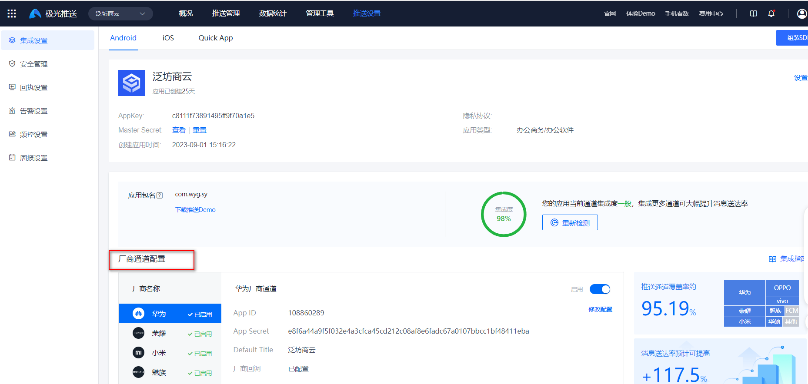
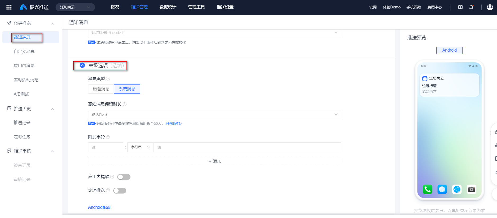
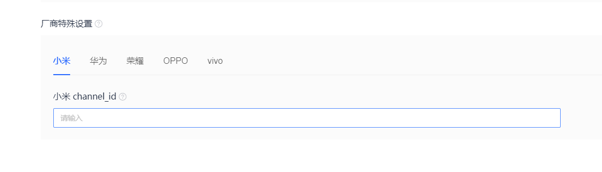

## 介绍

手机如果需要收到离线消息，需要厂商渠道进行支持

[厂商通道文档](https://docs.jiguang.cn/jpush/client/Android/android_channel_id#oppo-%E6%B6%88%E6%81%AF%E5%88%86%E7%B1%BB%E4%BD%BF%E7%94%A8%E6%8C%87%E5%8D%97)

third_party_channel 说明
https://docs.jiguang.cn/jpush/server/push/rest_api_v3_push#third_party_channel-%E8%AF%B4%E6%98%8E

比如说微信，当关闭微信的时候。仍然可以收到新的推送消息。其实原因是使用的厂商通道，每个厂商不一样的，需要和厂商进行对接

## web 平台进行测试

[web测试地址](https://www.jiguang.cn/console/push/#/push3/app/c8111f73891495ff9f70a1e5/push_manage/create/notification)

在通知消息—高级选项—厂商特殊设置进行配置

每个厂商的规定不一样的

- 小米，测试发现提交申请channel_id很快就可以测试使用
- 华为需要申请通道，配置三方地址
- 荣耀最简单，不需要申请
- OPPO不仅需要申请，还需要发送邮件给官方，官方回复文件后，才能使用
- vivo，厂商提供了测试环境。实际使用中发现不可用。等待审核通过测试正式的