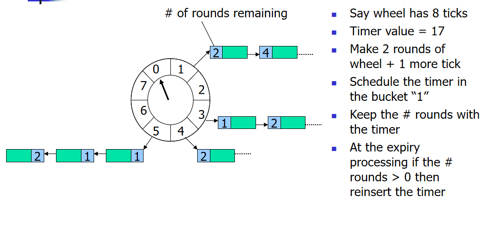

资料来源：
[SpringBoot定时任务 - Netty HashedWheelTimer方式](https://pdai.tech/md/spring/springboot/springboot-x-task-hashwheeltimer-timer.html)


## Netty HashedWheelTimer方式

Timer和ScheduledExecutorService是JDK内置的定时任务方案，而业内还有一个经典的定时任务的设计叫时间轮(Timing Wheel), Netty内部基于时间轮实现了一个HashedWheelTimer来优化百万量级I/O超时的检测，它是一个高性能，低消耗的数据结构，它适合用非准实时，延迟的短平快任务，例如心跳检测。本文主要介绍时间轮(Timing Wheel)及其使用

### 时间轮(Timing Wheel)

> 时间轮(Timing Wheel)是George Varghese和Tony Lauck在1996年的论文'[Hashed and Hierarchical Timing Wheels: data structures to efficiently implement a timer facility在新窗口打开](https://www.cse.wustl.edu/~cdgill/courses/cs6874/TimingWheels.ppt)'实现的，它在Linux内核中使用广泛，是Linux内核定时器的实现方法和基础之一。

时间轮(Timing Wheel)是一种环形的数据结构，就像一个时钟可以分成很多格子（Tick)，每个格子代表时间的间隔，它指向存储的具体任务（timerTask）的一个链表。



以上述在论文中的图片例子，这里一个轮子包含8个格子（Tick), 每个tick是一秒钟；

**任务的添加**：如果一个任务要在17秒后执行，那么它需要转2轮，最终加到Tick=1位置的链表中。

**任务的执行**：在时钟转2Round到Tick=1的位置，开始执行这个位置指向的链表中的这个任务。（# 这里表示剩余需要转几轮再执行这个任务）

### netty的hashedwheeltimer要解决什么问题

> HashedWheelTimer是Netty根据时间轮(Timing Wheel)开发的工具类，它要解决什么问题呢？这里面有两个要点：**延迟任务 + 低时效性**。@pdai

在Netty中的一个典型应用场景是判断某个连接是否idle，如果idle（如客户端由于网络原因导致到服务器的心跳无法送达），则服务器会主动断开连接，释放资源。判断连接是否idle是通过定时任务完成的，但是Netty可能维持数百万级别的长连接，对每个连接去定义一个定时任务是不可行的，所以如何提升I/O超时调度的效率呢？

Netty根据时间轮(Timing Wheel)开发了HashedWheelTimer工具类，用来优化I/O超时调度(本质上是延迟任务）；之所以采用时间轮(Timing Wheel)的结构还有一个很重要的原因是I/O超时这种类型的任务对时效性不需要非常精准。

###  HashedWheelTimer的使用方式

> 在了解时间轮（Timing Wheel)和Netty的HashedWheelTimer要解决的问题后，我们看下HashedWheelTimer的使用方式

通过构造函数看主要参数

```java
public HashedWheelTimer(
        ThreadFactory threadFactory,
        long tickDuration, TimeUnit unit, int ticksPerWheel, boolean leakDetection,
        long maxPendingTimeouts, Executor taskExecutor) {

}
```

具体参数说明如下：

- `threadFactory`：线程工厂，用于创建工作线程， 默认是Executors.defaultThreadFactory()
- `tickDuration`：tick的周期，即多久tick一次
- `unit`: tick周期的单位
- `ticksPerWheel`：时间轮的长度，一圈下来有多少格
- `leakDetection`：是否开启内存泄漏检测，默认是true
- `maxPendingTimeouts`：最多执行的任务数，默认是-1，即不限制。在高并发量情况下才会设置这个参数。

##  实现案例

> 这里展示下HashedWheelTimer的基本使用案例。@pdai

### Pom依赖

引入pom的依赖

```xml
<dependency>
    <groupId>io.netty</groupId>
    <artifactId>netty-all</artifactId>
    <version>4.1.77.Final</version>
</dependency>
```

###  2个简单例子

例子1：5秒后执行TimerTask

```java
@SneakyThrows
public static void simpleHashedWheelTimer() {
    log.info("init task 1...");
    
    HashedWheelTimer timer = new HashedWheelTimer(1, TimeUnit.SECONDS, 8);

    // add a new timeout
    timer.newTimeout(timeout -> {
        log.info("running task 1...");
    }, 5, TimeUnit.SECONDS);
}
```

执行结果如下：

```java
23:32:21.364 [main] INFO tech.pdai.springboot.schedule.timer.netty.HashedWheelTimerTester - init task 1...
...
23:32:27.454 [pool-1-thread-1] INFO tech.pdai.springboot.schedule.timer.netty.HashedWheelTimerTester - running task 1...
```

例子2：任务失效后cancel并让它重新在3秒后执行。

```java
@SneakyThrows
public static void reScheduleHashedWheelTimer() {
    log.info("init task 2...");

    HashedWheelTimer timer = new HashedWheelTimer(1, TimeUnit.SECONDS, 8);

    Thread.sleep(5000);

    // add a new timeout
    Timeout tm = timer.newTimeout(timeout -> {
        log.info("running task 2...");
    }, 5, TimeUnit.SECONDS);

    // cancel
    if (!tm.isExpired()) {
        log.info("cancel task 2...");
        tm.cancel();
    }

    // reschedule
    timer.newTimeout(tm.task(), 3, TimeUnit.SECONDS);
}
23:28:36.408 [main] INFO tech.pdai.springboot.schedule.timer.netty.HashedWheelTimerTester - init task 2...
23:28:41.412 [main] INFO tech.pdai.springboot.schedule.timer.netty.HashedWheelTimerTester - cancel task 2...
23:28:45.414 [pool-2-thread-1] INFO tech.pdai.springboot.schedule.timer.netty.HashedWheelTimerTester - running task 2...
```

##  进一步理解

> 我们通过如下问题进一步理解HashedWheelTimer。@pdai

###  HashedWheelTimer是如何实现的?

> 简单看下HashedWheelTimer是如何实现的


- `Worker`：worker工作线程主要负责任务调度触发，单线程运行。
- `HashedWheelBucket`： 时间轮上面的格子，内部持有HashedWheelTimeout组成的链表结构的头尾节点，多个格子组成的时间轮形成一圈又一圈的任务环
- `HashedWheelTimeout`： 往时间轮里面提交的任务会被封装成HashedWheelTimeout

构造函数

```java
public HashedWheelTimer(
        ThreadFactory threadFactory,
        long tickDuration, TimeUnit unit, int ticksPerWheel, boolean leakDetection,
        long maxPendingTimeouts, Executor taskExecutor) {

    checkNotNull(threadFactory, "threadFactory");
    checkNotNull(unit, "unit");
    checkPositive(tickDuration, "tickDuration");
    checkPositive(ticksPerWheel, "ticksPerWheel");
    this.taskExecutor = checkNotNull(taskExecutor, "taskExecutor");

    // Normalize ticksPerWheel to power of two and initialize the wheel.
    wheel = createWheel(ticksPerWheel);

    // Convert tickDuration to nanos.
    long duration = unit.toNanos(tickDuration);

    // Prevent overflow.
    if (duration >= Long.MAX_VALUE / wheel.length) {
        throw new IllegalArgumentException(String.format(
                "tickDuration: %d (expected: 0 < tickDuration in nanos < %d",
                tickDuration, Long.MAX_VALUE / wheel.length));
    }

    if (duration < MILLISECOND_NANOS) {
        logger.warn("Configured tickDuration {} smaller than {}, using 1ms.",
                    tickDuration, MILLISECOND_NANOS);
        this.tickDuration = MILLISECOND_NANOS;
    } else {
        this.tickDuration = duration;
    }

    workerThread = threadFactory.newThread(worker);

    leak = leakDetection || !workerThread.isDaemon() ? leakDetector.track(this) : null;

    this.maxPendingTimeouts = maxPendingTimeouts;

    if (INSTANCE_COUNTER.incrementAndGet() > INSTANCE_COUNT_LIMIT &&
        WARNED_TOO_MANY_INSTANCES.compareAndSet(false, true)) {
        reportTooManyInstances();
    }
}
```

创建wheel

```java
private static HashedWheelBucket[] createWheel(int ticksPerWheel) {
    //ticksPerWheel may not be greater than 2^30
    checkInRange(ticksPerWheel, 1, 1073741824, "ticksPerWheel");

    ticksPerWheel = normalizeTicksPerWheel(ticksPerWheel);
    HashedWheelBucket[] wheel = new HashedWheelBucket[ticksPerWheel];
    for (int i = 0; i < wheel.length; i ++) {
        wheel[i] = new HashedWheelBucket();
    }
    return wheel;
}

private static int normalizeTicksPerWheel(int ticksPerWheel) {
    int normalizedTicksPerWheel = 1;
    while (normalizedTicksPerWheel < ticksPerWheel) {
        normalizedTicksPerWheel <<= 1;
    }
    return normalizedTicksPerWheel;
}
```

任务的添加

```java
@Override
public Timeout newTimeout(TimerTask task, long delay, TimeUnit unit) {
    checkNotNull(task, "task");
    checkNotNull(unit, "unit");

    long pendingTimeoutsCount = pendingTimeouts.incrementAndGet();

    if (maxPendingTimeouts > 0 && pendingTimeoutsCount > maxPendingTimeouts) {
        pendingTimeouts.decrementAndGet();
        throw new RejectedExecutionException("Number of pending timeouts ("
            + pendingTimeoutsCount + ") is greater than or equal to maximum allowed pending "
            + "timeouts (" + maxPendingTimeouts + ")");
    }

    start();

    // Add the timeout to the timeout queue which will be processed on the next tick.
    // During processing all the queued HashedWheelTimeouts will be added to the correct HashedWheelBucket.
    long deadline = System.nanoTime() + unit.toNanos(delay) - startTime;

    // Guard against overflow.
    if (delay > 0 && deadline < 0) {
        deadline = Long.MAX_VALUE;
    }
    HashedWheelTimeout timeout = new HashedWheelTimeout(this, task, deadline);
    timeouts.add(timeout);
    return timeout;
}
```

执行方法

```java
/**
    * Starts the background thread explicitly.  The background thread will
    * start automatically on demand even if you did not call this method.
    *
    * @throws IllegalStateException if this timer has been
    *                               {@linkplain #stop() stopped} already
    */
public void start() {
    switch (WORKER_STATE_UPDATER.get(this)) {
        case WORKER_STATE_INIT:
            if (WORKER_STATE_UPDATER.compareAndSet(this, WORKER_STATE_INIT, WORKER_STATE_STARTED)) {
                workerThread.start();
            }
            break;
        case WORKER_STATE_STARTED:
            break;
        case WORKER_STATE_SHUTDOWN:
            throw new IllegalStateException("cannot be started once stopped");
        default:
            throw new Error("Invalid WorkerState");
    }

    // Wait until the startTime is initialized by the worker.
    while (startTime == 0) {
        try {
            startTimeInitialized.await();
        } catch (InterruptedException ignore) {
            // Ignore - it will be ready very soon.
        }
    }
}
```

停止方法

```java
@Override
public Set<Timeout> stop() {
    if (Thread.currentThread() == workerThread) {
        throw new IllegalStateException(
                HashedWheelTimer.class.getSimpleName() +
                        ".stop() cannot be called from " +
                        TimerTask.class.getSimpleName());
    }

    if (!WORKER_STATE_UPDATER.compareAndSet(this, WORKER_STATE_STARTED, WORKER_STATE_SHUTDOWN)) {
        // workerState can be 0 or 2 at this moment - let it always be 2.
        if (WORKER_STATE_UPDATER.getAndSet(this, WORKER_STATE_SHUTDOWN) != WORKER_STATE_SHUTDOWN) {
            INSTANCE_COUNTER.decrementAndGet();
            if (leak != null) {
                boolean closed = leak.close(this);
                assert closed;
            }
        }

        return Collections.emptySet();
    }

    try {
        boolean interrupted = false;
        while (workerThread.isAlive()) {
            workerThread.interrupt();
            try {
                workerThread.join(100);
            } catch (InterruptedException ignored) {
                interrupted = true;
            }
        }

        if (interrupted) {
            Thread.currentThread().interrupt();
        }
    } finally {
        INSTANCE_COUNTER.decrementAndGet();
        if (leak != null) {
            boolean closed = leak.close(this);
            assert closed;
        }
    }
    return worker.unprocessedTimeouts();
}
```

###  什么是多级Timing Wheel?

多级的时间轮是比较好理解的，时钟是有小时，分钟，秒的，秒转一圈(Round)分钟就转一个格（Tick）, 分钟转一圈(Round)小时就转一格（Tick）。


PS：显然HashedWheelTimer是一层时间轮。

##  示例源码

https://github.com/realpdai/tech-pdai-spring-demos

------

