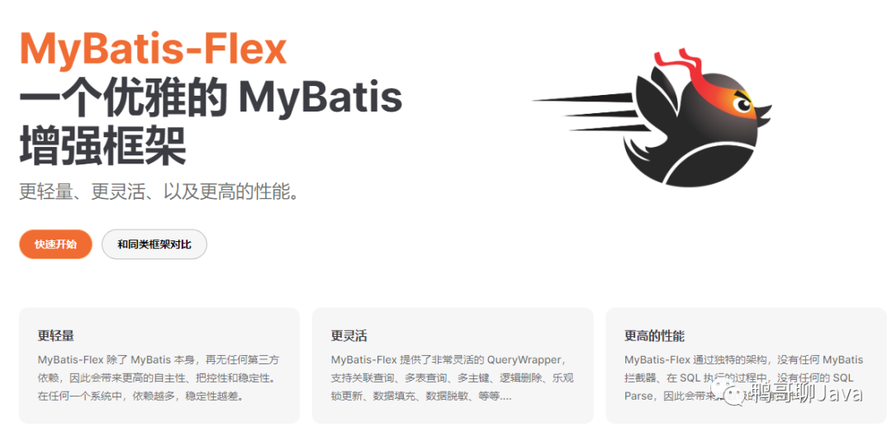

资料来源:
[增强版 MyBatis-Flex ，超越 MyBatis-Plus，太优雅~](https://mp.weixin.qq.com/s/-QEf2Y0EcF5X-8ctCmmXLw)

帮助文档比较全面，没必须要总结到自己的文档上了。文档地址

https://mybatis-flex.com/zh/intro/what-is-mybatisflex.html

## 介绍

Mybatis-Flex 是一个优雅的 Mybatis 增强框架，它非常轻量、同时拥有极高的性能与灵活性。我们可以轻松的使用 Mybaits-Flex 链接任何数据库，其内置的 QueryWrapper^亮点 帮助我们极大的减少了 SQL 编写的工作的同时，减少出错的可能性。

总而言之，MyBatis-Flex 能够极大地提高我们的开发效率和开发体验，让我们有更多的时间专注于自己的事情。

## Mybatis-Flex的有什么特点？

1、轻量： 除了 MyBatis，没有任何第三方依赖轻依赖、没有任何拦截器，其原理是通过 SqlProvider 的方式实现的轻实现。同时，在执行的过程中，没有任何的 Sql 解析（Parse）轻运行。这带来了几个好处：

1、极高的性能；

2、极易对代码进行跟踪和调试；

3、把控性更高。

2、灵活： 支持 Entity 的增删改查、以及分页查询的同时，Mybatis-Flex 提供了 Db + Row^灵活 工具，可以无需实体类对数据库进行增删改查以及分页查询。与此同时，Mybatis-Flex 内置的 QueryWrapper^灵活 可以轻易的帮助我们实现 多表查询、链接查询、子查询 等等常见的 SQL 场景。

3、强大： 支持任意关系型数据库，还可以通过方言持续扩展，同时支持 多（复合）主键、逻辑删除、乐观锁配置、数据脱敏、数据审计、 数据填充 等等功能。