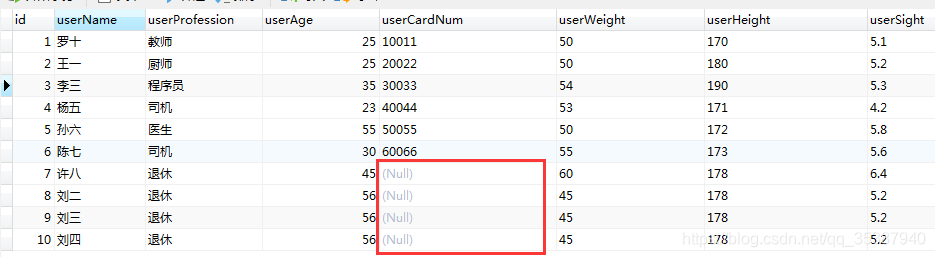

资料来源：<br/>
[MySQL数据表索引命名规范](https://developer.aliyun.com/article/1619664)<br/>
[Mysql唯一索引的字段值允许多个NULL值存在吗](https://blog.csdn.net/qq_35387940/article/details/109174748)<br/>

## mysql索引规范

### 简介

> 普通索引(INDEX)：最基本的索引，没有任何限制
> 唯一索引(UNIQUE)：与"普通索引"类似，不同的就是：索引列的值必须唯一，但允许有空值。
> 主键索引(PRIMARY)：它 是一种特殊的唯一索引，不允许有空值。
> 全文索引(FULLTEXT )：可用于 MyISAM 表，mysql5.6之后也可用于innodb表， 用于在一篇文章中，检索文本信息的, 针对较大的数据，生成全文索引很耗时和空间。
> 联合（组合）索引：为了更多的提高mysql效率可建立组合索引，遵循”最左前缀“原则。

### 索引的作用

索引的主要作用是提高数据检索的速度，同时它也有助于保证数据的唯一性和完整性。以下是索引的一些主要作用：

**1.提高查询速度：**通过索引可以快速定位数据，减少数据扫描的范围。

**2.保证数据唯一性：**唯一索引可以确保列中的数据是唯一的，避免数据重复。

**3.加速排序和分组操作：**索引可以加快ORDER BY、GROUP BY等操作的速度。

**4.加速联接操作：**在多表联接查询中，索引可以显著提高联接操作的效率。


### **索引的类型**

MySQL中常见的索引类型包括主键索引、唯一索引、普通索引、全文索引和组合索引。

**主键索引**

主键索引是一种特殊的唯一索引，用于唯一标识表中的每一行。一个表只能有一个主键索引。

**唯一索引**

唯一索引用于保证列中的值是唯一的，即不能有重复值。

**普通索引**

普通索引是最基本的索引类型，没有任何限制，仅用于加速数据检索。

**全文索引**

全文索引用于对文本字段进行全文检索，适用于TEXT类型的字段。

**组合索引**

组合索引是对多个列进行索引，可以用于多个列的联合查询。

### 索引命名规范

合理的索引命名规范可以提高代码的可读性和可维护性。以下是各种索引的命名规范。

**主键索引命名规范**

主键索引通常命名为pk_<table_name>，其中<table_name>是表名。例如，对于users表，主键索引命名为pk_users。

**唯一索引命名规范**

唯一索引通常命名为uk_<table_name>_<column_name>，其中<column_name>是列名。例如，对于users表中的email列，唯一索引命名为uk_users_email。

**普通索引命名规范**

普通索引通常命名为idx_<table_name>_<column_name>。例如，对于users表中的last_name列，普通索引命名为idx_users_last_name。

**全文索引命名规范**

全文索引通常命名为ft_<table_name>_<column_name>。例如，对于articles表中的content列，全文索引命名为ft_articles_content。

**组合索引命名规范**

组合索引通常命名为idx_<table_name>_<column1>_<column2>。例如，对于orders表中的user_id和order_date列，组合索引命名为idx_orders_user_id_order_date。


### **示例代码**

**示例1：创建主键索引**

```sql
CREATE TABLE users (
    id INT AUTO_INCREMENT,
    username VARCHAR(50) NOT NULL,
    PRIMARY KEY (id)
) ENGINE=InnoDB;

ALTER TABLE users ADD CONSTRAINT pk_users PRIMARY KEY (id);
```

**示例2：创建唯一索引**

```sql
CREATE TABLE users (
    id INT AUTO_INCREMENT,
    email VARCHAR(100) NOT NULL,
    PRIMARY KEY (id)
) ENGINE=InnoDB;

CREATE UNIQUE INDEX uk_users_email ON users(email);
```

**示例3：创建普通索引**

```sql
CREATE TABLE users (
    id INT AUTO_INCREMENT,
    last_name VARCHAR(50),
    PRIMARY KEY (id)
) ENGINE=InnoDB;

CREATE INDEX idx_users_last_name ON users(last_name);
```

**示例4：创建全文索引**

```sql
CREATE TABLE articles (
    id INT AUTO_INCREMENT,
    content TEXT,
    PRIMARY KEY (id)
) ENGINE=InnoDB;

CREATE FULLTEXT INDEX ft_articles_content ON articles(content);
```


**示例5：创建组合索引**

```sql
CREATE TABLE orders (
    id INT AUTO_INCREMENT,
    user_id INT,
    order_date DATE,
    PRIMARY KEY (id)
) ENGINE=InnoDB;

CREATE INDEX idx_orders_user_id_order_date ON orders(user_id, order_date);
```

**实践与优化建议**

**1.合理选择索引类型：**根据查询需求选择合适的索引类型，避免过多或不必要的索引。

**2.命名规范统一**：遵循统一的命名规范，便于识别和管理索引。

**3.避免冗余索引：**定期检查和删除不再使用的索引，减少维护成本。

**4.使用覆盖索引：**在查询中尽量使用覆盖索引，避免回表查询，提高查询性能。

**5.监控索引使用情况：**定期监控和分析索引的使用情况，调整和优化索引设计。

## 唯一索引为空

字段 userCardNum 添加了唯一索引

 

证实是允许存在的多个NULL值数据的：



####  原由：

因为这里 NULL 的定义 ，是指 未知值。 所以多个 NULL ，都是未知的，不能说它们是相等的，也不能说是不等，就是未知的。所以多个NULL的存在是不违反唯一约束的。