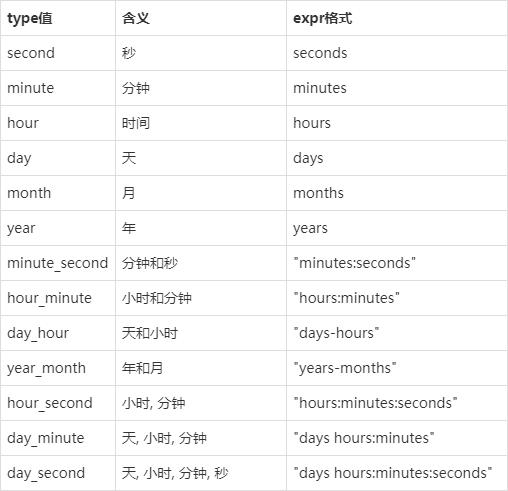

资料来源：<br/>
[mysql怎么求时间差](https://www.utheme.cn/code/mysql/26085.html)<br/>
[MySQL 获得当前日期时间函数](https://www.cnblogs.com/ggjucheng/p/3352280.html)<br/>
[mysql 获取当天零点和当天最后时间](https://blog.csdn.net/qq_35461948/article/details/141021907)

## 时间函数

### 获取时间

```
当天零点
 SELECT DATE(NOW()) AS today_zero_time;
当天最后时间：
 SELECT DATE_ADD(ADDDATE(DATE(NOW()), 1), INTERVAL -1 SECOND) AS today_last_time;

昨天零点
SELECT  ADDDATE(DATE(NOW()), -1) AS yesterday_last_time;
昨天最后时间：
SELECT  DATE_ADD(DATE(NOW()), INTERVAL -1 SECOND) AS yesterday_last_time;

指定日期零点
SELECT DATE(STR_TO_DATE("2024-08-08 12:13:14", '%Y-%m-%d %H:%i:%s')) AS appoint_zero_time;
指定日期最后时间：
SELECT DATE_ADD(ADDDATE(DATE(STR_TO_DATE("2024-08-08 12:13:14", '%Y-%m-%d %H:%i:%s')), 1), INTERVAL -1 SECOND) AS appoint_last_time;
```


#### DATE(date)

**返回指定日期/时间表达式的日期部分或将文本转为日期格式**

```sql
mysql> select date("2022-3-15");2022-03-15
mysql> select date('2022-4-15 12:30:48');2022-04-15

```

#### YEAR(date)

**返回指定日期的年份(范围在1000到9999)**

```sql
mysql> select year('2022-4-15 12:30:48');2022
```

类似的，MONTH(date)返回指定日期的月份(范围在1到12）；DAY(date)返回指定日期的日(范围在1到31)；HOUR(datetime)返回指定时间的小时(范围在0-23)；minute(datetime)返回指定时间的分(范围在0-59)；second(datetime)返回指定时间的秒(范围在0-59)。

#### 对日期时间进行加减运算

> **ADDDATE(**date,interval expr type)
>
> DATE_ADD(date,interval expr type)
>
> SUBDATE(date,interval expr type)
>
> DATE_SUB(date,interval expr type)

其中，date是一个datetime或date值；expr是对date进行加减法的一个表达式字符串或一个数字；type指明表达式expr应该如何被解释，是减去1天还是一年等。




```sql
mysql>select adddate('2022-4-1',interval 5 day);2022-04-06
select adddate('2022-4-15 13:30:28',interval '3 1:2' day_minute);2022-04-18 14:32:28
```

#### DATE_FORMAT

**根据format字符串格式化date值，常用于获取日期的年月日和时间**

在format字符串中可用标志符

%M 月名字(january……december)

**%Y 年**, 数字, 4 位

%y 年, 数字, 2 位

%a 缩写的星期名字(sun……sat)

**%d 月份中的天数**, 数字(00……31)

%e 月份中的天数, 数字(0……31)

**%m 月**, 数字(01……12)

%c 月, 数字(1……12)

%b 缩写的月份名字(jan……dec)

%j 一年中的天数(001……366)

%h 十二时制的小时(00……12)

%k 二十四时制的小时(0……23)

%i 分钟, 数字(00……59)

%r 时间,12 小时(hh:mm:ss [ap]m)

%s 秒(00……59) %p am或pm

**%w 一个星期中的天数**(0=sunday ……6=saturday ）

**%u 一年中的周数**(1……53)

示例

```
mysql> select date_format('2022-4-15 13:30:28','%Y-%m-%d');2022-04-15
```

#### 5.CURDATE()

**以'yyyy-mm-dd'或yyyymmdd格式返回当前日期值(根据返回值所处上下文是字符串或数字)**

示例

```
mysql> select curdate();2022-04-15
mysql> select curdate()+0;20220415
```

#### CURTIME()

**以'hh:mm:ss'或hhmmss格式返回当前时间值(根据返回值所处上下文是字符串或数字)**

```
mysql> select curtime();22:26:44
```

#### NOW()

**以'yyyy-mm-dd hh:mm:ss'或yyyymmddhhmmss格式返回当前日期时间(根据返回值所处上下文是字符串或数字**

示例

```
mysql> select now();2022-04-15 22:28:33
```

#### TIMESTAMPDIFF(type,expr1,expr2)

**返回起始日expr1和结束日expr2之间的时间差整数**。

时间差的单位由type指定：

second 秒

minute 分

hour 时

day 天

month 月

year 年

示例

```
select timestampdiff(day,'2022-4-1','2022-4-15') 14
```

#### UNIX_TIMESTAMP([date])

**返回一个unix时间戳(从'1970-01-01 00:00:00'开始的秒数,date默认值为当前时间)**

```
mysql> select unix_timestamp('2022-4-15');1649952000
```

#### FROM_UNIXTIME(unix_timestamp)

**以'yyyy-mm-dd hh:mm:ss'或yyyymmddhhmmss格式返回时间戳的值(根据返回值所处上下文是字符串或数字)**

```
mysql> select from_unixtime(1649952001);2022-04-15 00:00:01
```

#### now

获得当前日期+时间（date + time）函数：now()

```sql
mysql> select now();
+---------------------+
| now()               |
+---------------------+
| 2023-08-09 16:46:04 |
+---------------------+
1 row in set (0.00 sec)

mysql> select current_timestamp, current_timestamp();
+---------------------+---------------------+
| current_timestamp   | current_timestamp() |
+---------------------+---------------------+
| 2023-08-09 16:46:14 | 2023-08-09 16:46:14 |
+---------------------+---------------------+
1 row in set (0.00 sec)
```

### MySQL 日期转换函数、时间转换函数

MySQL Date/Time to Str（日期/时间转换为字符串）函数：date_format(date,format), time_format(time,format)

```sql
mysql> select date_format('2008-08-08 22:23:01', '%Y%m%d%H%i%s');

+----------------------------------------------------+
| date_format('2008-08-08 22:23:01', '%Y%m%d%H%i%s') |
+----------------------------------------------------+
| 20080808222301 |
+----------------------------------------------------+
```

MySQL 日期、时间转换函数：date_format(date,format), time_format(time,format) 能够把一个日期/时间转换成各种各样的字符串格式。它是 str_to_date(str,format) 函数的 一个逆转换。

MySQL Str to Date （字符串转换为日期）函数：str_to_date(str, format)

~~~~sql
select str_to_date('08/09/2008', '%m/%d/%Y'); -- 2008-08-09
select str_to_date('08/09/08' , '%m/%d/%y'); -- 2008-08-09
select str_to_date('08.09.2008', '%m.%d.%Y'); -- 2008-08-09
select str_to_date('08:09:30', '%h:%i:%s'); -- 08:09:30
select str_to_date('08.09.2008 08:09:30', '%m.%d.%Y %h:%i:%s'); -- 2008-08-09 08:09:30
~~~~

可以看到，str_to_date(str,format) 转换函数，可以把一些杂乱无章的字符串转换为日期格式。另外，它也可以转换为时间。“format” 可以参看 MySQL 手册。

MySQL （日期、天数）转换函数：to_days(date), from_days(days)

```sql
select to_days('0000-00-00'); -- 0
select to_days('2008-08-08'); -- 733627
```

MySQL （时间、秒）转换函数：time_to_sec(time), sec_to_time(seconds)

```sql
select time_to_sec('01:00:05'); -- 3605
select sec_to_time(3605); -- '01:00:05'
```

MySQL 拼凑日期、时间函数：makdedate(year,dayofyear), maketime(hour,minute,second)

~~~~sql
select makedate(2001,31); -- '2001-01-31'
select makedate(2001,32); -- '2001-02-01'
select maketime(12,15,30); -- '12:15:30'
~~~~

MySQL （Unix 时间戳、日期）转换函数

```sql
unix_timestamp(),
unix_timestamp(date),
from_unixtime(unix_timestamp),
from_unixtime(unix_timestamp,format)
```

下面是示例：

~~~~sql
select unix_timestamp(); -- 1218290027
select unix_timestamp('2008-08-08'); -- 1218124800
select unix_timestamp('2008-08-08 12:30:00'); -- 1218169800

select from_unixtime(1218290027); -- '2008-08-09 21:53:47'
select from_unixtime(1218124800); -- '2008-08-08 00:00:00'
select from_unixtime(1218169800); -- '2008-08-08 12:30:00'

select from_unixtime(1218169800, '%Y %D %M %h:%i:%s %x'); -- '2008 8th August 12:30:00 2008'
~~~~

### 时间计算函数

MySQL 为日期增加一个时间间隔：date_add()

```sql
set @dt = now();

select date_add(@dt, interval 1 day); -- add 1 day
select date_add(@dt, interval 1 hour); -- add 1 hour
select date_add(@dt, interval 1 minute); -- ...
select date_add(@dt, interval 1 second);
select date_add(@dt, interval 1 microsecond);
select date_add(@dt, interval 1 week);
select date_add(@dt, interval 1 month);
select date_add(@dt, interval 1 quarter);
select date_add(@dt, interval 1 year);

select date_add(@dt, interval -1 day); -- sub 1 day
```

MySQL adddate(), addtime()函数，可以用 date_add() 来替代。下面是 date_add() 实现 addtime() 功能示例：

~~~~sql
mysql> set @dt = '2008-08-09 12:12:33';

mysql>
mysql> select date_add(@dt, interval '01:15:30' hour_second);

+------------------------------------------------+
| date_add(@dt, interval '01:15:30' hour_second) |
+------------------------------------------------+
| 2008-08-09 13:28:03 |
+------------------------------------------------+

mysql> select date_add(@dt, interval '1 01:15:30' day_second);

+-------------------------------------------------+
| date_add(@dt, interval '1 01:15:30' day_second) |
+-------------------------------------------------+
| 2008-08-10 13:28:03 |
+-------------------------------------------------+
~~~~

MySQL 为日期减去一个时间间隔：date_sub()

```sql
mysql> select date_sub('1998-01-01 00:00:00', interval '1 1:1:1' day_second);

+----------------------------------------------------------------+
| date_sub('1998-01-01 00:00:00', interval '1 1:1:1' day_second) |
+----------------------------------------------------------------+
| 1997-12-30 22:58:59 |
+----------------------------------------------------------------+
```

MySQL date_sub() 日期时间函数 和 date_add() 用法一致，不再赘述。

MySQL 日期、时间相减函数：datediff(date1,date2), timediff(time1,time2)

```
MySQL datediff(date1,date2)：两个日期相减 date1 - date2，返回天数。
select datediff('2008-08-08', '2008-08-01'); -- 7
select datediff('2008-08-01', '2008-08-08'); -- -7
```

MySQL timediff(time1,time2)：两个日期相减 time1 - time2，返回 time 差值。

```
select timediff('2008-08-08 08:08:08', '2008-08-08 00:00:00'); -- 08:08:08
select timediff('08:08:08', '00:00:00'); -- 08:08:08
```

注意：timediff(time1,time2) 函数的两个参数类型必须相同。

MySQL 时间戳（timestamp）转换、增、减函数：

```
timestamp(date) -- date to timestamp
timestamp(dt,time) -- dt + time
timestampadd(unit,interval,datetime_expr) --
timestampdiff(unit,datetime_expr1,datetime_expr2) --
```

请看示例部分：

```
select timestamp('2008-08-08'); -- 2008-08-08 00:00:00
select timestamp('2008-08-08 08:00:00', '01:01:01'); -- 2008-08-08 09:01:01
select timestamp('2008-08-08 08:00:00', '10 01:01:01'); -- 2008-08-18 09:01:01

select timestampadd(day, 1, '2008-08-08 08:00:00'); -- 2008-08-09 08:00:00
select date_add('2008-08-08 08:00:00', interval 1 day); -- 2008-08-09 08:00:00

MySQL timestampadd() 函数类似于 date_add()。
select timestampdiff(year,'2002-05-01','2001-01-01'); -- -1
select timestampdiff(day ,'2002-05-01','2001-01-01'); -- -485
select timestampdiff(hour,'2008-08-08 12:00:00','2008-08-08 00:00:00'); -- -12

select datediff('2008-08-08 12:00:00', '2008-08-01 00:00:00'); -- 7
```

MySQL timestampdiff() 函数就比 datediff() 功能强多了，datediff() 只能计算两个日期（date）之间相差的天数。


## 计算时间差

在日常开发或数据分析工作中，我们经常需要计算时间差，例如计算两个时间戳之间的时长，或者计算某个事件距离当前时间的时间差等。MySQL提供了几个函数来方便地计算时间差。

### 天数(DATEDIFF)

DATEDIFF函数可以计算两个日期之间的天数差。其语法如下：

```sql
DATEDIFF(end_date, start_date)
```

其中end_date和start_date是表示时间的日期格式，可以是日期字符串、时间戳或Date类型的列。

例如，计算2020年10月1日到2020年10月5日这五天之间的天数差：

```sql
SELECT DATEDIFF('2020-10-05', '2020-10-01');
```

说明这五天之间相差了4天。

### 时间差（DATEDIFF）

TIMESTAMPDIFF函数可以计算两个时间戳之间的时间差，其语法如下：

```sql
TIMESTAMPDIFF(interval, start_date, end_date)
```

其中interval表示计算的时间单位，可以是second（秒）、minute（分钟）、hour（小时）、day（天）、week（周）、month（月）或year（年）；start_date和end_date是表示时间的时间戳或Datetime类型的列。

例如，计算2020年10月1日13点30分到2020年10月1日14点30分之间的时间差：

```sql
SELECT TIMESTAMPDIFF(minute, '2020-10-01 13:30:00', '2020-10-01 14:30:00');c
```

结果是60

说明这两个时间戳之间相差了60分钟。

### UNIX_TIMESTAMP

UNIX_TIMESTAMP函数可以将日期字符串或Datetime类型的列转换为Unix时间戳。Unix时间戳是指自1970年1月1日零时零分零秒起至当前时间的秒数。

```sql
UNIX_TIMESTAMP([date])
```

其中date表示要转换的日期，可以是日期字符串、Datetime类型的列或者NOW()函数。

例如，将2020年10月1日转换为Unix时间戳：

```sql
SELECT UNIX_TIMESTAMP('2020-10-01');
```

输出结果为：`1601491200`

说明2020年10月1日的Unix时间戳是1601491200。c

### FROM_UNIXTIME

FROM_UNIXTIME函数可以将Unix时间戳转换为日期字符串或Datetime类型的列。其语法如下：

```sql
FROM_UNIXTIME(unix_timestamp, [format])
```

其中unix_timestamp为Unix时间戳，可以是整数或者Datetime类型的列。format表示输出的日期格式，可以省略，默认为`%Y-%m-%d %H:%i:%s`格式。

```sql
SELECT FROM_UNIXTIME(1601491200);
```

结果
`2020-10-01 00:00:00`

说明1601491200对应的日期是2020年10月1日。