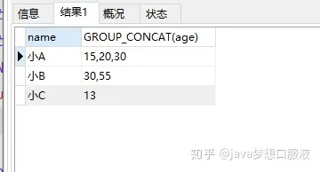

资料来源：<br/>
[MySQL递归查询上下级菜单](https://blog.csdn.net/worilb/article/details/124646612)<br/>
[MySQL递归查询上下级菜单](https://zhuanlan.zhihu.com/p/321792765)


## 查询上下级菜单


### 场景介绍

不如这种存在上下级关系的


目录结构


如何实现，一个子类找到上面所有的数据，或者是从父类开始查询所有的子类信息

### 准备

```sql
DROP TABLE IF EXISTS `my_dept`;
CREATE TABLE `my_dept` (
  `dept_id` int NOT NULL AUTO_INCREMENT COMMENT 'id值',
  `parent_id` int DEFAULT NULL COMMENT '上级部门',
  `ancestors` varchar(50) CHARACTER SET utf8 COLLATE utf8_general_ci DEFAULT NULL COMMENT '祖级列表',
  `dept_name` varchar(255) CHARACTER SET utf8 COLLATE utf8_general_ci DEFAULT NULL COMMENT '名称',
  `sort` int DEFAULT NULL COMMENT '排序',
  `status` bit(1) NOT NULL COMMENT '状态',
  `create_time` datetime DEFAULT CURRENT_TIMESTAMP  COMMENT '创建时间',
  `update_time` datetime DEFAULT CURRENT_TIMESTAMP  COMMENT '更新时间',
  PRIMARY KEY (`dept_id`) USING BTREE
) ENGINE=InnoDB AUTO_INCREMENT=8 DEFAULT CHARSET=utf8 ROW_FORMAT=DYNAMIC;
```

准备数据

```sql
INSERT INTO `my_dept` (`dept_id`, `parent_id`, `ancestors`, `dept_name`, `sort`, `status`) VALUES
(0, null, null, '总公司', 1, b'1'),
(1, 0, '0', '南京总公司', 1, b'1'),
(2, 1, '0,1', '研发部门', 1, b'1'),
(3, 1, '0,1', '市场部门', 2, b'1'),
(4, 1, '0,1', '运维部门', 3, b'1'),
(5, 0, '0', '苏州分公司', 2, b'1'),  
(6, 5, '0,5', '营销部门', 1, b'1'),
(7, 5, '0,5', '运维部门', 2, b'1');
```

### FIND_IN_SET

假设我们有一张 book 书籍表，有书名和作者两个字段：

```text
SELECT name,author FROM book
```

执行结果为：


现在我们想查作者包含 小A 的书籍，我们来试一下：

```text
SELECT name,author FROM book WHERE author IN ('小A')
```

执行结果为：


实际上这样是不行的，这样只有当 author 字段的值等于'小A'时（和IN前面的字符串完全匹配），查询才有效，否则都得不到结果。

可能你会想到用LIKE实现，我们来试试看：

```text
SELECT name,author FROM book WHERE author LIKE '%小A%';
```

执行结果为：


可以看到把小AA的书籍也查出来了，所以用LIKE无法实现该功能。

那么我们如何使用 FIND_IN_SET 函数来实现呢？

```text
SELECT name,author FROM book WHERE FIND_IN_SET('小A',author);
```

执行结果为：


语法：**FIND_IN_SET(str,strlist)**

**str** ：要查询的字符串
**strlist** ：字段名 参数以”,”分隔 如 (1,2,6,8)
查询字段(strlist)中包含(str)的结果，返回结果为null或记录

### GROUP_CONCAT()函数

**前言**：在有 group by 的查询语句中，select指定的字段要么就包含在 group by 语句的后面，作为分组的依据，要么就包含在聚合函数中。

假设我们有一张 user 用户表，我们想查看名字相同的用户的最小年龄，可以这样写：

```sql
SELECT name,age FROM user GROUP BY name
```

执行结果为：


现在我们想查询 name 相同的用户的所有年龄，当然我们可以这样写：

```text
SELECT name,age FROM user ORDER BY name
```

执行结果为：


但是这样同一个名字出现多次，看上去非常不直观。有没有更直观的方法，既让每个名字都只出现一次，又能够显示所有的名字相同的人的id呢？——使用 GROUP_CONCAT() 函数

功能：**将** **group by** **产生的同一个分组中的值连接起来，返回一个字符串结果。**

语法：**GROUP_CONCAT**( [distinct] 要连接的字段 [**ORDER BY** 排序字段 **ASC/DESC** ] [separator '分隔符'] )

```text
SELECT name,GROUP_CONCAT(age) FROM user GROUP BY name
```

执行结果为：




可以看到相同用户名的年龄都放到一起了，以逗号分割。

## 查询所有的下级

### 利用祖级列表(ancestors)字段

原始数据


查询所有的下级

```sql
SELECT * FROM `my_dept` WHERE FIND_IN_SET(1,ancestors);
```

## 递归方式

Mysql8.0支持递归

递归的写法

```
WITH recursive 表名 AS ( 
	初始语句（非递归部分） 
	UNION ALL 
	递归部分语句
)
[ SELECT| INSERT | UPDATE | DELETE]
```

### **查询下级：**

```sql
-- 递归查询下级部门
WITH RECURSIVE tree_cte as
 (
				 select dept_id, dept_name, parent_id, 0 as lv
				 from my_dept
				 where dept_id = 1

				 UNION ALL

				 select t.dept_id, t.dept_name, t.parent_id, lv + 1
				 from my_dept t
				 join tree_cte tcte on t.parent_id = tcte.dept_id 
 )
 SELECT * from tree_cte ORDER BY lv 

```

- 解析


### 查询上级

```sql
WITH RECURSIVE tree_cte as
 (
				 select dept_id, dept_name, parent_id, 0 as lv
				 from my_dept
				 where dept_id = 6

				 UNION ALL

				 select t.dept_id, t.dept_name, t.parent_id, lv + 1
				 from my_dept t
				 join tree_cte tcte on t.dept_id = tcte.parent_id 
 )
 SELECT * from tree_cte ORDER BY lv desc
```


过程分析(个人理解)

> 1, tree_cte 表的值是 `dept_id = 6`这条记录
>
> 2.部门表内连接 dept_id = 6 这条记录。查询到dept_id = 5 这条记录。赋值给 tree_cte 
>
> 3.tree_cte 两条记录了，再继续这样执行下去，直到没有数据

## 局部变量递归查询

- 局部变量方式

```sql
select t4.* from (
	select @pids as dept_id,
	(SELECT @pids := parent_id FROM my_dept WHERE dept_id = @pids) as pid
	from 
	(
			 select dept_id,parent_id,dept_name from my_dept t 
	) t1,
	(select @pids := 2) t2 
 
 ) t3
 inner JOIN
 my_dept t4 
 on t4.dept_id = t3.dept_id 
```

运行结果


- 增加排序

```sql
 select  t4.* from (
	select @pids as dept_id,
	(SELECT @pids := parent_id FROM my_dept WHERE dept_id = @pids) as pid,
	@lv := @lv+1 as lv
	from 
	(
			 select dept_id,parent_id,dept_name from my_dept t 
	) t1,
	(select @pids := 5, @lv := 0) t2 
 ) t3
 inner JOIN
 my_dept t4 
 on t4.dept_id = t3.dept_id ORDER BY lv desc
```

运行结果


在[02_查询显示行号](数据库/MySQL使用/mysql序号.md) 中有介绍局部变量

如果一个变量，不断地赋值pid。这样就可以拿到所有的父记录了

```sql
select @pids as dept_id,
	(SELECT @pids := parent_id FROM my_dept WHERE dept_id = @pids) as pid
	from 
	(
			 select dept_id,parent_id,dept_name from my_dept t 
	) t1,
	(select @pids := 2) t2 
```


这个结果，内连接总表就是要查的结果