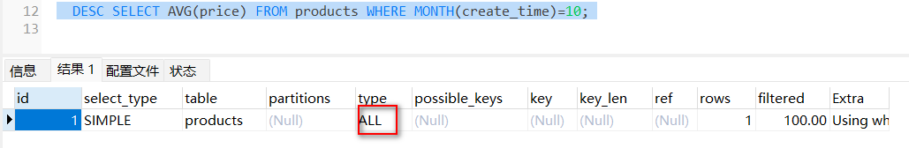
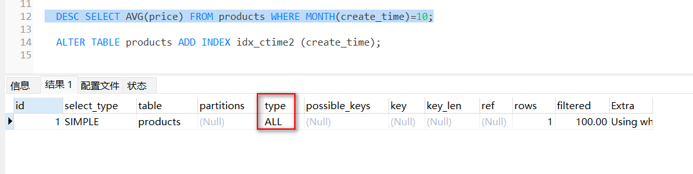
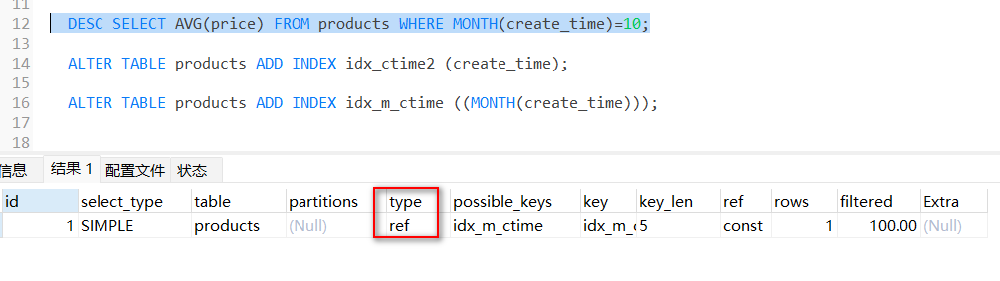

资料来源：<br/>
[MySQL8中的函数索引](https://cloud.tencent.com/developer/article/1941178?areaSource=102001.14&traceId=mOx3FRocaL_Gct_pf2g07)<br/>


## 递归

在[12_MySQL递归查询上下级菜单](数据库/MySQL使用/12_MySQL递归查询上下级菜单.md) 有应用介绍。这里不做介绍了

##  MySQL8中的函数索引

### 举例

最近翻了下percona blog，发现 MySQL从8.0.13也引入了函数索引了，这个特性貌似在PG很早就具备了。。。<br/>
在5.7中，我们可以使用虚拟列来实现函数索引的效果。MySQL 8.0 的优点是完全透明，不需要创建虚拟列。<br/>
看下面的示例

```sql
DROP TABLE products ;

CREATE TABLE `products` (
  `id` INT UNSIGNED NOT NULL AUTO_INCREMENT,
  `description` LONGTEXT,
  `price` DECIMAL (8, 2) DEFAULT NULL,
  `create_time` TIMESTAMP NULL DEFAULT NULL,
  PRIMARY KEY (`id`)
  ) ENGINE = INNODB AUTO_INCREMENT = 149960 DEFAULT CHARSET = utf8mb4 COLLATE = utf8mb4_0900_ai_ci;
```

- 查询

```sql
	DESC SELECT AVG(price) FROM products WHERE MONTH(create_time)=10;
```




- 然后，对 create_time加一个索引，试试看效果

```sql
ALTER TABLE products ADD INDEX idx_ctime (create_time);
```



执行计划上看，依然是全表扫描 

- 下面开始再加一个函数索引，注意这里的语法，有2层的括号！ 

```
ALTER TABLE products ADD INDEX idx_m_ctime ((MONTH(create_time)));
```



sql 创建语句

```sql
SHOW CREATE TABLE products \G
CREATE TABLE `products` (
  `id` INT UNSIGNED NOT NULL AUTO_INCREMENT,
  `description` LONGTEXT,
  `price` DECIMAL(8,2) DEFAULT NULL,
  `create_time` TIMESTAMP NULL DEFAULT NULL,
  PRIMARY KEY (`id`),
  KEY `idx_m_ctime` ((MONTH(`create_time`)))
) ENGINE=INNODB AUTO_INCREMENT=149960 DEFAULT CHARSET=utf8mb4 COLLATE=utf8mb4_0900_ai_ci;
```

### 允许使用哪些函数索引

```shell
我们已经看到了一个涉及应用于列的简单函数的示例，但是您可以创建更复杂的索引。

函数索引可以包含任何类型的表达式，而不仅仅是单个函数。以下模式是有效的功能索引：
INDEX( ( col1 + col2 ) )
INDEX( ( FUNC(col1) + col2 – col3 ) )

You can use ASC or DESC as well:
INDEX( ( MONTH(col1) ) DESC )

You can have multiple functional parts, each one included in parentheses:
INDEX( ( col1 + col2 ), ( FUNC(col2) ) )

You can mix functional with nonfunctional parts:
INDEX( (FUNC(col1)), col2, (col2 + col3), col4 )

还有些需要注意的地方:
- A functional key can not contain a single column. The following is not permitted: INDEX( (col1), (col2) )
- The primary key can not include a functional key part
- The foreign key can not include a functional key part
- SPATIAL and FULLTEXT indexes can not include functional key parts
- A functional key part can not refer to a column prefix
```

最后，请记住，函数索引仅对优化使用完全相同的函数表达式的查询有用。下面的这几个都不会走我们创建的month的函数索引，依然会需要全表扫描。当然我们也可以创建多个函数索引来解决多个不同的查询问题。

```
WHERE YEAR(create_time) = 2019
WHERE create_time > ‘2019-10-01’
WHERE create_time BETWEEN ‘2019-10-01’ AND ‘2019-11-01’
WHERE MONTH(create_time+INTERVAL 1 YEAR)
```

补充， 目前YearningSQL平台还不支持函数索引的工单的校验和提交，需要走其它流程，由DBA人工执行。