资料来源：

[MySQL入门必做练习题50题(一) 创建表](https://zhuanlan.zhihu.com/p/345457364)<br/>
[MySQL入门必做练习题50题(二) 基础题](https://zhuanlan.zhihu.com/p/345459843)<br/>
[MySQL入门必做练习题50题(三) 进阶题](https://zhuanlan.zhihu.com/p/345468087)


## 创建表

**对于一个学校信息管理系统中的数据库，有如下4张表：**

> 学生表：student(学号,学生姓名,出生年月,性别)
>
> 成绩表：score(学号,课程号,成绩)
>
> 课程表：course(课程号,课程名称,教师号)
>
> 教师表：teacher(教师号,教师姓名)

**这四张表的部分截图数据及关系如下图**：

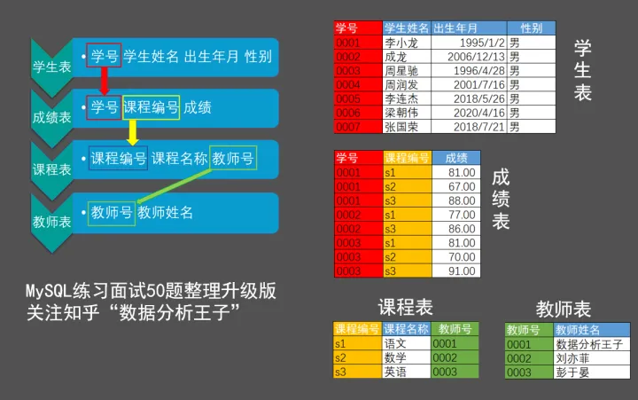

**(一)创建库和表**

**步骤：**

步骤1：新建查询，创建数据库SQL50，刷新检查一下。

步骤2：鼠标选择数据库SQL50，后新建查询 创建4张表，刷新检查一下。

步骤3：向表中插入数据。刷新检查一下

```sql
-- 创建库
CREATE DATABASE SQL50;
-- 创建4张表
CREATE TABLE SC(Sid VARCHAR(10),Cid VARCHAR(10),score DECIMAL(18,1));
CREATE TABLE Student(Sid VARCHAR(10),Sname VARCHAR(10),Sage DATE,Ssex VARCHAR(10));
CREATE TABLE Course (Cid VARCHAR(10),Cname VARCHAR(10),Tid VARCHAR(10));
CREATE TABLE Teacher(Tid VARCHAR(10),Tname VARCHAR(18));
-- 注意：这里有个DECIMAL(18,1)数据类型，意思就是整数位最大18位，小数位1位。

-- 插入数据
-- 向[学生表]插入数据
INSERT INTO Student VALUES('0001' , '李小龙' , '1995/1/2' , '男');
INSERT INTO Student VALUES('0002' , '成龙' ,   '2006/12/13' , '男');		
INSERT INTO Student VALUES('0003' , '周星驰' , '1996/4/28' , '男');
INSERT INTO Student VALUES('0004' , '周润发' , '2001/7/16' , '男');
INSERT INTO Student VALUES('0005' , '李连杰' , '2018/5/26' , '男');
INSERT INTO Student VALUES('0006' , '梁朝伟' , '2020/4/16' , '男');
INSERT INTO Student VALUES('0007' , '张国荣' , '2018/7/21' , '男');
INSERT INTO Student VALUES('0008' , '梁家辉' , '1995/9/13' , '男');
INSERT INTO Student VALUES('0009' , '刘德华' , '1990/10/7' , '男');
INSERT INTO Student VALUES('0010' , '刘青云' , '2006/6/2' , '男');
INSERT INTO Student VALUES('0011' , '邱淑贞' , '1990/1/8' , '女');	
INSERT INTO Student VALUES('0012' , '张敏' ,   '2017/12/7' , '女');
INSERT INTO Student VALUES('0013' , '朱茵' ,   '2015/11/6' , '女');
INSERT INTO Student VALUES('0014' , '关之琳' , '2002/11/18' , '女');
INSERT INTO Student VALUES('0015' , '林青霞' , '2014/2/14' , '女');
INSERT INTO Student VALUES('0016' , '王祖贤' , '2011/5/25' , '女');
INSERT INTO Student VALUES('0017' , '钟楚红' , '2006/12/10' , '女');
INSERT INTO Student VALUES('0018' , '黎姿' ,   '2000/12/25' , '女');
INSERT INTO Student VALUES('0019' , '李嘉欣' , '1992/2/19' , '女');
INSERT INTO Student VALUES('0020' , '周慧敏' , '2010/8/15' , '女');

-- 向[课程表]插入数据
INSERT INTO Course VALUES('s1' , '语文' , '0001');
INSERT INTO Course VALUES('s2' , '数学' , '0002');
INSERT INTO Course VALUES('s3' , '英语' , '0003');

-- 向[教师表]插入数据
INSERT INTO Teacher VALUES('0001' , '数据分析王子');
INSERT INTO Teacher VALUES('0002' , '刘亦菲');
INSERT INTO Teacher VALUES('0003' , '彭于晏');

-- 向[成绩表]插入数据
INSERT INTO SC VALUES('0001' , 's1' ,81);
INSERT INTO SC VALUES('0001' , 's2' ,67);
INSERT INTO SC VALUES('0001' , 's3' ,88);
INSERT INTO SC VALUES('0002' , 's1' ,77);
INSERT INTO SC VALUES('0002' , 's3' ,86);
INSERT INTO SC VALUES('0003' , 's1' ,81);
INSERT INTO SC VALUES('0003' , 's2' ,70);
INSERT INTO SC VALUES('0003' , 's3' ,91);
INSERT INTO SC VALUES('0004' , 's1' ,62);
INSERT INTO SC VALUES('0004' , 's2' ,93);
INSERT INTO SC VALUES('0004' , 's3' ,95);
INSERT INTO SC VALUES('0005' , 's1' ,72);
INSERT INTO SC VALUES('0005' , 's2' ,52);
INSERT INTO SC VALUES('0005' , 's3' ,61);
INSERT INTO SC VALUES('0006' , 's1' ,80);
INSERT INTO SC VALUES('0006' , 's2' ,86);
INSERT INTO SC VALUES('0007' , 's1' ,100);
INSERT INTO SC VALUES('0007' , 's2' ,62);
INSERT INTO SC VALUES('0007' , 's3' ,72);
INSERT INTO SC VALUES('0008' , 's1' ,88);
INSERT INTO SC VALUES('0008' , 's2' ,72);
INSERT INTO SC VALUES('0008' , 's3' ,51);
INSERT INTO SC VALUES('0009' , 's2' ,56);
INSERT INTO SC VALUES('0009' , 's3' ,52);
INSERT INTO SC VALUES('0010' , 's1' ,84);
INSERT INTO SC VALUES('0010' , 's2' ,61);
INSERT INTO SC VALUES('0010' , 's3' ,75);
INSERT INTO SC VALUES('0011' , 's2' ,82);
INSERT INTO SC VALUES('0011' , 's3' ,92);
INSERT INTO SC VALUES('0012' , 's1' ,97);
INSERT INTO SC VALUES('0012' , 's2' ,88);
INSERT INTO SC VALUES('0012' , 's3' ,64);
INSERT INTO SC VALUES('0013' , 's1' ,75);
INSERT INTO SC VALUES('0013' , 's2' ,97);
INSERT INTO SC VALUES('0013' , 's3' ,67);
INSERT INTO SC VALUES('0014' , 's1' ,83);
INSERT INTO SC VALUES('0014' , 's2' ,86);
INSERT INTO SC VALUES('0014' , 's3' ,96);
INSERT INTO SC VALUES('0015' , 's2' ,86);
INSERT INTO SC VALUES('0015' , 's3' ,57);
INSERT INTO SC VALUES('0016' , 's1' ,75);
INSERT INTO SC VALUES('0016' , 's3' ,99);
INSERT INTO SC VALUES('0017' , 's1' ,56);
INSERT INTO SC VALUES('0017' , 's2' ,98);
INSERT INTO SC VALUES('0017' , 's3' ,80);
INSERT INTO SC VALUES('0018' , 's1' ,53);
INSERT INTO SC VALUES('0018' , 's2' ,51);
INSERT INTO SC VALUES('0018' , 's3' ,69);
INSERT INTO SC VALUES('0019' , 's1' ,97);
INSERT INTO SC VALUES('0019' , 's2' ,99);
INSERT INTO SC VALUES('0019' , 's3' ,64);
INSERT INTO SC VALUES('0020' , 's1' ,81);
INSERT INTO SC VALUES('0020' , 's2' ,52);
INSERT INTO SC VALUES('0020' , 's3' ,62);
```

## 基础题

**1.查询名字中含有「龙」字的学生信息**

```text
SELECT *
FROM student
WHERE sname LIKE '%龙%';
```

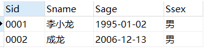

**2.查询「数」姓的所有老师的信息**

```text
-- 很简单。用个like就行，不会like的，去百度一下就可以。
SELECT * FROM teacher
WHERE Tname LIKE '数%';
```

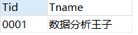

**3.查询男生、女生人数**

```text
SELECT Ssex,COUNT(ssex) as 人数 
FROM student
GROUP BY Ssex; 
```

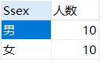


**4.查询2000年后出生的学生名单**

```text
SELECT sname
FROM student
WHERE sage LIKE '20%';
```

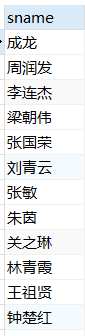

**5.查询同名同姓学生名单，并统计同名人数**

```text
-- 思路：sname分组即可，本数据无同名
SELECT sname,COUNT(sname) AS 同名人数
FROM student
GROUP BY sname
HAVING 同名人数>1;
```

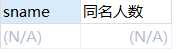

**6.查询每门课程选修人数**

```text
-- 思路：分组后，用个count即可
SELECT Cid,COUNT(sid) AS num
FROM  sc 
GROUP BY cid;
```

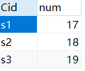

**7.查询每门课程的平均成绩**

```text
SELECT cid,AVG(score) '平均成绩'
FROM sc
GROUP BY cid 
```

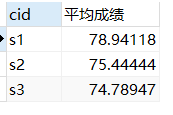

**8.查询每门成绩最好的前3名**

```text
-- 思路：三个课程的乘积表，排名取前三，然后合并
(SELECT * FROM sc WHERE Cid='s1'  ORDER BY score DESC LIMIT 3)
UNION
(SELECT * FROM sc WHERE Cid='s2'  ORDER BY score DESC LIMIT 3)
UNION
(SELECT * FROM sc WHERE Cid='s3'  ORDER BY score DESC LIMIT 3) 
```

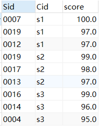

**9.查询选修过任一课程的学生的学生信息**

```text
-- 思路：没选修课程的同学不在成绩表中，所以直接联结即可。
-- 这种等值联结，相当于内联结，只有两表都有的记录才会被留下。
-- 如果不理解，可以网上查一下，深刻理解一下联结部分的内容。
SELECT  DISTINCT student.*
FROM student,sc
WHERE student.Sid=sc.Sid
```

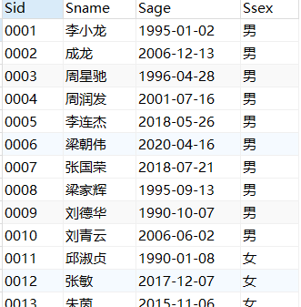

**10.查询至少选修两门课程的学生学号**

```text
SELECT 
  sid,COUNT(cid) 选修数 
FROM
  sc 
GROUP BY sid 
HAVING 选修数 >= 2 ; 
```

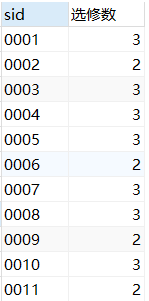

**11.查询出只选修两门课程的学生学号和姓名**

```text
SELECT sc.sid,sname
FROM sc INNER JOIN student
ON sc.sid = student.sid
GROUP BY sc.sid
HAVING COUNT(sc.cid) = 2; 
```

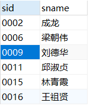

**12.查询选修了全部课程的学生信息**

```text
-- 思路：分组求出每个学生选课数，加上选课数等于全部课程数的条件。
-- 后用in把剩下的Sid带到student表即可。
SELECT * FROM student 
WHERE Sid in (
SELECT Sid FROM sc 
GROUP BY Sid 
HAVING COUNT(*)=(SELECT COUNT(cid) FROM course)) 
```

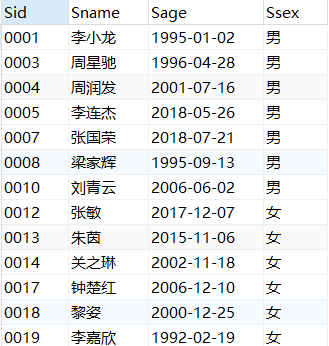

**13.查询没有选修全部课程的同学的信息。**

```text
-- 思路：先查询选了所有课的学生，再反向选择这些人之外的学生.否则会漏掉什么都没选的。
SELECT * FROM student 
WHERE Sid  NOT IN(
SELECT Sid FROM sc 
GROUP BY Sid 
HAVING COUNT(*)=(SELECT COUNT(cid) FROM course));
```

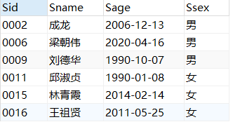

**14.查询各学生的年龄，只按年份来算**

```text
-- 思路：用时间函数，看一眼就明白了，注意记忆。
SELECT sname,YEAR(NOW()) - YEAR(sage) AS 年龄
FROM student ;
```

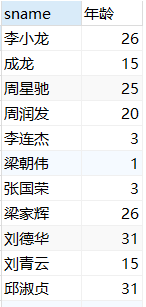

**15.查询所有学生的姓名、课程名称和分数**

```text
SELECT sname,sc.cid,score 
FROM sc INNER JOIN student 
ON sc.sid = student.sid ;
```

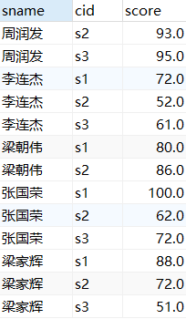

**16.查询任何一门课程成绩在 70 分以上的姓名、课程名称和分数**

```text
-- 思路：上一题的基础上，加上一个where条件判断
SELECT sname,sc.cid,score 
FROM
  sc INNER JOIN student AS s 
    ON sc.sid = s.sid 
AND score > 70 ; 
```

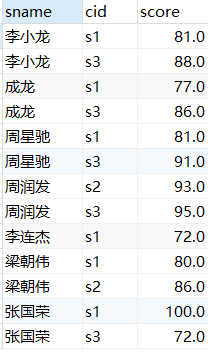


**17.查询有不及格课程的学生的姓名、课程名称和分数**

```text
-- 思路：同上一题
SELECT sname,sc.cid,score 
FROM
  sc INNER JOIN student AS s 
    ON sc.sid = s.sid 
AND score < 60 ; 
```

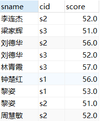

**18.查询课程编号为 s1 且课程成绩在 80 分以上的学生的学号和姓名**

```text
-- 思路：同上一题,多加个条件
SELECT sc.sid,sname
FROM sc INNER JOIN student AS s
ON sc.sid = s.sid
WHERE sc.cid = 's1' AND score >= 80; 
```

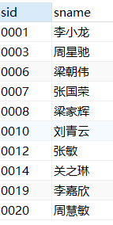


**19.查询本周过生日的学生**

```text
-- 思路：时间函数week()，返回日期的所在周数，一年大概52周，试一下就知道了
SELECT sname
FROM student
WHERE WEEK(sage) = WEEK(NOW());
```

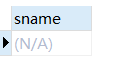

**20.查询下周过生日的学生**

```text
SELECT 
  sname 
FROM
  student 
WHERE WEEK(sage) = WEEK(NOW()) + 1 ; 
```

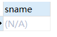

**21.查询本月过生日的学生**

```text
SELECT 
  sname,
  sage 
FROM
  student 
WHERE MONTH(sage) = MONTH(NOW());
```

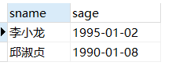

**22.查询下月过生日的学生**

```text
SELECT 
  sname,
  sage 
FROM
  student 
WHERE MONTH(sage) = MONTH(NOW()) + 1 ; 
```

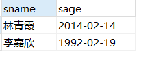

##  进阶题

**1.查询所有同学的学生编号、学生姓名、选课总数、所有课程的成绩总和**

```text
-- 思路：看到选课总数和成绩总和，要想到groupby，然后和student表联结一下即可。
-- 如果有学生没选课，用left join联结，也会被选出，因为在student表该学生存在。
-- 此数据中没有一节课没选的学生。
SELECT student.Sid,Sname,r.ct '选课总数',r.sm '成绩总和' FROM student
LEFT JOIN
(
SELECT Sid,COUNT(Cid)AS ct,SUM(score) AS sm 
FROM sc
GROUP BY Sid) 
AS r
ON student.Sid=r.Sid;
```

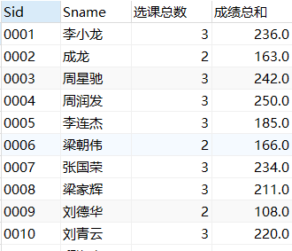

**2.按平均成绩从高到低显示所有学生的所有课程的成绩以及平均成绩**

```text
-- 思路：这题非常漂亮，但不难，联结3张各科成绩表+1张平均成绩表即可。记得排序
SELECT t1.Sid,t1.score '语文',t2.score '数学',t3.score '英语',t4.平均成绩 FROM
(SELECT * FROM sc WHERE CId='s1' )AS t1,
(SELECT * FROM sc WHERE CId='s2' )AS t2,
(SELECT * FROM sc WHERE CId='s3' )AS t3,
(SELECT Sid,AVG(score) '平均成绩'FROM sc GROUP BY Sid) AS t4
WHERE t1.Sid=t2.Sid AND t2.Sid=t3.Sid AND t3.Sid=t4.Sid
ORDER BY 平均成绩 DESC
```

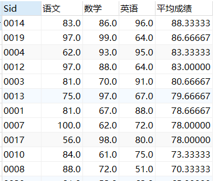

**3.查询各科成绩最高分、最低分、平均分、（及格率、中等率、优良率、优秀率）**

```text
-- 思路：虽然多，但是不难。前3个分组后聚合函数直接求。后面4个用case分类后再计算。不会case的百度下case
SELECT 
  cid AS 课程ID,
  COUNT(sid) AS 选课人数,
  MAX(score) AS 最高分,
  MIN(score) AS 最低分,
  AVG(score) AS 平均分,
  SUM(及格) / COUNT(sid) AS 及格率,
  SUM(中等) / COUNT(sid) AS 中等率,
  SUM(优良) / COUNT(sid) AS 优良率,
  SUM(优秀) / COUNT(sid) AS 优秀率 
FROM
  (SELECT *,
    CASE WHEN score >= 60 THEN 1 ELSE 0 END AS 及格,
    CASE WHEN score >= 70 AND score < 80 THEN 1 ELSE 0 END AS 中等,
    CASE WHEN score >= 80 AND score < 90 THEN 1 ELSE 0 END AS 优良,
    CASE WHEN score >= 90 THEN 1 ELSE 0 END AS 优秀 
  FROM sc) a 
GROUP BY cid 
```

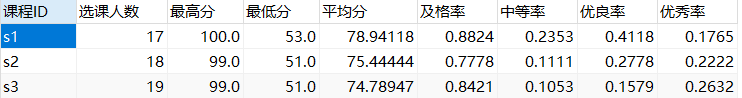


**4.统计各科成绩各分数段人数：课程编号，课程名称，[0-59]，[60-79]，[80-89]，[90-100] 及所占百分比**

```text
-- 思路：在case的基础上加一个 SUM()聚合即可。百分比的多弄个除法。
SELECT
  sc.Cid AS 课程编号,
  Cname AS 课程名称,
  SUM(CASE WHEN score >= 0 AND score <= 59 THEN 1 ELSE 0 END) AS '0-59',
  SUM(CASE WHEN score >= 0 AND score <= 59 THEN 1 ELSE 0 END) / COUNT(sid) AS '[0-59]百分比',
  SUM(CASE WHEN score >= 60 AND score <= 79 THEN 1 ELSE 0 END) AS '60-79',
  SUM(CASE WHEN score >= 60 AND score <= 79 THEN 1 ELSE 0 END) / COUNT(sid) AS '[60-79]百分比',
  SUM(CASE WHEN score >= 80 AND score <= 89 THEN 1 ELSE 0 END) AS '80-89',
  SUM(CASE WHEN score >= 80 AND score <= 89 THEN 1  ELSE 0 END) / COUNT(sid) AS '[80-89]百分比',
  SUM(CASE WHEN score >= 90 AND score <= 100 THEN 1 ELSE 0 END) AS '90-100',
  SUM(CASE WHEN score >= 90 AND score <= 100 THEN 1 ELSE 0 END) / COUNT(sid) AS '[90-100]百分比' 
FROM sc 
JOIN course 
ON sc.cid = course.cid 
GROUP BY sc.cid ; 
```

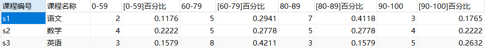

**5.查询选修了" s1 "课程和" s2 "课程的成绩情况**

```text
SELECT * FROM 
(SELECT * FROM sc WHERE CId='s1') AS t1,
(SELECT * FROM sc WHERE CId='s2') AS t2
WHERE t1.SId=t2.SId;
```

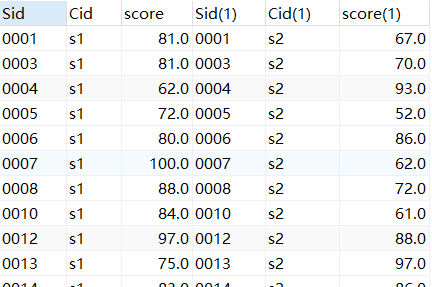

**6.查询" s1 "课程比" s2 "课程成绩高的学生的信息及课程分数**

```text
-- 思路：将成绩表sc中课程s1和s2的记录进行表联结，选出分数s1>s2的，
-- 然后再和student联结以取出学生信息。最后每个字段全查询出来。
SELECT * FROM Student
RIGHT JOIN
(
SELECT t1.Sid,t1.score AS '语文',t2.score AS '数学'
FROM
(SELECT * FROM sc WHERE CId='s1' )AS t1,
(SELECT * FROM sc WHERE CId='s2' )AS t2
WHERE t1.Sid=t2.Sid AND t1.score > t2.score
)AS r 
ON Student.Sid = r.Sid; 
```

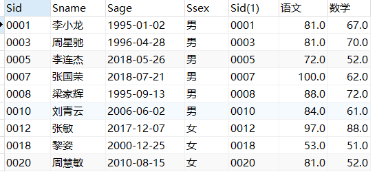

**7.查询没有选修“s1”课程的同学的“s2”课程的成绩。**

```text
-- 思路:先把选修了s1课程的学生的学号取出来，然后用not in 反向选择没选修s1的，再加个s2的条件即可。
SELECT * FROM sc
WHERE sc.Sid NOT IN (
    SELECT Sid FROM sc WHERE sc.Cid = 's1'
) 
AND sc.Cid= 's2'; 
```

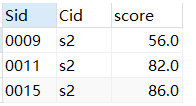

**8.检索" s1 "课程分数小于 60，按分数降序排列的学生信息,及对应成绩**

```text
-- 思路：先查询s1<60的，再和student表联结即可
SELECT student.*,Cid,score
FROM student,
	(SELECT * FROM sc WHERE Cid = 's1' AND score <60) t2
WHERE student.Sid = t2.Sid
ORDER BY score DESC; 
```

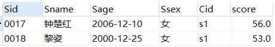

**9.查询至少有一门课与学号为"0001 "的同学选修课程一样的同学的信息**

```mysql
-- 思路：从sc表查询01同学的所有选课cid，从sc表查询所有同学的sid如果其cid在前面的结果中，
-- 从student表查询所有学生信息如果sid在前面的结果中
SELECT * FROM student WHERE Sid IN(
SELECT DISTINCT Sid FROM sc WHERE Cid IN(
SELECT Cid FROM sc WHERE Sid='0001'));		
```

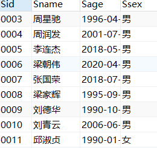

**10.查询和学号为" 0001 "的同学选修课程完全相同的学生信息**

```text
-- 思路：此题很特殊！如果一次得出结果，会非常复杂!所以我们必须分两次。见下文
-- 第一次查询：查看学号为" 0001 "的同学，选了哪些课程。
SELECT Cid FROM sc WHERE Sid='0001';
-- 得出结果：该学生选修了s1 s2 s3门课程

-- 第二次查询:查询选了这三门课程的学生的信息
-- 思路：这三门课程的记录的Sid取交集，就得出选了这3门课的Sid,再在学生表中in一下即可。
SELECT * FROM student
WHERE Sid in
(SELECT t1.sid FROM
(SELECT Sid FROM sc WHERE CId='s1' )AS t1,
(SELECT Sid FROM sc WHERE CId='s2' )AS t2,
(SELECT Sid FROM sc WHERE CId='s3' )AS t3
WHERE t1.Sid=t2.Sid AND t2.Sid=t3.Sid) 
```

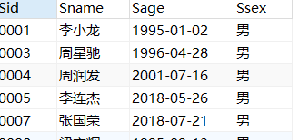

**11.查询两门及其以上不及格课程的同学的学号，姓名及其’不及格课程的平均成绩’**

```text
-- 这题简化了一下，只求(有两门不及格课程的学生的对应课程平均成绩)
-- 而不是(有两门不及格课程的学生的全部课程平均成绩)。注意区分！
-- 思路：先把不及格的选出来，再分组，选出计数大于2的，再和student表联结即可。
SELECT t2.sid, sname,AVG(t2.score) '平均成绩'
FROM  student,(SELECT * FROM sc WHERE score < 60) t2
WHERE student.sid=t2.sid
GROUP BY t2.sid
HAVING COUNT(t2.cid)>=2; 
```

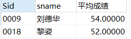

**12.查询平均成绩大于等于 60 分的同学的学生学号、姓名和平均成绩**

```text
-- 思路:看见平均，先想到分组，然后用having加个>=60的条件，最后和student表联结，取出所需值即可。
SELECT student.Sid,sname,avg_sc FROM student,(
    SELECT Sid, AVG(score) AS avg_sc FROM sc  
    GROUP BY Sid 
    HAVING AVG(score)>=60
    )r
WHERE student.sid = r.sid;
```

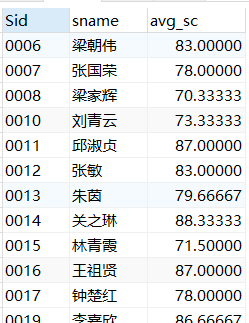

**13.查询平均成绩大于等于 85 的所有学生的学号、姓名和平均成绩**

```text
SELECT sc.sid,sname,AVG(score) AS 平均成绩
FROM sc,student
WHERE sc.sid = student.sid
GROUP BY sc.sid
HAVING 平均成绩>= 85;
```

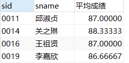

**14. 查询课程名称为「数学」，且分数低于 60 的学生姓名和分数**

```text
-- 思路：多表联结加上条件即可，相比先联结再加条件，这种先加条件再联结，效率高一点
SELECT sname,score 
FROM
  course AS c 
  INNER JOIN sc 
    ON c.cid = sc.cid 
    AND c.cname = '数学' 
    AND sc.score < 60 
  INNER JOIN student AS s 
ON sc.sid = s.sid ; 
```

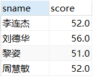

**15.查询学过「数据分析王子」老师授课的同学的信息**

```text
-- 思路：要通过读题看出需要几张表，本题需要4张，联结后，再加个条件即可。
SELECT student.* FROM student,teacher,course,sc
WHERE 
   		student.sid = sc.sid 
   		AND course.cid=sc.cid 
   		AND course.tid = teacher.tid 
   		AND tname = '数据分析王子'; 	
```

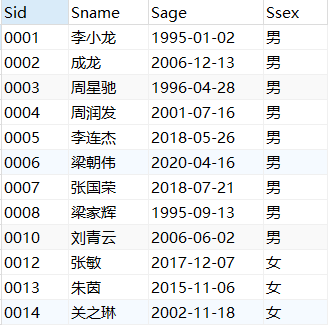

**16.查询选修「数据分析王子」老师所授课程的学生中，成绩最高的学生信息及其成绩(如果有并列的，需要都列出来)**

```text
-- 思路：通过两次联结，第一次联结求出最大值，
--     第二次联结加上条件 老师='数据分析王子'老师和分数=最高分
-- 思路：方法有待优化，无奈试了其他方法会报错。
SELECT student.*,sc.cid,score 
FROM
  student 
  INNER JOIN sc ON student.sid = sc.sid 
	INNER	JOIN course ON sc.cid = course.cid 
  INNER JOIN teacher ON course.tid = teacher.tid 
WHERE tname = '数据分析王子' 
  AND score = 
  (SELECT MAX(score) 
  FROM
    sc INNER JOIN course ON sc.cid = course.cid 
			 INNER JOIN teacher ON course.tid = teacher.tid 
  WHERE tname = '数据分析王子') ;
```

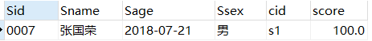

**17. 查询不同课程但成绩相同的学生的学生编号、课程编号、学生成绩**

-- 思路：两个sc表通过 score字段 自联结,并把同课程的剔除掉。

-- 没什么实际意义，看个乐就行

```text
SELECT 
  DISTINCT *
FROM
  sc AS a 
  INNER JOIN 
	sc AS b 
WHERE a.score = b.score 
  AND a.cid != b.cid ; 
```

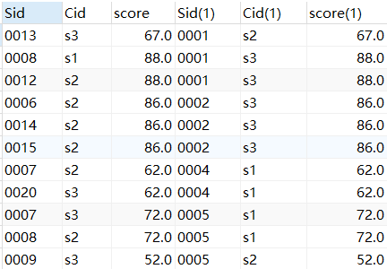


**18-20.查询学生的总成绩，并进行排名，使用3种排名方法**

```text
-- 知识补充；
-- 	三种排名函数，我已经帮你写好了格式，可以直接拿去用。
-- 	具体的可以百度Mysql排名函数，了解一下。它是一种窗体函数。
-- 		ROW_NUMBER() OVER (ORDER BY 总分 DESC)	当遇到相同值时的排名效果：1 2 3
-- 		RANK() OVER (ORDER BY 总分 DESC)	排名效果：1 1 3
-- 		DENSE_RANK() OVER (ORDER BY 总分 DESC)	排名效果：1 2 2
 
SELECT *,ROW_NUMBER() OVER (ORDER BY 总分 DESC) 排名
FROM (SELECT sid,SUM(score) 总分 FROM sc GROUP BY sid) a

SELECT *,RANK() OVER (ORDER BY 总分 DESC) 排名
FROM (SELECT sid,SUM(score) 总分 FROM sc GROUP BY sid) a

SELECT *,DENSE_RANK() OVER (ORDER BY 总分 DESC) 排名
FROM (SELECT sid,SUM(score) 总分 FROM sc GROUP BY sid) a
```

**21.各科成绩排名**

```text
-- 思路:使用排名函数会非常简单，详细可以百度学习一下mysql排名函数学习一下
SELECT *,ROW_NUMBER() OVER (ORDER BY cid,score DESC) '排名'
FROM sc
```

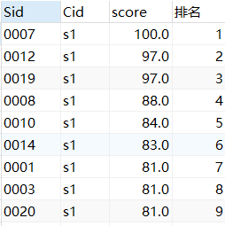