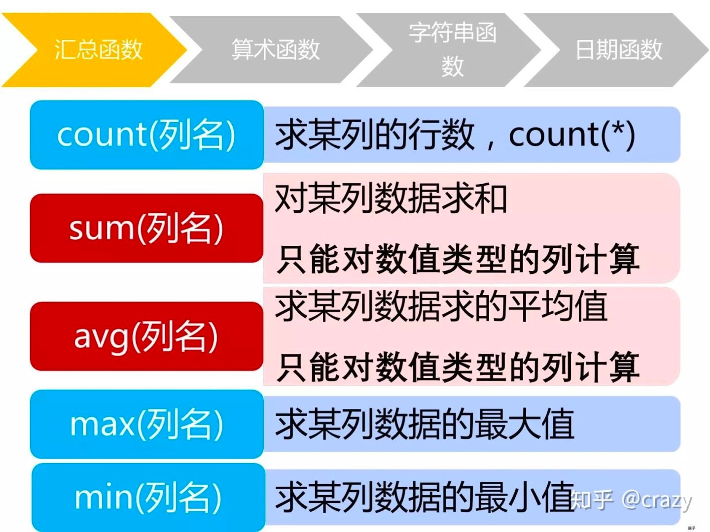
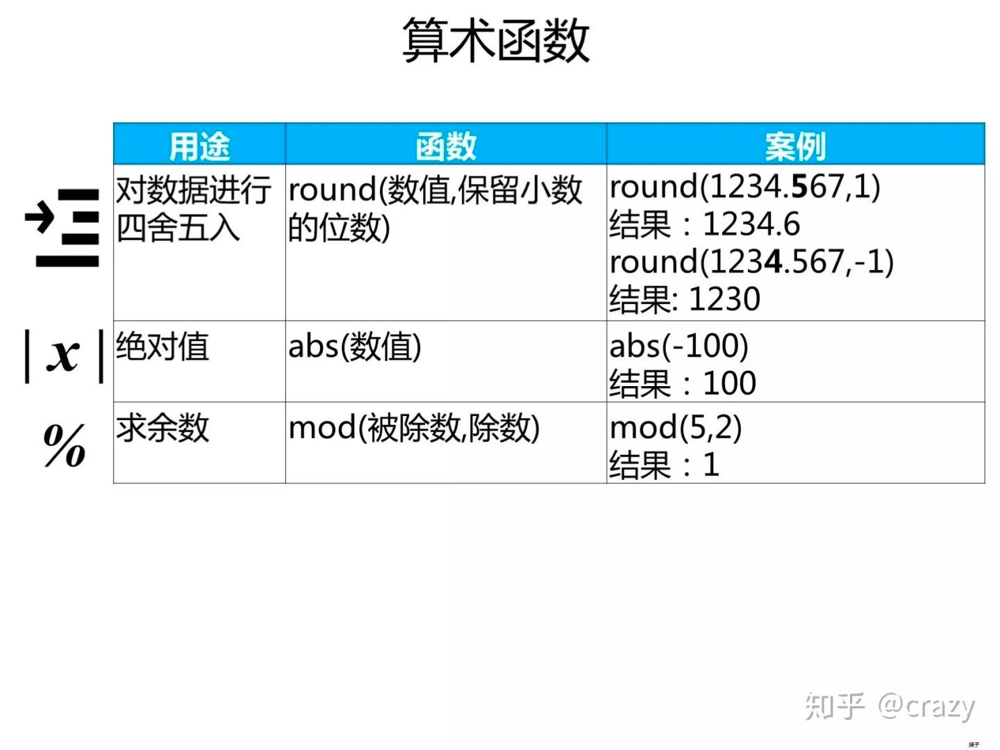
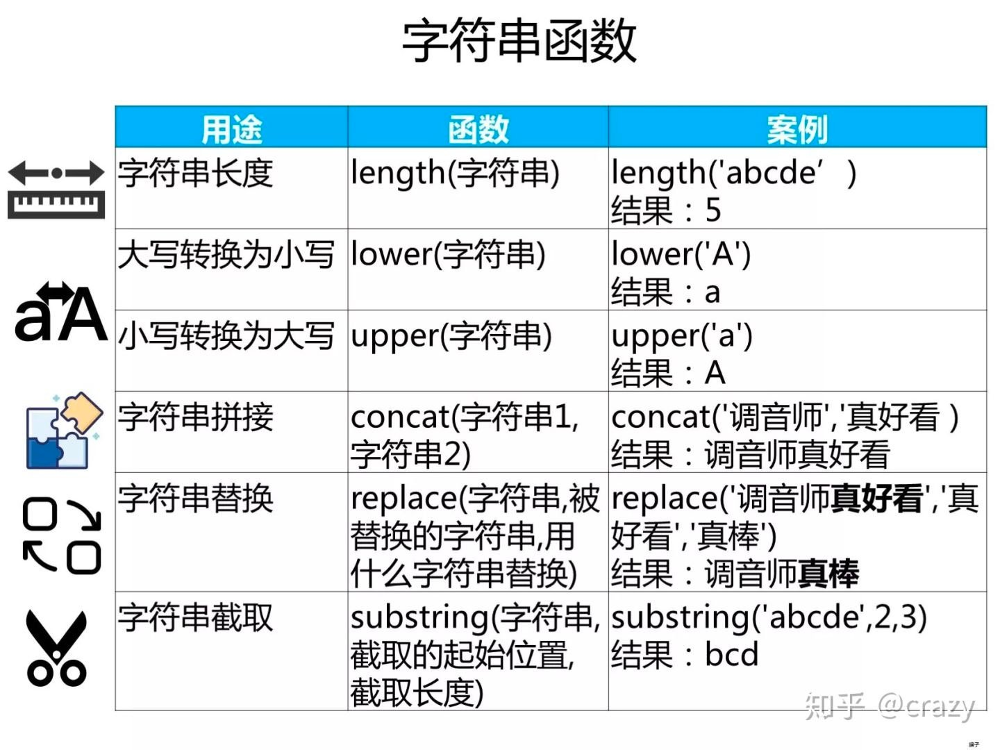
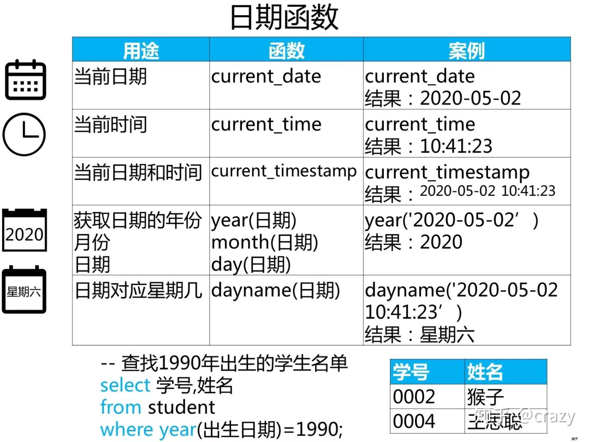

资料来源：https://zhuanlan.zhihu.com/p/92104959

### 视图

#### 介绍

 在实际的数据库中，每一张表会有很多个字段，但是不同的用户只想了解自己想了解的字段，对于其他的字段并不感兴趣，这时候使用视图可以把自己想要的一些字段再封装成一张表，这样每次特定用户只需要访问这张封装成的表即可了解自己想知道的字段。再说的专业一点，视图是对SQL语句的封装，这个说法在下面进行解释

视图是对SQL语句的封装。因为，我们在数据库中建立的一张张表会实际存储到存储设备上，比如磁盘，我们每次使用select语句，实际上就是在访问内存中的表，但是视图并不是，视图保存的并不是数据，而是select语句，每次从视图中读取数据的时候，相当于是在内部执行select语句并创建出一张临时表

#### 视图的优点：

> （1）视图不需要保存实际数据，节省存储空间 
>
> （2）可以将频繁使用的select语句保存成视图，这样就不用每次都书写复杂的SQL了

### 函数

#### 汇总函数

#### 算术函数

#### 字符串函数

#### 日期函数

### 自定义函数

——————————————————————————————————————未完待续