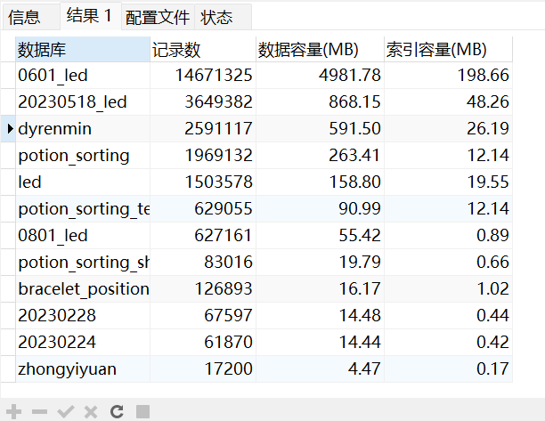
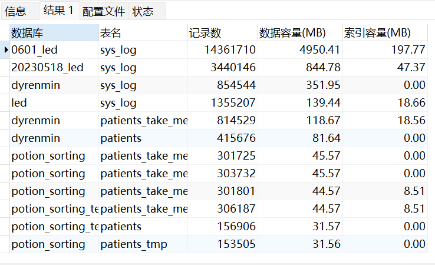

资料来源： 
[mysql、oracle查询表占用的空间](https://blog.csdn.net/gouzhengju1454/article/details/119195420?spm=1001.2014.3001.5502)

### 数据库的容量

查看所有数据库容量大小

~~~~sql
select 
table_schema as '数据库',
sum(table_rows) as '记录数',
sum(truncate(data_length/1024/1024, 2)) as '数据容量(MB)',
sum(truncate(index_length/1024/1024, 2)) as '索引容量(MB)'
from information_schema.tables
group by table_schema
order by sum(data_length) desc, sum(index_length) desc;
~~~~

运行效果

### 数据库表

2.查看所有数据库各表容量大小

~~~~sql
select 
table_schema as '数据库',
table_name as '表名',
table_rows as '记录数',
truncate(data_length/1024/1024, 2) as '数据容量(MB)',
truncate(index_length/1024/1024, 2) as '索引容量(MB)'
from information_schema.tables
order by data_length desc, index_length desc;
~~~~

运行效果

- 可以响应的增加查询条件