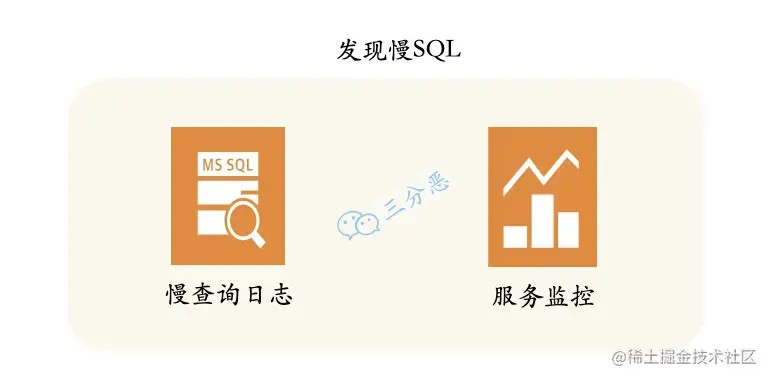
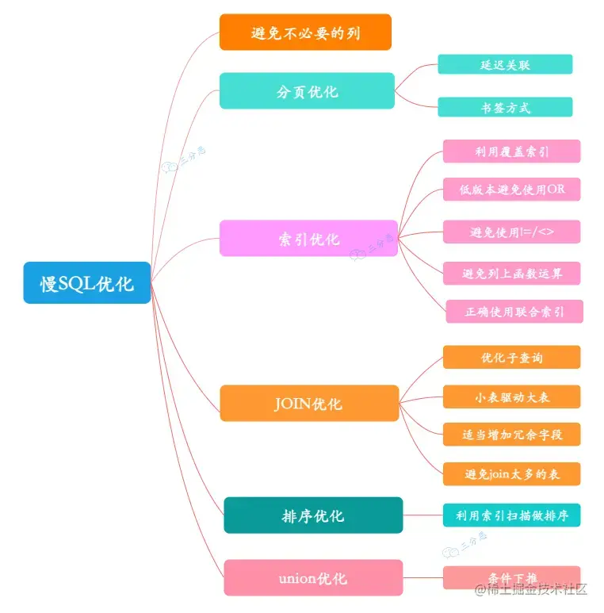
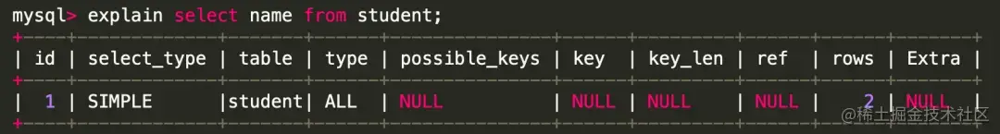
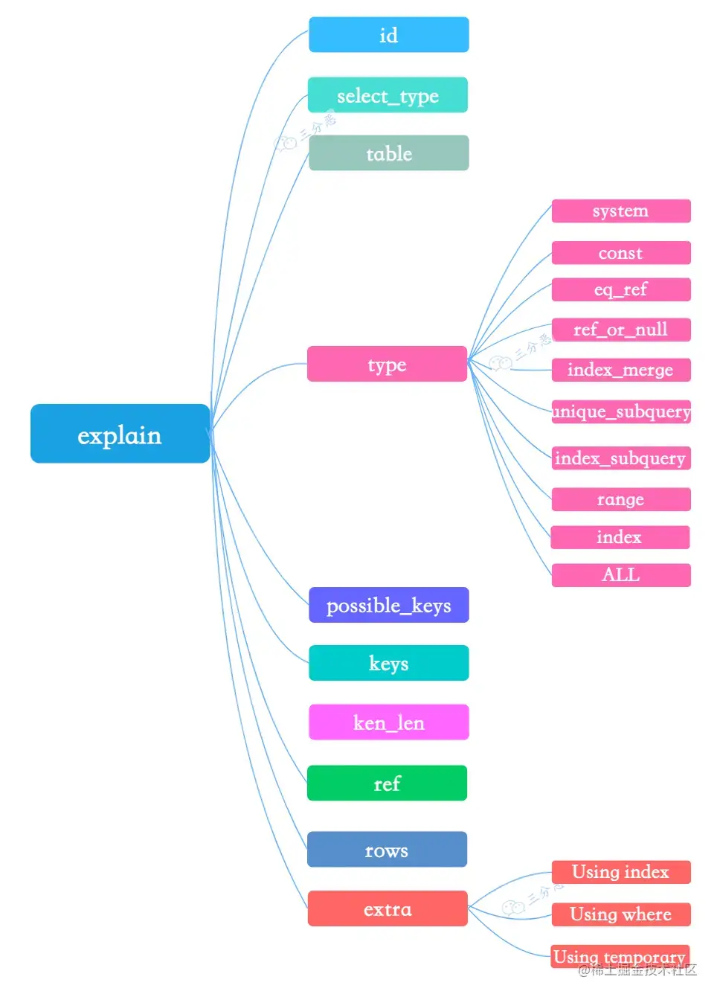

资料来源：<br/>
[面渣逆袭：MySQL六十六问，两万字+五十图详解！](https://www.toutiao.com/article/7227085009981784637/)


## SQL 优化

###  24.慢SQL如何定位呢？

慢SQL的监控主要通过两个途径：




- **慢查询日志**：开启MySQL的慢查询日志，再通过一些工具比如mysqldumpslow去分析对应的慢查询日志，当然现在一般的云厂商都提供了可视化的平台。
- **服务监控**：可以在业务的基建中加入对慢SQL的监控，常见的方案有字节码插桩、连接池扩展、ORM框架过程，对服务运行中的慢SQL进行监控和告警。

### 25.有哪些方式优化慢SQL？

慢SQL的优化，主要从两个方面考虑，SQL语句本身的优化，以及数据库设计的优化。




#### 避免不必要的列

这个是老生常谈，但还是经常会出的情况，SQL查询的时候，应该只查询需要的列，而不要包含额外的列，像slect * 这种写法应该尽量避免。

#### 分页优化

在数据量比较大，分页比较深的情况下，需要考虑分页的优化。

例如：

```
select * from table where type = 2 and level = 9 order by id asc limit 190289,10;
```

优化方案：

- **延迟关联**
- 先通过where条件提取出主键，在将该表与原数据表关联，通过主键id提取数据行，而不是通过原来的二级索引提取数据行
- 例如：
```
select a.* from table a, (select id from table where type = 2 and level = 9 order by id asc limit 190289,10 ) b where a.id = b.id 
```
- **书签方式**
- 书签方式就是找到limit第一个参数对应的主键值，根据这个主键值再去过滤并limit
- 例如：

```
  select * from table where id >
  (select * from table where type = 2 and level = 9 order by id asc limit 190
```

#### 索引优化

合理地设计和使用索引，是优化慢SQL的利器。

**利用覆盖索引**

InnoDB使用非主键索引查询数据时会回表，但是如果索引的叶节点中已经包含要查询的字段，那它没有必要再回表查询了，这就叫覆盖索引

例如对于如下查询：

```
select name from test where city='上海'
```

我们将被查询的字段建立到联合索引中，这样查询结果就可以直接从索引中获取

```
alter table test add index idx_city_name (city, name);
```

**低版本避免使用or查询**

在 MySQL 5.0 之前的版本要尽量避免使用 or 查询，可以使用 union 或者子查询来替代，因为早期的 MySQL 版本使用 or 查询可能会导致索引失效，高版本引入了索引合并，解决了这个问题。

**避免使用 != 或者 <> 操作符**

SQL中，不等于操作符会导致查询引擎放弃查询索引，引起全表扫描，即使比较的字段上有索引

解决方法：通过把不等于操作符改成or，可以使用索引，避免全表扫描

例如，把column<>’aaa’，改成column>’aaa’ or column<’aaa’，就可以使用索引了

**适当使用前缀索引**

适当地使用前缀所云，可以降低索引的空间占用，提高索引的查询效率。

比如，邮箱的后缀都是固定的“@xxx.com”，那么类似这种后面几位为固定值的字段就非常适合定义为前缀索引

```
alter table test add index index2(email(6));
```

PS:需要注意的是，前缀索引也存在缺点，MySQL无法利用前缀索引做order by和group by 操作，也无法作为覆盖索引

**避免列上函数运算**

要避免在列字段上进行算术运算或其他表达式运算，否则可能会导致存储引擎无法正确使用索引，从而影响了查询的效率

```
select * from test where id + 1 = 50;
select * from test where month(updateTime) = 7;
```

**正确使用联合索引**

使用联合索引的时候，注意最左匹配原则。

#### JOIN优化

**优化子查询**

尽量使用 Join 语句来替代子查询，因为子查询是嵌套查询，而嵌套查询会新创建一张临时表，而临时表的创建与销毁会占用一定的系统资源以及花费一定的时间，同时对于返回结果集比较大的子查询，其对查询性能的影响更大

**小表驱动大表**

关联查询的时候要拿小表去驱动大表，因为关联的时候，MySQL内部会遍历驱动表，再去连接被驱动表。

比如left join，左表就是驱动表，A表小于B表，建立连接的次数就少，查询速度就被加快了。

```
 select name from A left join B ;
```

**适当增加冗余字段**

增加冗余字段可以减少大量的连表查询，因为多张表的连表查询性能很低，所有可以适当的增加冗余字段，以减少多张表的关联查询，这是以空间换时间的优化策略

**避免使用JOIN关联太多的表**

《阿里巴巴Java开发手册》规定不要join超过三张表，第一join太多降低查询的速度，第二join的buffer会占用更多的内存。

如果不可避免要join多张表，可以考虑使用数据异构的方式异构到ES中查询。

#### 排序优化

**利用索引扫描做排序**

MySQL有两种方式生成有序结果：其一是对结果集进行排序的操作，其二是按照索引顺序扫描得出的结果自然是有序的

但是如果索引不能覆盖查询所需列，就不得不每扫描一条记录回表查询一次，这个读操作是随机IO，通常会比顺序全表扫描还慢

因此，在设计索引时，尽可能使用同一个索引既满足排序又用于查找行

例如：

```
--建立索引（date,staff_id,customer_id）
select staff_id, customer_id from test where date = '2010-01-01' order by staff_id,customer_id;
```

只有当索引的列顺序和ORDER BY子句的顺序完全一致，并且所有列的排序方向都一样时，才能够使用索引来对结果做排序

#### UNION优化

**条件下推**

MySQL处理union的策略是先创建临时表，然后将各个查询结果填充到临时表中最后再来做查询，很多优化策略在union查询中都会失效，因为它无法利用索引

最好手工将where、limit等子句下推到union的各个子查询中，以便优化器可以充分利用这些条件进行优化

此外，除非确实需要服务器去重，一定要使用union all，如果不加all关键字，MySQL会给临时表加上distinct选项，这会导致对整个临时表做唯一性检查，代价很高。

### 26.怎么看执行计划（explain），如何理解其中各个字段的含义？

explain是sql优化的利器，除了优化慢sql，平时的sql编写，也应该先explain，查看一下执行计划，看看是否还有优化的空间。

直接在 select 语句之前增加explain关键字，就会返回执行计划的信息。







1. **id** 列：MySQL会为每个select语句分配一个唯一的id值
2. **select_type** 列，查询的类型，根据关联、union、子查询等等分类，常见的查询类型有SIMPLE、PRIMARY。
3. **table** 列：表示 explain 的一行正在访问哪个表。
4. **type** 列：最重要的列之一。表示关联类型或访问类型，即 MySQL 决定如何查找表中的行。
5. 性能从最优到最差分别为：system > const > eq_ref > ref > fulltext > ref_or_null > index_merge > unique_subquery > index_subquery > range > index > ALL
6. system
7. system： 当表仅有一行记录时(系统表)，数据量很少，往往不需要进行磁盘IO，速度非常快
8. const
9. const：表示查询时命中 primary key 主键或者 unique 唯一索引，或者被连接的部分是一个常量(const)值。这类扫描效率极高，返回数据量少，速度非常快。
10. eq_ref
11. eq_ref：查询时命中主键primary key 或者 unique key索引， type 就是 eq_ref。
12. ref_or_null
13. ref_or_null：这种连接类型类似于 ref，区别在于 MySQL会额外搜索包含NULL值的行。
14. index_merge
15. index_merge：使用了索引合并优化方法，查询使用了两个以上的索引。
16. unique_subquery
17. unique_subquery：替换下面的 IN子查询，子查询返回不重复的集合。
18. index_subquery
19. index_subquery：区别于unique_subquery，用于非唯一索引，可以返回重复值。
20. range
21. range：使用索引选择行，仅检索给定范围内的行。简单点说就是针对一个有索引的字段，给定范围检索数据。在where语句中使用 bettween...and、<、>、<=、in 等条件查询 type 都是 range。
22. index
23. index：Index 与ALL 其实都是读全表，区别在于index是遍历索引树读取，而ALL是从硬盘中读取。
24. ALL
25. 就不用多说了，全表扫描。
26. **possible_keys** 列：显示查询可能使用哪些索引来查找，使用索引优化sql的时候比较重要。
27. **key** 列：这一列显示 mysql 实际采用哪个索引来优化对该表的访问，判断索引是否失效的时候常用。
28. **key_len** 列：显示了 MySQL使用
29. **ref** 列：ref 列展示的就是与索引列作等值匹配的值，常见的有：const（常量），func，NULL，字段名。
30. **rows** 列：这也是一个重要的字段，MySQL查询优化器根据统计信息，估算SQL要查到结果集需要扫描读取的数据行数，这个值非常直观显示SQL的效率好坏，原则上rows越少越好。
31. **Extra** 列：显示不适合在其它列的额外信息，虽然叫额外，但是也有一些重要的信息：

- Using index：表示MySQL将使用覆盖索引，以避免回表
- Using where：表示会在存储引擎检索之后再进行过滤
- Using temporary ：表示对查询结果排序时会使用一个临时表。
