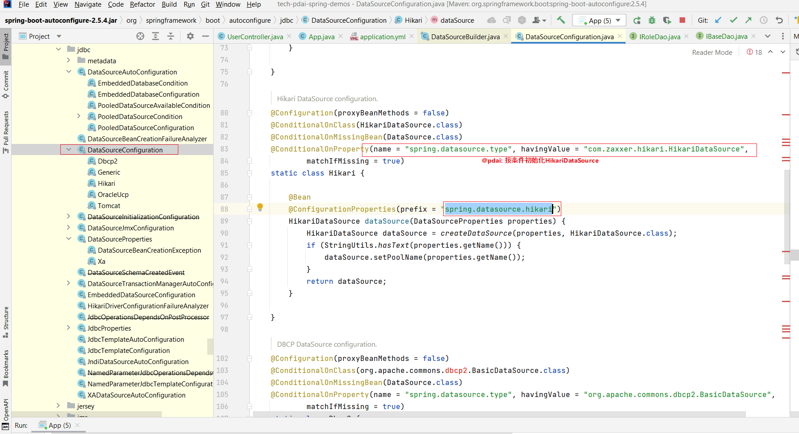
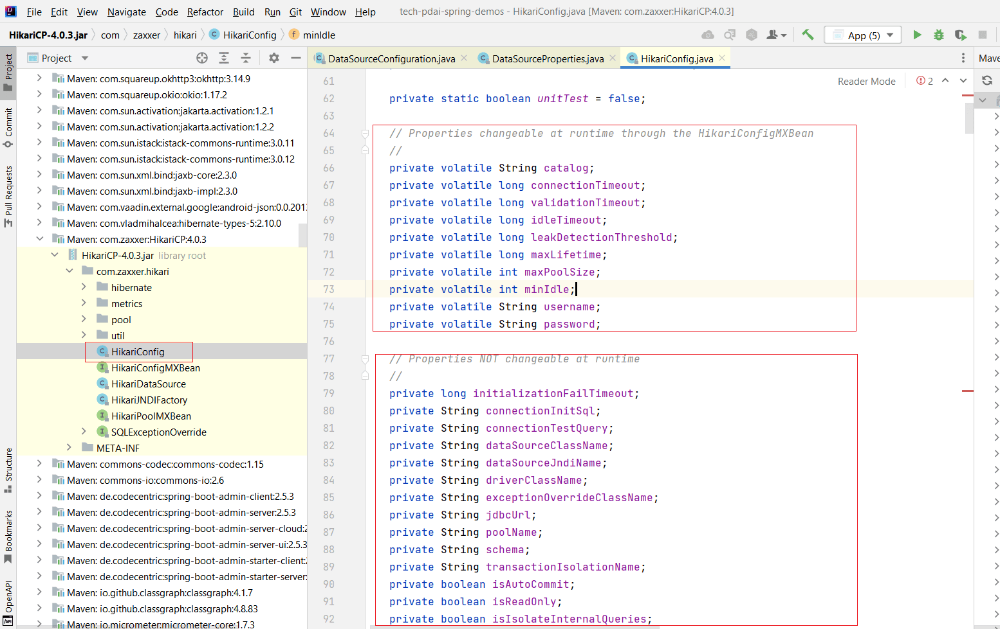
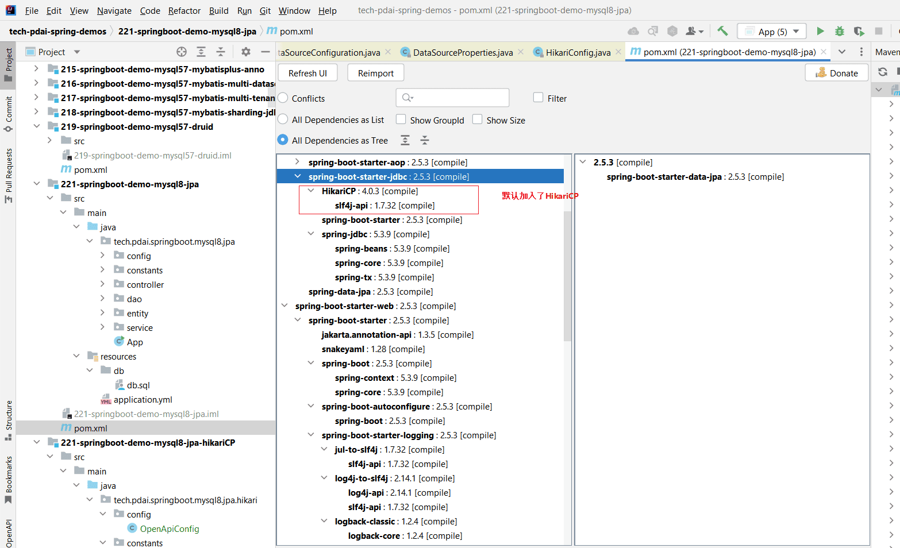

资料来源：<br/>
[SpringBoot集成连接池 - 数据库连接池和默认连接池HikariCP](https://pdai.tech/md/spring/springboot/springboot-x-mysql-HikariCP.html)


## 什么是数据库连接池？

> 什么是连接池，它要解决什么样的问题呢？

数据库连接池负责分配、管理和释放数据库连接，它允许应用程序重复使用一个现有的数据库连接，而不是再重新建立一个；释放空闲时间超过最大空闲时间的数据库连接来避免因为没有释放数据库连接而引起的数据库连接遗漏。这项技术能明显提高对数据库操作的性能。

###  数据库连接池基本原理？

连接池基本的思想是在系统初始化的时候，将数据库连接作为对象存储在内存中，当用户需要访问数据库时，并非建立一个新的连接，而是从连接池中取出一个已建立的空闲连接对象。使用完毕后，用户也并非将连接关闭，而是将连接放回连接池中，以供下一个请求访问使用。而连接的建立、断开都由连接池自身来管理。同时，还可以通过设置连接池的参数来控制连接池中的初始连接数、连接的上下限数以及每个连接的最大使用次数、最大空闲时间等等。也可以通过其自身的管理机制来监视数据库连接的数量、使用情况等。

数据库连接池的最小连接数和最大连接数的设置要考虑到下列几个因素：

- 最小连接数

是连接池一直保持的数据库连接，所以如果应用程序对数据库连接的使用量不大，将会有大量的数据库连接资源被浪费。

- 最大连接数

是连接池能申请的最大连接数，如果数据库连接请求超过此数，后面的数据库连接请求将被加入到等待队列中，这会影响之后的数据库操作。

- 最小连接数与最大连接数差距

最小连接数与最大连接数相差太大，那么最先的连接请求将会获利，之后超过最小连接数量的连接请求等价于建立一个新的数据库连接。不过，这些大于最小连接数的数据库连接在使用完不会马上被释放，它将被放到连接池中等待重复使用或是空闲超时后被释放。

### 哪些常见的数据库连接池？

> 开源的数据库连接池众多，这里我们需要了解曾经常用的开源数据库连接池及其被淘汰原因，并了解目前最常用的数据库连接池。

- **C3P0(被淘汰：历史悠久，过于复杂，性能差)**

是一个开放源代码的JDBC连接池，它在lib目录中与Hibernate一起发布，包括了实现jdbc3和jdbc2扩展规范说明的Connection 和Statement 池的DataSources 对象。由于一度是Hibernate内置的数据库连接池而被开发者熟知，但是由于性能和复杂度，官方已经放弃维护。

- **DBCP（被淘汰：依赖Commons-Pool，性能差）** DBCP（DataBase Connection Pool）属于Apache顶级项目Commons中的核心子项目。但DBCP并不是独立实现连接池功能的，它内部依赖于Commons-Pool项目，连接池最核心的“池”，就是由Commons-Pool组件提供的，因此，DBCP的性能实际上就是Pool的性能。

终于在tomcat 7.0版本中，tomcat重新设计开发出了一套连接池（**Tomcat JDBC Pool**）并且于13年9月发布了Commons-Pool 2.0。命脉已经更新的DBCP终于在14年2月份发布了DBCP2.0。但是，毕竟由于长时间没有更新突破的DBCP，已经被人放弃了。

- **BoneCP（被淘汰：为解决C3P0/DBCP性能而生，后续出现了更高性能的hikariCP，BoneCP也不再更新）**

是一个快速、开源的数据库连接池。帮用户管理数据连接，让应用程序能更快速地访问数据库。

BoneCP的出现主要是为了解决C3P0/DBCP连接池性能问题，有一些测试表明其性能提升了25倍。

后来出现了更高性能的hikariCP，BoneCP也不再更新，所以BoneCP目前也很少被使用。

- **Druid**

Druid功能最为全面，sql拦截等功能，统计数据较为全面，具有良好的扩展性

------

### 简单示例

```yaml
spring:
  datasource:
    url: jdbc:mysql://localhost:3306/test_db?useSSL=false&autoReconnect=true&characterEncoding=utf8
    driver-class-name: com.mysql.cj.jdbc.Driver
    username: root
    password: bfXa4Pt2lUUScy8jakXf
    # 指定为HikariDataSource
    type: com.zaxxer.hikari.HikariDataSource
    # hikari连接池配置
    hikari:
      #连接池名
      pool-name: HikariCP
      #最小空闲连接数
      minimum-idle: 5
      # 空闲连接存活最大时间，默认10分钟
      idle-timeout: 600000
      # 连接池最大连接数，默认是10
      maximum-pool-size: 10
      # 此属性控制从池返回的连接的默认自动提交行为,默认值：true
      auto-commit: true
      # 此属性控制池中连接的最长生命周期，值0表示无限生命周期，默认30分钟
      max-lifetime: 1800000
      # 数据库连接超时时间,默认30秒
      connection-timeout: 30000
      # 连接测试query
      connection-test-query: SELECT 1

```

### SpringBoot2默认连接池HikariCP是如何起作用的？

> 从SpringBoot自动初始化配置 和 默认的数据源 两个角度理解。

- **SpringBoot自动初始化配置**

关键代码如下



然后可以找到HikariCP数据源的配置



你可以发现，为了支持动态更新配置（基于MXBean)，这里还设计了一层HikariConfigMXBean接口

- **为什么说是默认的数据源呢**？

首先，springboot-starter-jdbc中默认加载了Hikari



其次，在配置初始化或者加载时都是第一个被加载的

~~~~java
private static <T extends DataSource> MappedDataSourceProperties<T> lookupPooled(ClassLoader classLoader,
    Class<T> type) {
  MappedDataSourceProperties<T> result = null;
  result = lookup(classLoader, type, result, "com.zaxxer.hikari.HikariDataSource",
      HikariDataSourceProperties::new);
  result = lookup(classLoader, type, result, "org.apache.tomcat.jdbc.pool.DataSource",
      TomcatPoolDataSourceProperties::new);
  result = lookup(classLoader, type, result, "org.apache.commons.dbcp2.BasicDataSource",
      MappedDbcp2DataSource::new);
  result = lookup(classLoader, type, result, "oracle.ucp.jdbc.PoolDataSourceImpl",
      OraclePoolDataSourceProperties::new, "oracle.jdbc.OracleConnection");
  return result;
}

~~~~

### 为什么使用


> 官网详细地说明了HikariCP所做的一些优化，总结如下：

- **字节码精简** ：优化代码，直到编译后的字节码最少，这样，CPU缓存可以加载更多的程序代码；
- **优化代理和拦截器**：减少代码，例如HikariCP的Statement proxy只有100行代码，只有BoneCP的十分之一；
- **自定义数组类型（FastStatementList）代替ArrayList**：避免每次get()调用都要进行range check，避免调用remove()时的从头到尾的扫描；
- **自定义集合类型（ConcurrentBag)**：提高并发读写的效率；
- **其它**：针对BoneCP缺陷的优化，比如对于耗时超过一个CPU时间片的方法调用的研究等。

------

著作权归@pdai所有 原文链接：https://pdai.tech/md/spring/springboot/springboot-x-mysql-HikariCP.html