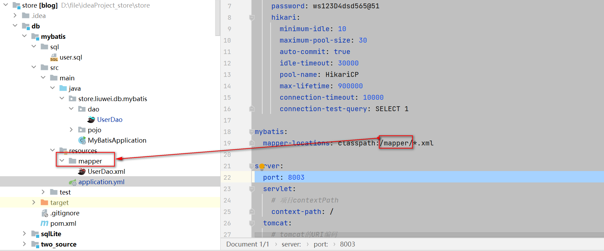

参考代码：

[gitee](https://gitee.com/L10052108/store/tree/master/db/mybatis)


## springboot集成mybatis

### 准备

**依赖的jar**

```xml
<?xml version="1.0" encoding="UTF-8"?>
<project xmlns="http://maven.apache.org/POM/4.0.0"
         xmlns:xsi="http://www.w3.org/2001/XMLSchema-instance"
         xsi:schemaLocation="http://maven.apache.org/POM/4.0.0 http://maven.apache.org/xsd/maven-4.0.0.xsd">
    <modelVersion>4.0.0</modelVersion>
    <parent>
        <groupId>store.liuwei</groupId>
        <artifactId>db</artifactId>
        <version>1.0-SNAPSHOT</version>
    </parent>

    <artifactId>mybatis</artifactId>

    <dependencies>
        <dependency>
            <groupId>org.springframework.boot</groupId>
            <artifactId>spring-boot-starter</artifactId>
        </dependency>

        <dependency>
            <groupId>org.springframework.boot</groupId>
            <artifactId>spring-boot-starter-web</artifactId>
        </dependency>
        <dependency>
            <groupId>org.springframework.boot</groupId>
            <artifactId>spring-boot-starter-test</artifactId>
            <scope>test</scope>
        </dependency>
        <dependency>
            <groupId>org.springframework.boot</groupId>
            <artifactId>spring-boot-starter-tomcat</artifactId>
            <scope>provided</scope>
        </dependency>

        <dependency>
            <groupId>org.projectlombok</groupId>
            <artifactId>lombok</artifactId>
            <optional>true</optional>
        </dependency>

        <dependency>
            <groupId>junit</groupId>
            <artifactId>junit</artifactId>
            <scope>test</scope>
        </dependency>


        <dependency>
            <groupId>mysql</groupId>
            <artifactId>mysql-connector-java</artifactId>
        </dependency>

        <!-- mybatis -->
        <dependency>
            <groupId>org.mybatis.spring.boot</groupId>
            <artifactId>mybatis-spring-boot-starter</artifactId>
            <version>1.3.2</version>
        </dependency>

        <!-- SpringBoot的Mybatis启动器 -->
        <dependency>
            <groupId>org.mybatis.spring.boot</groupId>
            <artifactId>mybatis-spring-boot-starter</artifactId>
            <version>2.2.2</version>
        </dependency>

        <dependency>
            <groupId>org.springframework.boot</groupId>
            <artifactId>spring-boot-starter-jdbc</artifactId>
        </dependency>

        <!-- mybatis end -->

    </dependencies>

    <build>
        <resources>
            <resource>
                <directory>src/main/java</directory>
                <includes>
                    <include>**/*.xml</include>
                </includes>
            </resource>
            <resource>
                <directory>src/main/resources</directory>
            </resource>
        </resources>
    </build>

</project>
```

**测试的sql**

```sql
SET FOREIGN_KEY_CHECKS=0;

-- ----------------------------
-- Table structure for user
-- ----------------------------
DROP TABLE IF EXISTS `user`;
CREATE TABLE `user`
(
    `id`       bigint(20) NOT NULL AUTO_INCREMENT,
    `username` varchar(50) NOT NULL COMMENT '用户名',
    `password` varchar(32) NOT NULL COMMENT '密码，加密存储',
    `phone`    varchar(20) DEFAULT NULL COMMENT '注册手机号',
    `email`    varchar(50) DEFAULT NULL COMMENT '注册邮箱',
    `created`  datetime    NOT NULL,
    `updated`  datetime    NOT NULL,
    PRIMARY KEY (`id`),
    UNIQUE KEY `username` (`username`) USING BTREE,
    UNIQUE KEY `phone` (`phone`) USING BTREE,
    UNIQUE KEY `email` (`email`) USING BTREE
) ENGINE=InnoDB AUTO_INCREMENT=5 DEFAULT CHARSET=utf8 COMMENT='用户表';

-- ----------------------------
-- Records of user
-- ----------------------------
INSERT INTO `user` VALUES ('1', 'zhangsan', 'e10adc3949ba59abbe56e057f20f883e', '13488888888', 'aa@a.cn', '2015-04-06 17:03:55', '2015-04-06 17:03:55');
INSERT INTO `user` VALUES ('2', 'lisi', '202cb962ac59075b964b07152d234b70', '12344444444', null, '2015-06-19 10:02:11', '2015-06-19 10:02:11');
INSERT INTO `user` VALUES ('3', 'tidy', '202cb962ac59075b964b07152d234b70', '13600112243', null, '2015-07-30 17:26:25', '2015-07-30 17:26:25');
INSERT INTO `user` VALUES ('4', 'niuniu', '202cb962ac59075b964b07152d234b70', '15866777744', '', '2015-08-01 11:48:42', '2015-08-01 11:48:42');

```

**启动类**

```java
import org.mybatis.spring.annotation.MapperScan;
import org.springframework.boot.SpringApplication;
import org.springframework.boot.autoconfigure.SpringBootApplication;

@MapperScan(value = "store.liuwei.db.mybatis.dao")
@SpringBootApplication
public class MyBatisApplication {

    public static void main(String[] args) {
        SpringApplication.run(MyBatisApplication.class, args);
    }
}
```

增加了`@MapperScan(value = "store.liuwei.db.mybatis.dao")`作用是，告诉系统扫描的持久层位置

如果不是这种，也可以采用，在接口上使用`@Mapper`

```java
import org.apache.ibatis.annotations.Mapper;
import store.liuwei.db.mybatis.pojo.User;

import java.util.List;
@Mapper
public interface UserDao {
	
	List<User> findUserList();
}
```

**二选一即可**

**配置文件**

```yaml

spring:
  datasource:
    driver-class-name: com.mysql.cj.jdbc.Driver
    url: jdbc:mysql://124.221.127.60:3306/store?useUnicode=true&characterEncoding=utf8&serverTimezone=Asia/Shanghai&useSSL=false
    username: root
    password: ws123D4dsd565@51
    hikari:
      minimum-idle: 10
      maximum-pool-size: 30
      auto-commit: true
      idle-timeout: 30000
      pool-name: HikariCP
      max-lifetime: 900000
      connection-timeout: 10000
      connection-test-query: SELECT 1

mybatis:
  mapper-locations: classpath:/mapper/*.xml

server:
  port: 8003
  servlet:
    # 项目contextPath
    context-path: /
  tomcat:
    # tomcat的URI编码
    uri-encoding: UTF-8
    # tomcat最大线程数，默认为200
    max-threads: 800
    # Tomcat启动初始化的线程数，默认值25
    min-spare-threads: 30

```

其中



指定`mapper`文件的路径

**注**：

- 在spring1.x和spring2.x中**数据库配置链接关键字有区别：**

- - 在1.x中配置的是spring.datasource.XXX.url
  - 在2.x中配置的是spring.datasource.XXX.jdbc-url

### 接口

定义的接口

```java
import org.apache.ibatis.annotations.Mapper;
import store.liuwei.db.mybatis.pojo.User;

import java.util.List;
@Mapper
public interface UserDao {
	
	List<User> findUserList();
}
```

实现的配置

```xml
<?xml version="1.0" encoding="UTF-8" ?>
<!DOCTYPE mapper PUBLIC "-//mybatis.org//DTD Mapper 3.0//EN" "http://mybatis.org/dtd/mybatis-3-mapper.dtd" >
<mapper namespace="store.liuwei.db.mybatis.dao.UserDao" >
    <!-- 	//查询所有 -->
    <!-- 	public List<User> findUserList(); -->
    <select id="findUserList" resultType="store.liuwei.db.mybatis.pojo.User">
        select * from user
    </select>
</mapper>
```

测试类

```java
import org.junit.Test;
import org.junit.runner.RunWith;
import org.springframework.beans.factory.annotation.Autowired;
import org.springframework.boot.test.context.SpringBootTest;
import org.springframework.test.context.junit4.SpringRunner;
import store.liuwei.db.mybatis.dao.UserDao;
import store.liuwei.db.mybatis.pojo.User;

import java.util.List;

@RunWith(SpringRunner.class)
@SpringBootTest
public class MybatisDemo {

    @Autowired
    private UserDao userDao;

    @Test
    public void testName1() throws Exception {
        List<User> userList = this.userDao.findUserList();
        userList.forEach(System.out::println);
    }

}
```

到此，一个简单的系统已经完成