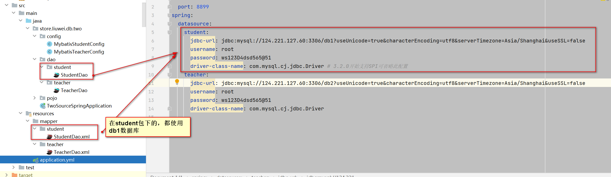

资料来源：<br/>
[SpringBoot-21-Mybatis多数据源配置](https://www.toutiao.com/article/7072000828030485004/?tt_from=weixin&utm_campaign=client_share&wxshare_count=1%C3%97tamp=1646780594&app=news_article&utm_source=weixin&utm_medium=toutiao_android&use_new_style=1&req_id=202203090703130101502221571126F741&share_token=6639b3b4-30b1-4a41-a44c-71bbb572f2cc&group_id=7072000828030485004)

[参考代码](https://gitee.com/L10052108/store/tree/master/db/two_source)

## springboot配置多数据源：

在[00_springboot集成mybatis](数据库/mybatis/00_springboot集成mybatis.md) 中使用到的是一个数据库

如果在开发中使用多个数据库怎么处理？

采用多数据源



依赖jar和单数据源相同

### 依赖的jar

```xml
<?xml version="1.0" encoding="UTF-8"?>
<project xmlns="http://maven.apache.org/POM/4.0.0"
         xmlns:xsi="http://www.w3.org/2001/XMLSchema-instance"
         xsi:schemaLocation="http://maven.apache.org/POM/4.0.0 http://maven.apache.org/xsd/maven-4.0.0.xsd">
    <modelVersion>4.0.0</modelVersion>
    <parent>
        <groupId>store.liuwei</groupId>
        <artifactId>db</artifactId>
        <version>1.0-SNAPSHOT</version>
    </parent>

    <artifactId>two_source</artifactId>

    <dependencies>
        <dependency>
            <groupId>org.springframework.boot</groupId>
            <artifactId>spring-boot-starter</artifactId>
        </dependency>

        <dependency>
            <groupId>org.springframework.boot</groupId>
            <artifactId>spring-boot-starter-web</artifactId>
        </dependency>
        <dependency>
            <groupId>org.springframework.boot</groupId>
            <artifactId>spring-boot-starter-test</artifactId>
            <scope>test</scope>
        </dependency>
        <dependency>
            <groupId>org.springframework.boot</groupId>
            <artifactId>spring-boot-starter-tomcat</artifactId>
            <scope>provided</scope>
        </dependency>

        <dependency>
            <groupId>org.projectlombok</groupId>
            <artifactId>lombok</artifactId>
            <optional>true</optional>
        </dependency>

        <dependency>
            <groupId>junit</groupId>
            <artifactId>junit</artifactId>
            <scope>test</scope>
        </dependency>


        <dependency>
            <groupId>mysql</groupId>
            <artifactId>mysql-connector-java</artifactId>
        </dependency>

        <!-- mybatis -->
        <dependency>
            <groupId>org.mybatis.spring.boot</groupId>
            <artifactId>mybatis-spring-boot-starter</artifactId>
            <version>1.3.2</version>
        </dependency>

        <!-- SpringBoot的Mybatis启动器 -->
        <dependency>
            <groupId>org.mybatis.spring.boot</groupId>
            <artifactId>mybatis-spring-boot-starter</artifactId>
            <version>2.2.2</version>
        </dependency>

        <dependency>
            <groupId>org.springframework.boot</groupId>
            <artifactId>spring-boot-starter-jdbc</artifactId>
        </dependency>

        <!-- mybatis end -->

    </dependencies>

    <build>
        <resources>
            <resource>
                <directory>src/main/java</directory>
                <includes>
                    <include>**/*.xml</include>
                </includes>
            </resource>
            <resource>
                <directory>src/main/resources</directory>
            </resource>
        </resources>
    </build>

</project>
```


### sql

使用的`sql`和单数据源相同，修改了表的名称

`db1`中`user`修改成`student`

`db2`中`user`修改成`teacher`

**student.sql**

~~~~sql
SET FOREIGN_KEY_CHECKS=0;

-- ----------------------------
-- Table structure for user
-- ----------------------------
DROP TABLE IF EXISTS `student`;
CREATE TABLE `student`
(
    `id`       bigint(20) NOT NULL AUTO_INCREMENT,
    `username` varchar(50) NOT NULL COMMENT '用户名',
    `password` varchar(32) NOT NULL COMMENT '密码，加密存储',
    `phone`    varchar(20) DEFAULT NULL COMMENT '注册手机号',
    `email`    varchar(50) DEFAULT NULL COMMENT '注册邮箱',
    `created`  datetime    NOT NULL,
    `updated`  datetime    NOT NULL,
    PRIMARY KEY (`id`),
    UNIQUE KEY `username` (`username`) USING BTREE,
    UNIQUE KEY `phone` (`phone`) USING BTREE,
    UNIQUE KEY `email` (`email`) USING BTREE
) ENGINE=InnoDB AUTO_INCREMENT=5 DEFAULT CHARSET=utf8 COMMENT='用户表';

-- ----------------------------
-- Records of user
-- ----------------------------
INSERT INTO `student` VALUES ('1', 'zhangsan', 'e10adc3949ba59abbe56e057f20f883e', '13488888888', 'aa@a.cn', '2015-04-06 17:03:55', '2015-04-06 17:03:55');
INSERT INTO `student` VALUES ('2', 'lisi', '202cb962ac59075b964b07152d234b70', '12344444444', null, '2015-06-19 10:02:11', '2015-06-19 10:02:11');
~~~~

**teacher.sql**

```sql
SET FOREIGN_KEY_CHECKS=0;

-- ----------------------------
-- Table structure for user
-- ----------------------------
DROP TABLE IF EXISTS `teacher`;
CREATE TABLE `teacher`
(
    `id`       bigint(20) NOT NULL AUTO_INCREMENT,
    `username` varchar(50) NOT NULL COMMENT '用户名',
    `password` varchar(32) NOT NULL COMMENT '密码，加密存储',
    `phone`    varchar(20) DEFAULT NULL COMMENT '注册手机号',
    `email`    varchar(50) DEFAULT NULL COMMENT '注册邮箱',
    `created`  datetime    NOT NULL,
    `updated`  datetime    NOT NULL,
    PRIMARY KEY (`id`),
    UNIQUE KEY `username` (`username`) USING BTREE,
    UNIQUE KEY `phone` (`phone`) USING BTREE,
    UNIQUE KEY `email` (`email`) USING BTREE
) ENGINE=InnoDB AUTO_INCREMENT=5 DEFAULT CHARSET=utf8 COMMENT='用户表';

-- ----------------------------
-- Records of user
-- ----------------------------
INSERT INTO `teacher` VALUES ('3', 'tidy', '202cb962ac59075b964b07152d234b70', '13600112243', null, '2015-07-30 17:26:25', '2015-07-30 17:26:25');
INSERT INTO `teacher` VALUES ('4', 'niuniu', '202cb962ac59075b964b07152d234b70', '15866777744', '', '2015-08-01 11:48:42', '2015-08-01 11:48:42');
```

### yaml配置

在项目的application.yml中设置要链接的数据库，配置如下：

```yaml
server:
  port: 8899
spring:
  datasource:
    student:
      jdbc-url: jdbc:mysql://124.221.127.60:3306/db1?useUnicode=true&characterEncoding=utf8&serverTimezone=Asia/Shanghai&useSSL=false
      username: root
      password: ws123D4dsd565@51
      driver-class-name: com.mysql.cj.jdbc.Driver # 3.2.0开始支持SPI可省略此配置
    teacher:
      jdbc-url: jdbc:mysql://124.221.127.60:3306/db2?useUnicode=true&characterEncoding=utf8&serverTimezone=Asia/Shanghai&useSSL=false
      username: root
      password: ws123D4dsd565@51
      driver-class-name: com.mysql.cj.jdbc.Driver
```

### pojo

`Student.java`

```java
import lombok.Data;

import java.io.Serializable;
import java.util.Date;

@Data
public class Student implements Serializable {
	private static final long serialVersionUID = 1L;
	private Long id;
    private String username;
    private String password;
    private String phone;
    private String email;
    private Date created;
    private Date updated;
}
```

`Teacher.java`

```java

import lombok.Data;

import java.io.Serializable;
import java.util.Date;

@Data
public class Teacher implements Serializable {
	private static final long serialVersionUID = 1L;
	private Long id;
    private String username;
    private String password;
    private String phone;
    private String email;
    private Date created;
    private Date updated;
}
```

### dao 

`StudentDao`

```java
import store.liuwei.db.two.pojo.Student;

import java.util.List;
public interface StudentDao {
	
	List<Student> findUserList();
}
```

对应的xml配置

```xml
<?xml version="1.0" encoding="UTF-8" ?>
<!DOCTYPE mapper PUBLIC "-//mybatis.org//DTD Mapper 3.0//EN" "http://mybatis.org/dtd/mybatis-3-mapper.dtd" >
<mapper namespace="store.liuwei.db.two.dao.student.StudentDao" >
    <!-- 	//查询所有 -->
    <!-- 	public List<User> findUserList(); -->
    <select id="findUserList" resultType="store.liuwei.db.two.pojo.Student">
        select * from student
    </select>
</mapper>
```


`TeacherDao`

~~~~java
import store.liuwei.db.two.pojo.Teacher;

import java.util.List;
public interface TeacherDao {
	
	List<Teacher> findUserList();
}
~~~~

对应的xml配置

```xml
<?xml version="1.0" encoding="UTF-8" ?>
<!DOCTYPE mapper PUBLIC "-//mybatis.org//DTD Mapper 3.0//EN" "http://mybatis.org/dtd/mybatis-3-mapper.dtd" >
<mapper namespace="store.liuwei.db.two.dao.teacher.TeacherDao" >
    <!-- 	//查询所有 -->
    <!-- 	public List<User> findUserList(); -->
    <select id="findUserList" resultType="store.liuwei.db.two.pojo.Teacher">
        select * from teacher
    </select>
</mapper>
```

### 配置

```java

import org.apache.ibatis.session.SqlSessionFactory;
import org.mybatis.spring.SqlSessionFactoryBean;
import org.mybatis.spring.SqlSessionTemplate;
import org.mybatis.spring.annotation.MapperScan;
import org.springframework.boot.context.properties.ConfigurationProperties;
import org.springframework.boot.jdbc.DataSourceBuilder;
import org.springframework.context.annotation.Bean;
import org.springframework.context.annotation.Configuration;
import org.springframework.context.annotation.Primary;
import org.springframework.core.io.support.PathMatchingResourcePatternResolver;
import javax.sql.DataSource;

@Configuration
//数据源student库接口存放目录
@MapperScan(basePackages = "store.liuwei.db.two.dao.student",
        sqlSessionTemplateRef = "sqlSessionTemplateStudent")
public class MybatisStudentConfig {
    /**
     * 主数据源默认使用Student
     *
     * @return
     */
    @Primary
    @Bean
    @ConfigurationProperties(prefix = "spring.datasource.student")
    public DataSource studentDataSource() {
        return DataSourceBuilder.create().build();
    }
    @Bean
    public SqlSessionFactory sqlSessionFactoryStudent() throws Exception {
        SqlSessionFactoryBean bean = new SqlSessionFactoryBean();
        bean.setDataSource(studentDataSource());
        //设置XML文件存放位置.注意这里student目录
        bean.setMapperLocations(new PathMatchingResourcePatternResolver()
                .getResources("classpath:mapper/student/*.xml")); 
        return bean.getObject();
    }
    @Bean
    public SqlSessionTemplate sqlSessionTemplateStudent() throws Exception {
        return new SqlSessionTemplate(sqlSessionFactoryStudent());
    }
}
```
注：

- 主数据源要是有**@Primary**进行表示

- `bean.setMapperLocations(new PathMatchingResourcePatternResolver()
  .getResources("classpath:mapper/teacher/*.xml"))`;用于配置xml的位置
- -配置类上使用`@MapperScan`注解来是用来扫描实体类和Mapper包路径

~~~~java

import org.apache.ibatis.session.SqlSessionFactory;
import org.mybatis.spring.SqlSessionFactoryBean;
import org.mybatis.spring.SqlSessionTemplate;
import org.mybatis.spring.annotation.MapperScan;
import org.springframework.boot.context.properties.ConfigurationProperties;
import org.springframework.boot.jdbc.DataSourceBuilder;
import org.springframework.context.annotation.Bean;
import org.springframework.context.annotation.Configuration;
import org.springframework.core.io.support.PathMatchingResourcePatternResolver;

import javax.sql.DataSource;

@Configuration
//数据源teacher库接口存放目录
@MapperScan(basePackages = "store.liuwei.db.two.dao.teacher",
        sqlSessionTemplateRef = "sqlSessionTemplateTeacher")
public class MybatisTeacherConfig {
    /**
     * 主数据源默认使用Student
     *
     * @return
     */
    @Bean
    @ConfigurationProperties(prefix = "spring.datasource.teacher")
    public DataSource teacherDataSource() {
        return DataSourceBuilder.create().build();
    }

    @Bean
    public SqlSessionFactory sqlSessionFactoryTeacher() throws Exception {
        SqlSessionFactoryBean bean = new SqlSessionFactoryBean();
        bean.setDataSource(teacherDataSource());
        //设置XML文件存放位置,注意这里teacher目录
        bean.setMapperLocations(new PathMatchingResourcePatternResolver()
                .getResources("classpath:mapper/teacher/*.xml"));
        return bean.getObject();
    }

    @Bean
    public SqlSessionTemplate sqlSessionTemplateTeacher() throws Exception {
        return new SqlSessionTemplate(sqlSessionFactoryTeacher());
    }
}
~~~~

### 测试

```java
import org.junit.Test;
import org.junit.runner.RunWith;
import org.springframework.beans.factory.annotation.Autowired;
import org.springframework.boot.test.context.SpringBootTest;
import org.springframework.test.context.junit4.SpringRunner;
import store.liuwei.db.two.dao.student.StudentDao;
import store.liuwei.db.two.dao.teacher.TeacherDao;
import store.liuwei.db.two.pojo.Student;
import store.liuwei.db.two.pojo.Teacher;

import java.util.List;

@RunWith(SpringRunner.class)
@SpringBootTest
public class MybatisDemo {

    @Autowired
    private TeacherDao teacherDao;

    @Autowired
    private StudentDao studentDao;

    @Test
    public void testName1() throws Exception {
        List<Teacher> userList = this.teacherDao.findUserList();
        userList.forEach(System.out::println);
    }

    @Test
    public void testName2() throws Exception {
        List<Student> userList = this.studentDao.findUserList();
        userList.forEach(System.out::println);
    }

}
```

