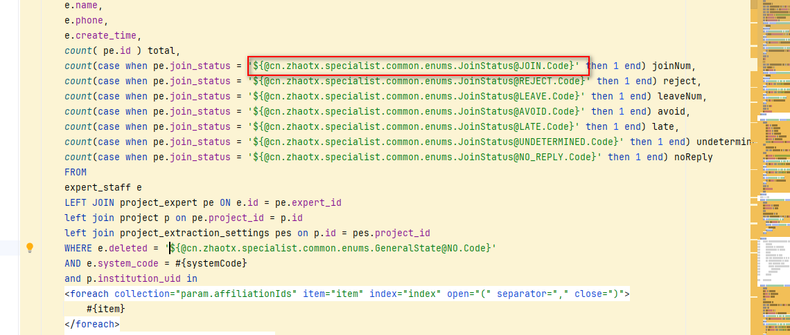

资料来源：<br/>
[Mybatis union 循环](https://blog.csdn.net/sinat_36454672/article/details/109287098)<br/>
[union all和union的区别用法](https://xue.baidu.com/okam/pages/strategy-tp/index?source=aladdin_36402&sa=aladdin_36402&strategyId=129466835353908)<br/>
[Mybatis 特殊符号(大于，小于，不等于)及常用函数总结](https://blog.csdn.net/jianxia801/article/details/90672581)


## 批量写入

- 接口

~~~~java
public interface WjVestJobDetailMapper extends BaseMapper<WjVestJobDetail> {


    void insertList(List<WjVestJobDetail> list);

}
~~~~

- 配置文件

~~~~xml
<?xml version="1.0" encoding="UTF-8"?>
<!DOCTYPE mapper PUBLIC "-//mybatis.org//DTD Mapper 3.0//EN" "http://mybatis.org/dtd/mybatis-3-mapper.dtd">
<mapper namespace="xyz.guqing.creek.mapper.WjVestJobDetailMapper">

    <insert id="insertList" parameterType="xyz.guqing.creek.model.entity.WjVestJobDetail">
        insert into wj_vest_job_detail ( comm_id, user_id,
                                        action_type, job_status, fail_reason,
                                        plan_time, execute_time, execute_id)
        values
        <foreach collection ="list" item="detail" separator =",">
               ( #{detail.commId,jdbcType=BIGINT}, #{detail.userId,jdbcType=BIGINT},
                #{detail.actionType,jdbcType=TINYINT}, #{detail.jobStatus,jdbcType=TINYINT}, #{detail.failReason,jdbcType=VARCHAR},
                #{detail.planTime,jdbcType=TIMESTAMP}, #{detail.executeTime,jdbcType=TIMESTAMP}, #{detail.executeId,jdbcType=BIGINT}
                )
        </foreach >
    </insert>

</mapper>
~~~~

### in

~~~~xml
 <foreach collection="topicIds" item="id" open="(" close=")" separator=",">
            #{id}
 </foreach>
~~~~

### union

~~~~sql
	<foreach collection="nameList" item="name" separator="union">
		select id  from table where name = #{name}
	</foreach>

   List<Object> getList(@Param("nameList")String[] nameList);  
~~~~
union all和union的区别：取结果的交集，union对两个结果集进行并集操作，不包括重复行，相当于distinct，同时进行默认规则的排序;union all：对两个结果集进行并集操作，包括重复行，即所有的结果全部显示，不管是不是重复。

Union因为要进行重复值扫描，所以效率低。如果合并没有刻意要删除重复行，那么就使用Union All。

两个要联合的SQL语句 字段个数必须一样，而且字段类型要“相容”(一致);

如果我们需要将两个select语句的结果作为一个整体显示出来，我们就需要用到union或者union all关键字。union(或称为联合)的作用是将多个结果合并在一起显示出来。

union和union all的区别是,union会自动压缩多个结果集合中的重复结果，而union all则将所有的结果全部显示出来，不管是不是重复。

Union：对两个结果集进行并集操作，不包括重复行，同时进行默认规则的排序;

Union All：对两个结果集进行并集操作，包括重复行，不进行排序;

Intersect：对两个结果集进行交集操作，不包括重复行，同时进行默认规则的排序;

Minus：对两个结果集进行差操作，不包括重复行，同时进行默认规则的排序。

## 转义

### 转义特殊符号方式

注释：严格地讲，在 XML 中仅有字符 "<"和"&" 是非法的。省略号、引号和大于号是合法的，但是把它们替换为实体引用是个好的习惯。

|   符号   | 原符号 | 替换符号 |
| :------: | :----: | :------: |
|   小于   |   <    |   `&lt;`   |
| 小于等于 |   <=   |  `&lt;=`   |
|   大于   |   >    |  ` &gt;`   |
| 大于等于 |   >=   |  `&gt;=`   |
|  不等于  |   <>   | `&lt;&gt;` |
|    与    |   &    | ` &amp;`   |
|  单引号  |   ’    |  `&apos; ` |
|  双引号  |   "    | ` &quot; ` |

```java
mapper文件写法： 
select * form tablenme t where t.code &lt;&gt; 1
```

### 2.2、使用 CDATA 区段

**所有 XML 文档中的文本均会被解析器解析。只有 CDATA 区段（CDATA section）中的文本会被解析器忽略。**

```java
大于等于 <![CDATA[ >= ]]>  
小于等于 <![CDATA[ <= ]]> 
不等于<![CDATA[ <> ]]>
 
mapper文件写法： 
select t.* form tablenme t where t.code <![CDATA[<>]]> 1
```

### Mybatis if 判断等于一个字符串

当传入的type的值为note 的时候，if判断内的sql也不会执行。

```java
<if test="type=='note'">  
    and status = 0   
</if>
```

mybatis是使用的OGNL表达式来进行解析的，在OGNL的表达式中，'note'会被解析成字符，因为java是强类型的，char 和 一个String 会导致不等。所以if标签中的sql不会被解析。

需要解决这个问题，只需要把代码修改成：

```java
    <if test='type=="note"'>  //注意是双引号，不是单引号！！！
        and status = 0   
    </if> 
```

### mysql二进制转成字符串

```java
SELECT  cast(fieldName as CHAR)  FROM tablename 
```

### 使用美枚举




```sql
 WHERE e.deleted = '${@cn.zhaotx.specialist.common.enums.GeneralState@NO.Code}'
```

