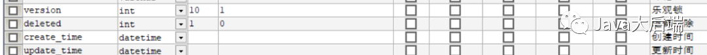

资料来源：<br/>
[看完这篇，你还不会用MyBatis-Plus？](https://blog.csdn.net/Gaowumao/article/details/123860421)


### Mybatis-plus概述

MyBatis-Plus（简称 MP）是一个 MyBatis的增强工具，在 MyBatis 的基础上只做增强不做改变，为简化开发、提高效率而生。


特点：

- **无侵入：** 只做增强不做改变，引入它不会对现有工程产生影响，如丝般顺滑
- **损耗小：** 启动即会自动注入基本 CURD，性能基本无损耗，直接面向对象操作
- **强大的 CRUD 操作：** 内置通用 Mapper、通用 Service，仅仅通过少量配置即可实现单表大部分 CRUD 操作，更有强大的条件构造器，满足各类使用需求
- **支持 Lambda 形式调用：** 通过 Lambda 表达式，方便的编写各类查询条件，无需再担心字段写错
- **支持主键自动生成：** 支持多达 4 种主键策略（内含分布式唯一 ID 生成器 - Sequence），可自由配置，完美解决主键问题
- **支持 ActiveRecord 模式：** 支持 ActiveRecord 形式调用，实体类只需继承 Model 类即可进行强大的 CRUD 操作
- **支持自定义全局通用操作：** 支持全局通用方法注入（ Write once, use anywhere ）
- **内置代码生成器：** 采用代码或者 Maven 插件可快速生成 Mapper 、 Model 、 Service 、 Controller 层代码，支持模板引擎，更有超多自定义配置等您来使用
- **内置分页插件：** 基于 MyBatis 物理分页，开发者无需关心具体操作，配置好插件之后，写分页等同于普通 List 查询
- **分页插件支持多种数据库：** 支持 MySQL、MariaDB、Oracle、DB2、H2、HSQL、SQLite、Postgre、SQLServer 等多种数据库
- **内置性能分析插件：** 可输出 Sql 语句以及其执行时间，建议开发测试时启用该功能，能快速揪出慢查询
- **内置全局拦截插件：** 提供全表 delete 、 update 操作智能分析阻断，也可自定义拦截规则，预防误操作

### 快速开始

1、创建数据库和表

```sql
DROP TABLE IF EXISTS user;

CREATE TABLE user
(
 id BIGINT(20) NOT NULL COMMENT '主键ID',
 name VARCHAR(30) NULL DEFAULT NULL COMMENT '姓名',
 age INT(11) NULL DEFAULT NULL COMMENT '年龄',
 email VARCHAR(50) NULL DEFAULT NULL COMMENT '邮箱',
 PRIMARY KEY (id)
);
```

2、向数据库中添加数据

```sql
INSERT INTO user (id, name, age, email) VALUES
(1, 'Jone', 18, 'test1@baomidou.com'),
(2, 'Jack', 20, 'test2@baomidou.com'),
(3, 'Tom', 28, 'test3@baomidou.com'),
(4, 'Sandy', 21, 'test4@baomidou.com'),
(5, 'Billie', 24, 'test5@baomidou.com');
```

3、创建一个SpringBoot项目并添加依赖

```xml
<dependency>
      <groupId>com.baomidou</groupId>
      <artifactId>mybatis-plus-boot-starter</artifactId>
      <version>Latest Version</version>
</dependency>
```

4、配置数据库连接

```properties
spring.datasource.driver-class-name=com.mysql.cj.jdbc.Driver
#mysql 8 需要配置时区，不然会出现启动报错的情况   serverTimezone=GMT%2B8
spring.datasource.url=jdbc:mysql://localhost:3306/mybatis_plus?serverTimezone=GMT%2B8&useSSL=true&useUnicode=true&characterEncoding=utf8
spring.datasource.username=root
spring.datasource.password=233031
```

5、编写实体类

```java
/*用户实体类*/
public class User {
    private Long id;
    private String name;
    private Integer age;
    private String email;

    //构造方法
    //GET、Set方法
}
```

6、编写UserMapper

```java
/*在对应的Mapper上面继承基本的类 BaseMapper*/
@Repository
public interface UserMapper extends BaseMapper<User> {
    /*所有的CRUD已经编写完成*/
}
//写@Repository注解，需要在主类添加MapperScan扫描mapper包
//写@Mapper则不需要
```

### 配置日志

在启动`@Test`需要显示Sql的细节需要配置日志

```properties
#配置日志
mybatis-plus.configuration.log-impl=org.apache.ibatis.logging.stdout.StdOutImpl
```

### CRUD扩展

#### 插入操作

- insert

```java
//测试插入
@Test
public void testInsert(){
    User user = new User();
    user.setName("派大星学Java");
    user.setAge(16);
    user.setEmail("none-j@qq.com");

    int insert = userMapper.insert(user);//帮我们自动生成id
    System.out.println(insert);//受影响的行数
    System.out.println(user);//发现，id会自动回填
}
```

数据库插入的id的默认值为：全局的唯一id。

##### 主键生成策略

默认 ID_WORKER 全局唯一

雪花算法：

> snowflake是Twitter开源的分布式ID生成算法，结果是一个long型的ID。其核心思想是：使用41bit作为毫秒数，10bit作为机器的ID（5个bit是数据中心，5个bit的机器ID），12bit作为毫秒内的流水号（意味着每个节点在每毫秒可以产生4096个ID），最后有一个符号，永远是0。可以保证几乎是全球唯一！另外，搜索公众号顶级架构师后台回复“架构整洁”，获取一份惊喜礼包。

##### 主键自增

我们需要配置主键自增：

1、实体类字段上`@TableId(type = IdType.AUTO)`

2、数据库字段一定要是自增！


##### 其他的源码解释

```java
public enum IdType{
    AUTO(0),//数据库id自增
    NONE(1),//未设置主键
    INPUT(2),//手动输入   一旦手动输入id之后，就需要自己设置id了
    ID_WORKER(3),//默认的全局唯一id
    UUID(4),//全局唯一id UUID
    ID_WORKER_STR(5),//ID_WORKER 字符串表示法
}
```

#### 更新操作

```java
//更新操作
@Test
public void updateTest(){
    User user = new User();
    user.setId(5L);
    user.setName("我想创建公众号");
    user.setAge(16);

    int i = userMapper.updateById(user);
    System.out.println(i);

}
```


所有的SQL都是自动帮你动态配置的！

##### 自动填充

创建时间、修改时间！这些个操作一遍都是自动化完成的，我们 不希望手动更新！

> 阿里巴巴开发手册：所有的数据库表：`gmt_create`、`gmt_modified`几乎所有的表都要配置上！而且需要自动化！

**方式一：数据库级别（工作中不允许更改数据库）**

1、在表中新增字段`create_time`、`update_time`


```java
private Date createTime;
private Date updateTime;
```

**方式二：代码级别**

1、删除数据库中的默认值、更新操作！


2、实体类字段属性需要增加注解

```java
//字段添加填充内容
@TableField(fill = FieldFill.INSERT)
private Date createTime;
@TableField(fill = FieldFill.INSERT_UPDATE)
private Date updateTime;
```

3、编写处理器来处理这个注解即可！

```sql
@Slf4j//日志
@Component
public class MyDateObjectHandler implements MetaObjectHandler {

    //插入时的填充策略
    @Override
    public void insertFill(MetaObject metaObject) {
        this.setFieldValByName("createTime",new Date(),metaObject);
        this.setFieldValByName("updateTime",new Date(),metaObject);

    }
    //更新时的填充策略
    @Override
    public void updateFill(MetaObject metaObject) {
        this.setFieldValByName("updateTime",new Date(),metaObject);
    }
}
```

4、测试插入

5、测试更新，观察时间即可！

##### 乐观锁

在面试过程中，我们经常会被问到乐观锁，悲观锁！

- **乐观锁：** 故名思议十分乐观，它总是认为不会出现问题，无论干什么不去上锁！如果出了问题，再次更新值测试
- **悲观锁：** 故名思议十分悲观，它总是认为总是出现问题，无论干什么都会上锁！再去操作！


乐观锁实现方式：

- 取出记录时，获取当前version
- 更新时，带上这个version
- 执行更新时， `set version = newVersion where version = oldVersion`
- 如果version不对，就更新失败

```sql
--A
update user set name = "wumao",version = version + 1
where id = 2 and version = 1

--B  线程抢先完成，这个时候 version = 2，会导致A修改失败
update user set name = "wumao",version = version + 1
where id = 2 and version = 1
```

##### 测试一下MP的乐观锁插件

1、给数据库中加入version字段


2、给实体类加上对应的字段！

```java
@Version//乐观锁Version的注解
private Integer version;
```

3、注册组件。另外，搜索公众号Linux就该这样学后台回复“猴子”，获取一份惊喜礼包。

```java
@MapperScan("com.pdx.mapper")//扫描mapper文件夹
@EnableTransactionManagement
@Configuration//配置类
public class MyBatisPlusConfig  {

    @Bean
    public OptimisticLockerInterceptor optimisticLockerInterceptor() {
        return new OptimisticLockerInterceptor();
    }
}
```

4、测试乐观锁

```java
//测试乐观锁
//成功案例
@Test
public void versionTest(){
    User user = userMapper.selectById(1L);
    user.setName("派大星");
    user.setEmail("admin@qq.com");
    userMapper.updateById(user);
}

//乐观锁失败案例----多线程
@Test
public void OptimisticLockerTest(){
    User user = userMapper.selectById(1L);
    user.setName("派大星111");
    user.setEmail("admin@qq.com");

    //模拟另外一个线程执行了插队操作
    User user2 = userMapper.selectById(1L);
    user.setName("派大星222");
    user.setEmail("admin@qq.com");
    userMapper.updateById(user2);

    userMapper.updateById(user);
}
```

#### 查询操作

```java
//查询操作
@Test
public void testSelect(){
    User user = userMapper.selectById(1L);
    System.out.println(user);
}
//批量查询
@Test
public void testBatchList(){
    List<User> users = userMapper.selectBatchIds(Arrays.asList(1, 2, 3));
    users.forEach(System.out::println);
}

//按条件查询 map操作
@Test
public void testSelectMap(){
    HashMap<String, Object> map = new HashMap<>();
    map.put("name","派大星");
    map.put("age",16);

    List<User> users = userMapper.selectByMap(map);
    users.forEach(System.out::println);
}
```

#### 分页查询

分页在网站使用的十分之多！

- 原始的limit 进行分页
- pageHelper 第三方插件
- MP内置了分页插件

##### 如何使用！

1、配置拦截器

```java
//分页插件
@Bean
public PaginationInterceptor paginationInterceptor() {
    return new PaginationInterceptor();
}
```

2、分页查询

```java
//分页查询
@Test
public void PageTest(){
    //参数一：当前页
    //参数二：页的大小
    //使用了分页插件之后，所有的分页操作也变得简单！
    Page<User> page = new Page<>(1,5);

    IPage<User> pages = userMapper.selectPage(page, null);
    pages.getRecords().forEach(System.out::println);
}
```

#### 删除操作

基本的删除操作

```java
//删除操作
@Test
public void deletTest(){
    userMapper.deleteById(1398260764485095426L);
}
//批量删除
@Test
public void deletBatchTest(){
    userMapper.deleteBatchIds(Arrays.asList(1398201429172178946L,5));
}
@Test
public void deletByMap(){
    HashMap<String, Object> map = new HashMap<>();
    map.put("name","我想创建公众号");
    userMapper.deleteByMap(map);
}
```

我们在工作中会遇到一些问题：逻辑删除！

- **物理删除：** 从数据库中直接移除
- **逻辑删除：** 在数据库中没有被移除，而是通过一个变量让他无效！`delete = 0 —> delete = 1`

管理员可以查看被删除的记录！防止数据的丢失，类似于回收站！

**测试一下：**

1、在数据库中增加一个deleted字段



2、在pojo中增加新的属性

```java
@TableLogic//逻辑删除
private Integer deleted;
```

3、配置组件

```java
@Bean//逻辑删除组件
public ISqlInjector sqlInjector(){
    return new LogicSqlInjector();
}
#配置逻辑删除  1 删除  0 未删除
mybatis-plus.global-config.db-config.logic-delete-value=1
mybatis-plus.global-config.db-config.logic-not-delete-value=0
```

4、测试一下：

```java
  //逻辑删操作
    @Test
    public void deleteLogic(){
        int i = userMapper.deleteById(1L);
        System.out.println(i);
    }
```


记录依旧在数据库中！

以上的所有CRUD操作及其扩展操作，我们必须精通掌握！


**性能分析插件**

我们在平时的开发中，会遇到一些慢SQL，测试！Druid…

- 作用：性能分析拦截器，用于输出每条SQL语句及其执行时间

MP也提供了性能分析插件，如果超过这个时间就停止运行！

1、导入插件

```java
 /*
  * SQL执行效率插件
  * */
 @Bean
 @Profile({"dev","test"})//设置dev test 环境开启，保证我们的效率
 public PerformanceInterceptor performanceInterceptor(){
     PerformanceInterceptor performanceInterceptor = new PerformanceInterceptor();
     performanceInterceptor.setMaxTime(100);//ms  设置SQL执行的最大时间，如果超过了则不执行
     performanceInterceptor.setFormat(true);//是否格式化代码
     return performanceInterceptor;
 }
```

> 记住，要在SpringBoot中配置环境为dev或者test环境

2、测试使用！

```java
@Test
void contextLoads() {
    List<User> users = userMapper.selectList(null);

    for (User user : users) {
        System.out.println(user);
    }
}
```


### 条件构造器

> 十分重要！！！！

测试一下：

```java
@Test
public void wapperTest(){
    //查询name不为空的用户，并且邮箱不为空的用户，年龄大于12
    QueryWrapper<User> wrapper = new QueryWrapper<>();

    wrapper
            .isNotNull("name")
            .isNotNull("email")
            .ge("age",12);
    userMapper.selectList(wrapper).forEach(System.out::println);

}
```

测试二：

```java
@Test
  void test2(){
      //查询名字为五毛
      QueryWrapper<User> wrapper = new QueryWrapper<>();
      wrapper.eq("name","派大星");
      User user = userMapper.selectOne(wrapper);
      System.out.println(user);
  }
```

测试三：

```java
@Test
void test3(){
    //查询年龄在16-30岁之间的用户
    QueryWrapper<User> wrapper = new QueryWrapper<>();

    wrapper.between("age",16,30);
    Integer count = userMapper.selectCount(wrapper);
    System.out.println(count);
}
```

测试四：记住查看输出的SQL进行分析

```java
//模糊查询
@Test
void test4(){
    QueryWrapper<User> wrapper = new QueryWrapper<>();
    //左和右  是指通配符在左边还是右边 t%
    wrapper.notLike("name","l")
            .likeRight("email","t");
    List<Map<String, Object>> maps = userMapper.selectMaps(wrapper);
    maps.forEach(System.out::println);
}
```

测试五：

```java
@Test
void test5(){
    QueryWrapper<User> wrapper = new QueryWrapper<>();
    // id 在子查询中查出来
    wrapper.inSql("id","select id from user where id<3");
    List<Object> objects = userMapper.selectObjs(wrapper);
    objects.forEach(System.out::println);

}
```

测试六：

```java
//排序
@Test
void test6(){
    QueryWrapper<User> wrapper = new QueryWrapper<>();

    wrapper.orderByDesc("id");

    //通过id进行排序
    List<User> users = userMapper.selectList(wrapper);
    users.forEach(System.out::println);

}
```

### 代码自动生成器

`AutoGenerator` 是 `MyBatis-Plus `的代码生成器，通过 `AutoGenerator` 可以快速生成` Entity、Mapper、Mapper XML、Service、Controller` 等各个模块的代码，极大的提升了开发效率。

```java
public class Generator{
    public static void main(String[] args){
    // 1、创建代码生成器
        AutoGenerator mpg = new AutoGenerator();

        // 2、全局配置
        GlobalConfig gc = new GlobalConfig();
        String projectPath = System.getProperty("user.dir");
        gc.setOutputDir(projectPath + "/src/main/java");
        gc.setAuthor("派大星");
        gc.setOpen(false); //生成后是否打开资源管理器
        gc.setFileOverride(false); //重新生成时文件是否覆盖
        gc.setServiceName("%sService"); //去掉Service接口的首字母I
        gc.setIdType(IdType.ID_WORKER_STR); //主键策略
        gc.setDateType(DateType.ONLY_DATE);//定义生成的实体类中日期类型
        gc.setSwagger2(true);//开启Swagger2模式

        mpg.setGlobalConfig(gc);

        // 3、数据源配置
        DataSourceConfig dsc = new DataSourceConfig();
        dsc.setUrl("jdbc:mysql://localhost:3306/kuangstudy?useUnicode=true&characterEncoding=utf-8&useSSL=false");
        dsc.setDriverName("com.mysql.jdbc.Driver");
        dsc.setUsername("root");
        dsc.setPassword("233031");
        dsc.setDbType(DbType.MYSQL);
        mpg.setDataSource(dsc);

        // 4、包配置
        PackageConfig pc = new PackageConfig();
        pc.setModuleName("pdx");
        pc.setParent("com");
        pc.setController("controller");
        pc.setEntity("pojo");
        pc.setService("service");
        pc.setMapper("mapper");
        mpg.setPackageInfo(pc);

        // 5、策略配置
        StrategyConfig strategy = new StrategyConfig();
        //strategy.setInclude("pdx_\\w*");//设置要映射的表名
        strategy.setInclude("pdx_download");//设置要映射的表名
        strategy.setNaming(NamingStrategy.underline_to_camel);//数据库表映射到实体的命名策略
        strategy.setTablePrefix("i_");//设置表前缀不生成

        strategy.setColumnNaming(NamingStrategy.underline_to_camel);//数据库表字段映射到实体的命名策略
        strategy.setEntityLombokModel(true); // lombok 模型 @Accessors(chain = true) setter链式操作

        strategy.setRestControllerStyle(true); //restful api风格控制器
        strategy.setControllerMappingHyphenStyle(true); //url中驼峰转连字符

        mpg.setStrategy(strategy);

        // 6、执行
        mpg.execute();
    }
}
```

四川文渊阁使用

依赖的jar

```xml
<dependency>
			<groupId>org.freemarker</groupId>
			<artifactId>freemarker</artifactId>
			<version>2.3.30</version>
		</dependency>
		<dependency>
			<groupId>com.baomidou</groupId>
			<artifactId>mybatis-plus-generator</artifactId>
			<version>3.5.1</version>
		</dependency>
```


```java

import com.baomidou.mybatisplus.annotation.IdType;
import com.baomidou.mybatisplus.generator.FastAutoGenerator;
import com.baomidou.mybatisplus.generator.config.*;
import com.baomidou.mybatisplus.generator.config.converts.MySqlTypeConvert;
import com.baomidou.mybatisplus.generator.config.querys.MySqlQuery;
import com.baomidou.mybatisplus.generator.engine.FreemarkerTemplateEngine;
import com.baomidou.mybatisplus.generator.keywords.MySqlKeyWordsHandler;

import java.util.*;

/**
 * The type Code generator.
 *
 * @author hjh
 * @version 2023 /3/4-23:55
 */
public class CodeGeneratorMysql {


    /**
     * The entry point of application.
     *
     * @param args the input arguments
     */
    public static void main(String[] args) {
        // 数据源配置
        DataSourceConfig.Builder DATA_SOURCE_CONFIG = new DataSourceConfig.Builder(
                "jdbc:mysql://124.221.127.60:3306/event_center?useUnicode=true&useSSL=false&characterEncoding=utf8"
                , "root"
                , "h=stu<09#!jS")
                .dbQuery(new MySqlQuery())
                .typeConvert(new MySqlTypeConvert())
                .keyWordsHandler(new MySqlKeyWordsHandler());
        String projectPath = CodeGeneratorMysql.class.getResource("/").getPath().replaceAll("/target/(test-)?classes/", "");
        FastAutoGenerator.create(DATA_SOURCE_CONFIG)
                // 全局配置
                .globalConfig((scanner, builder) -> builder.author("hjh").outputDir(projectPath + "/src/main/java")
                                .disableOpenDir().fileOverride()
                        //.dateType()
                        //.enableSwagger()
                )
                // 包配置
                .packageConfig((scanner, builder) ->
//                        builder.moduleName(scanner.apply("请输入模块名："))
                        builder.moduleName("event")
                                .parent("com.wygtech.sfsjeventcenter.dmr")
                                .entity("dataobject")
                                .mapper("mapper")
                                .service("repository")
                                .serviceImpl("repository.impl")
                                // 设置mapperXml生成路径
                                .pathInfo(Collections.singletonMap(OutputFile.mapperXml, projectPath + "/src/main/resources/com/wygtech/sfsjeventcenter/dmr/event/mapper/"
                                        /*+ builder.build().getModuleName()*/)))
                // 策略配置
                //TODO 修改表名，多个使用逗号隔开
                .strategyConfig((scanner, builder) -> builder.addInclude(getTables("e_tag,e_tag_user_rel"))
//                        .addTablePrefix(scanner.apply("请输入表的前缀："))
                        .addTablePrefix("e_")
                        .controllerBuilder().enableRestStyle().enableHyphenStyle()
                        .entityBuilder().formatFileName("%sDO").enableLombok().idType(IdType.AUTO)
//                        .superClass(BaseDO.class)
                        .addSuperEntityColumns("id", "is_delete", "created", "create_id", "createName", "modified", "update_id", "updateName")
                        //.addTableFills(new Column("created", FieldFill.INSERT))
                        .serviceBuilder().formatServiceFileName("I%sRepository")
                        .formatServiceImplFileName("%sRepositoryImpl")
                        .build())
                //  模板引擎配置，默认 Velocity 可选模板引擎 Beetl 或 Freemarker
                .templateEngine(new FreemarkerTemplateEngine())
                .execute();
    }

    /**
     * Gets tables.
     * <p>
     * 处理 all 情况
     *
     * @param tables the tables
     * @return the tables
     */
    protected static List<String> getTables(String tables) {
        return "all".equals(tables) ? Collections.emptyList() : Arrays.asList(tables.split(","));
    }
}
```


### 枚举类型的的使用

用法非常简答，在成员变量上加上注解


```java 
----------------------    
/**
     * 项目编号
     */
    private String projectNumber;

    /**
     * 项目发布方式
     */
    @TableField("project_publish_type")
    private ProjectPublishTypeEnum publishTypeEnum;

    /**
     * 招标项目id
     */
    private Long invitationProjectId;

----------------------    


@Getter
public enum ProjectPublishTypeEnum {
    ALL(0, "全流程"), SIMPLE(1, "简易招标");

    @EnumValue
    private final Integer value;
    private final String text;

    ProjectPublishTypeEnum(int value, String text) {
        this.value = value;
        this.text = text;
    }
}
----------------------    

```

