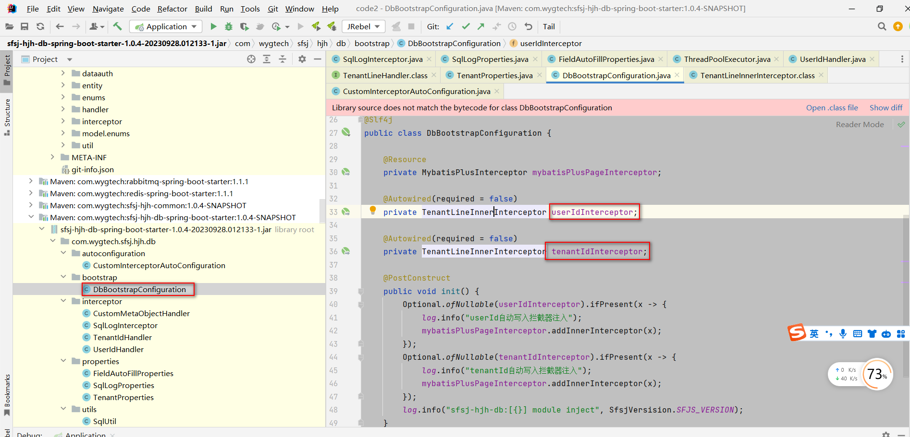
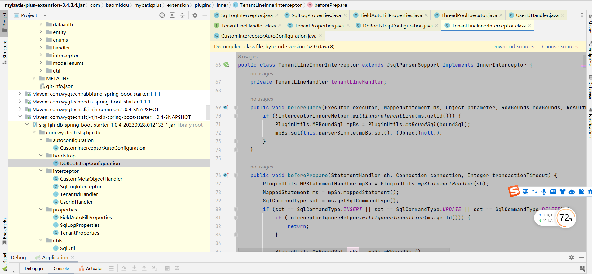

## MP高级用法

在官方文档中看到的是一些基础用法，数据的增删改查这些

### 说明

在`四川文渊阁科技有限公司(杭州)`，运行项目的代码的时候。看到日志中的内容


在开发中也发现了，当我执行`insert`,`update`的时候，会自动填充`create_id`,`create_name`,`update_id`,`update_name`

当时开发任务比较重，没时间看代码的实现的原理。离职以后，有时间进行了整理


### 打印日志

通过代码执行的过程，可以看到运行的代码是在这个`jar`包中


- 配置文件

  ```java
  
  import lombok.Data;
  import org.springframework.boot.context.properties.ConfigurationProperties;
  import org.springframework.stereotype.Component;
  
  /**
   * The type Sql log properties.
   * <p>
   * sql日志打印
   *
   * @author hjh
   * @version 2023 /4/12-17:31
   */
  @Data
  @Component
  @ConfigurationProperties(prefix = SqlLogProperties.PREFIX)
  public class SqlLogProperties {
      /**
       * The constant PREFIX.
       */
      public static final String PREFIX = "mybatis-plus.global-config.db-config.sql-log";
  
      /**
       * sql日志打印开关
       */
      private boolean enabled = false;
  
      /**
       * sql日志打印查询结果
       */
      private boolean printRsp = false;
  
      /**
       * sql日志打印执行时间
       */
      private boolean printTime = false;
  }
  
  ```

- 打印sql

```java
import cn.hutool.core.collection.CollUtil;
import org.apache.ibatis.mapping.BoundSql;
import org.apache.ibatis.mapping.MappedStatement;
import org.apache.ibatis.mapping.ParameterMapping;
import org.apache.ibatis.plugin.Invocation;
import org.apache.ibatis.reflection.MetaObject;
import org.apache.ibatis.session.Configuration;
import org.apache.ibatis.type.TypeHandlerRegistry;

import java.text.SimpleDateFormat;
import java.time.LocalDate;
import java.time.LocalDateTime;
import java.time.format.DateTimeFormatter;
import java.util.Date;
import java.util.List;

/**
 * The type Sql util.
 *
 * @author hjh
 * @version 2023 /4/13-10:30
 */
public class SqlUtil {
    /**
     * Show sql string.
     *
     * @param configuration the configuration
     * @param boundSql the bound sql
     * @return the string
     */
    public static String showSql(Configuration configuration, BoundSql boundSql) {
        Object parameterObject = boundSql.getParameterObject();
        List<ParameterMapping> parameterMappings = boundSql.getParameterMappings();
        String sql = boundSql.getSql().replaceAll("[\\s]+", " ");
        if (CollUtil.isEmpty(parameterMappings)) {
            return sql;
        }
        TypeHandlerRegistry typeHandlerRegistry = configuration.getTypeHandlerRegistry();
        if (parameterObject != null && typeHandlerRegistry.hasTypeHandler(parameterObject.getClass())) {
            sql = sql.replaceFirst("\\?", getParameterValue(parameterObject));
        } else {
            sql = sql.replaceAll("\\?", "%s");
            Object[] params = new String[parameterMappings.size()];
            MetaObject metaObject = configuration.newMetaObject(parameterObject);

            for (int i = 0; i < parameterMappings.size(); ++i) {
                String propertyName = parameterMappings.get(i).getProperty();
                Object obj;
                if (metaObject.hasGetter(propertyName)) {
                    obj = metaObject.getValue(propertyName);
                    params[i] = getParameterValue(obj);
                } else if (boundSql.hasAdditionalParameter(propertyName)) {
                    obj = boundSql.getAdditionalParameter(propertyName);
                    params[i] = getParameterValue(obj);
                }
            }

            sql = String.format(sql, params);
        }

        return sql;
    }

    /**
     * Gets sql by invocation.
     *
     * @param invocation the invocation
     * @return the sql by invocation
     */
    public static String getSqlByInvocation(Invocation invocation) {
        Object[] args = invocation.getArgs();
        MappedStatement ms = (MappedStatement) args[0];
        Object parameterObject = args[1];
        BoundSql boundSql = ms.getBoundSql(parameterObject);
        if (args.length == 6) {
            boundSql = (BoundSql) args[5];
        }

        return boundSql.getSql();
    }

    private static String getParameterValue(Object obj) {
        String value;
        if (obj instanceof String) {
            value = "'" + obj + "'";
        } else if (obj instanceof Date) {
            SimpleDateFormat simpleDateFormat = new SimpleDateFormat("yyyy-MM-dd HH:mm:ss");
            value = "'" + simpleDateFormat.format(obj) + "'";
        } else if (obj instanceof LocalDate) {
            value = "'" + obj + "'";
        } else if (obj instanceof LocalDateTime) {
            DateTimeFormatter df = DateTimeFormatter.ofPattern("yyyy-MM-dd HH:mm:ss");
            value = "'" + df.format((LocalDateTime) obj) + "'";
        } else if (obj != null) {
            value = obj.toString();
        } else {
            value = "NULL";
        }

        return value.replace("$", "\\$");
    }
}
```

- 配置的线程池

```java
import cn.hutool.core.thread.ThreadFactoryBuilder;
import org.springframework.context.annotation.Bean;
import org.springframework.stereotype.Component;

import java.util.concurrent.ArrayBlockingQueue;
import java.util.concurrent.ThreadFactory;
import java.util.concurrent.ThreadPoolExecutor;
import java.util.concurrent.TimeUnit;

@Component
public class ThreadPoolExecutorConfig {


    private final Integer CORES = Math.max(Runtime.getRuntime().availableProcessors(), 4);

    /**
     * 线程池
     * @return
     */
    @Bean
    public ThreadPoolExecutor transExecutor() {
        ThreadFactory factory = ThreadFactoryBuilder.create().setNamePrefix("trans-").build();
        ThreadPoolExecutor executor = new ThreadPoolExecutor(CORES,
                CORES * 2,
                60,
                TimeUnit.SECONDS,
                new ArrayBlockingQueue<>(100000),
                factory,
                new ThreadPoolExecutor.CallerRunsPolicy());
        return executor;
    }

}
```

- 执行的拦截

```java

import com.alibaba.fastjson.JSON;

import lombok.extern.slf4j.Slf4j;
import org.apache.ibatis.cache.CacheKey;
import org.apache.ibatis.executor.Executor;
import org.apache.ibatis.mapping.BoundSql;
import org.apache.ibatis.mapping.MappedStatement;
import org.apache.ibatis.plugin.Interceptor;
import org.apache.ibatis.plugin.Intercepts;
import org.apache.ibatis.plugin.Invocation;
import org.apache.ibatis.plugin.Signature;
import org.apache.ibatis.session.Configuration;
import org.apache.ibatis.session.ResultHandler;
import org.apache.ibatis.session.RowBounds;
import org.springframework.stereotype.Component;
import org.springframework.util.StopWatch;

import java.util.concurrent.ThreadPoolExecutor;

/**
 * sql日志打印拦截器
 *
 * @author hjh
 * @version 2023 /4/13-10:22
 */
@Intercepts({@Signature(
        type = Executor.class,
        method = "update",
        args = {MappedStatement.class, Object.class}
), @Signature(
        type = Executor.class,
        method = "query",
        args = {MappedStatement.class, Object.class, RowBounds.class, ResultHandler.class}
), @Signature(
        type = Executor.class,
        method = "query",
        args = {MappedStatement.class, Object.class, RowBounds.class, ResultHandler.class, CacheKey.class, BoundSql.class}
)})
@Slf4j
@Component
public class SqlLogInterceptor implements Interceptor {

    private final SqlLogProperties sqlLogProperties;

    private final ThreadPoolExecutor executor;


    public SqlLogInterceptor(SqlLogProperties sqlLogProperties, ThreadPoolExecutor executor) {
        this.sqlLogProperties = sqlLogProperties;
        this.executor = executor;
    }


    @Override
    public Object intercept(Invocation invocation) throws Throwable {
        MappedStatement mappedStatement = (MappedStatement) invocation.getArgs()[0];
        Object parameter = null;
        if (invocation.getArgs().length > 1) {
            parameter = invocation.getArgs()[1];
        }

        BoundSql boundSql = mappedStatement.getBoundSql(parameter);
        if (invocation.getArgs().length == 6) {
            boundSql = (BoundSql) invocation.getArgs()[5];
        }

        String sqlId = mappedStatement.getId();
        Configuration configuration = mappedStatement.getConfiguration();

        try {
            if (log.isInfoEnabled()) {
                if (this.executor != null) {
                    BoundSql finalBoundSql = boundSql;
                    this.executor.execute(() -> this.showSql(configuration, finalBoundSql, sqlId));
                } else {
                    this.showSql(configuration, boundSql, sqlId);
                }
            }
        } catch (Exception e) {
            log.warn("日志打印异常", e);
        }

        Object value;
        if (this.sqlLogProperties.isPrintTime()) {
            StopWatch watch = new StopWatch();
            watch.start();
            try {
                value = invocation.proceed();
            } finally {
                watch.stop();
                log.info("sqlId:[{}],消耗:[{}]毫秒", sqlId, watch.getTotalTimeMillis());
            }
        } else {
            value = invocation.proceed();
        }

        if (this.sqlLogProperties.isPrintRsp() && log.isInfoEnabled()) {
            log.info("响应:[{}]", JSON.toJSONString(value));
        }

        return value;
    }

    private void showSql(Configuration configuration, BoundSql boundSql, String sqlId) {
        String sql = SqlUtil.showSql(configuration, boundSql);
        this.logs(sql, sqlId);
    }

    private void logs(String sql, String sqlId) {
        log.info("\nsqlId:" + sqlId + "\n" + "最终执行sql:" + sql);
    }
}
```

我把这些代码拷贝到项目中进行测试，可以正常运行、

疑问？生成jar没有`@Component`注解？不知道什么原因


不知道系统如何进行加载的


## 自动增加insert ,update 创建人和更新人

```sql
-- ----------------------------
-- 组织表
-- ----------------------------
DROP TABLE IF EXISTS `organize`;
CREATE TABLE `organize` (
  `id` bigint unsigned NOT NULL AUTO_INCREMENT 	COMMENT 'id',


	`creator` 	varchar(50)  DEFAULT NULL 		COMMENT '创建人',
  `create_time` timestamp NOT NULL 				COMMENT '创建时间',
  `modifier` 	varchar(50)  DEFAULT NULL 		COMMENT '修改人',
  `modify_time` timestamp NOT NULL 				COMMENT '修改时间',
  PRIMARY KEY (`id`)
) ENGINE=InnoDB AUTO_INCREMENT=1  CHARSET=utf8mb4 COMMENT='组织表';
```

其中创建时间`create_time` 更新时间 `modify_time`  可以修改成

```sql
`create_time` datetime DEFAULT CURRENT_TIMESTAMP                                 COMMENT '创建时间',
 `update_time` datetime DEFAULT CURRENT_TIMESTAMP ON UPDATE CURRENT_TIMESTAMP     COMMENT '更新时间',
```

通过sql 语句进行实现

- 创建人和更新的人，就不能使用这样的方法

```java
import cn.zhaotx.specialist.common.utils.SessionUser;
import cn.zhaotx.specialist.common.utils.UserContextHolder;
import com.baomidou.mybatisplus.core.handlers.MetaObjectHandler;
import org.apache.ibatis.reflection.MetaObject;
import org.springframework.stereotype.Component;

import java.util.Calendar;

/**
 * 元数据处理器
 *
 * @author yangjinzhi
 * @date 2022-05-16 14:47
 */
@Component
public class MyMetaObjectHandler implements MetaObjectHandler {
    /**
     * 默认用户名
     */
    private static final String DEFAULT_USER_NAME = "system";

    /**
     * 插入时填充策略
     *
     * @param metaObject 元对象
     */
    @Override
    public void insertFill(MetaObject metaObject) {
        SessionUser user = UserContextHolder.getUser();
        if (user == null) {
            this.setFieldValByName("creator", DEFAULT_USER_NAME, metaObject);
            this.setFieldValByName("modifier", DEFAULT_USER_NAME, metaObject);
        } else {
            this.setFieldValByName("creator", user.getRealname(), metaObject);
            this.setFieldValByName("modifier", user.getRealname(), metaObject);
        }
        this.setFieldValByName("createTime", Calendar.getInstance().getTime(), metaObject);
        this.setFieldValByName("modifyTime", Calendar.getInstance().getTime(), metaObject);
    }

    /**
     * 修改时填充策略
     *
     * @param metaObject 元对象
     */
    @Override
    public void updateFill(MetaObject metaObject) {
        SessionUser user = UserContextHolder.getUser();
        if (user == null) {
            this.setFieldValByName("modifier", DEFAULT_USER_NAME, metaObject);
        } else {
            this.setFieldValByName("modifier", user.getRealname(), metaObject);
        }
        this.setFieldValByName("modifyTime", Calendar.getInstance().getTime(), metaObject);
    }
}

```

可以通过实现``com.baomidou.mybatisplus.core.handlers.MetaObjectHandler`接口来实现

### 其他功能

上面提到，自动填充`create_id`,`create_name`,`update_id`,`update_name`这些字段，从代码中，也可以看出。是通过拦截设置来实现的






