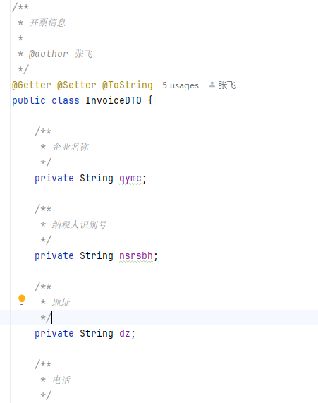

资料来源：[MyBatis基本用法-@TableField](https://zhuanlan.zhihu.com/p/646301434)


MyBatis Plus是一个强大的持久层框架，提供了很多方便的注解和配置，其中包括`@TableField`注解用于配置字段映射。

## @TableField注解

`@TableField`注解用于配置字段映射信息，可以用于在实体类中指定数据库字段名、字段策略等属性。

### 基本用法

```java
import com.baomidou.mybatisplus.annotation.TableField;

public class User {
    @TableField("user_name")
    private String username;
    
    // 省略其他字段和方法
}
```

上述代码中，`@TableField("user_name")`注解指定了`username`字段对应的数据库字段名为`user_name`。

### 属性详解

`@TableField`注解有以下常用属性：

- value：指定字段在数据库中的列名，可以使用表达式。
- exist：指定字段是否为数据库表中的字段，默认为`true`。
- fill：指定字段为自动填充字段，可选值为`FieldFill.DEFAULT`、`FieldFill.INSERT`、`FieldFill.UPDATE`等。
- select：指定字段在查询时是否进行查询，默认为`true`。
- condition：指定字段在更新操作时的条件，默认为空字符串。

### 完整示例

1. 实体类

```java
import com.baomidou.mybatisplus.annotation.FieldFill;
import com.baomidou.mybatisplus.annotation.TableField;

public class User {
    @TableField(value = "user_name", exist = true, fill = FieldFill.DEFAULT, select = true, condition = "")
    private String username;
    
    // 省略其他字段和方法
}
```

1. 配置文件

在MyBatis Plus的配置文件（如`mybatis-config.xml`）中，需要添加`@TableField`注解的支持：

```xml
<configuration>
    <settings>
        <setting name="mapUnderscoreToCamelCase" value="true" />
    </settings>
    <typeAliases>
        <package name="com.example.entity" />
    </typeAliases>
</configuration>
```

1. 引用

```java
import com.baomidou.mybatisplus.core.mapper.BaseMapper;
import com.baomidou.mybatisplus.extension.service.impl.ServiceImpl;

public interface UserMapper extends BaseMapper<User> {
}

public class UserService extends ServiceImpl<UserMapper, User> {
}
```

在以上代码中，`UserMapper`是自定义的Mapper接口，继承自`BaseMapper`；`UserService`是自定义的Service类，继承自`ServiceImpl`。

这样，我们就可以通过`UserMapper`和`UserService`来进行数据库操作，同时`@TableField`注解中的配置也会生效。

以上是`@TableField`注解的基本用法和配置说明，希望能对你有所帮助！


## 项目中使用

### 枚举的使用

```java
    /**
     * 状态
     */
    @TableField("state")
    private ChargeStateEnum stateEnum;

    /**
     * 类型
     */
    @TableField("type")
    private ChargeTypeEnum typeEnum;

```

枚举表

````java
import com.baomidou.mybatisplus.annotation.EnumValue;
import lombok.Getter;

/**
 * 结算类型枚举
 *
 * @author wwj
 */
@Getter
public enum ChargeTypeEnum {
    WIN(0, "中标服务费"), COMBINE(1, "招标文件费和技术服务费"),
    INVITATION(2, "招标文件费"), TECHNOLOGY(3, "技术服务费"), PRELIMINARY(4, "预审文件费");

    @EnumValue
    private final Integer value;
    private final String text;

    ChargeTypeEnum(int value, String text) {
        this.value = value;
        this.text = text;
    }
}

````


### json 封装成对象

```java
    
    /**
     * 开票信息
     */
    @TableField(typeHandler = JacksonTypeHandler.class)
    private InvoiceDTO invoice;
    
```

开票信息保存的是json格式




