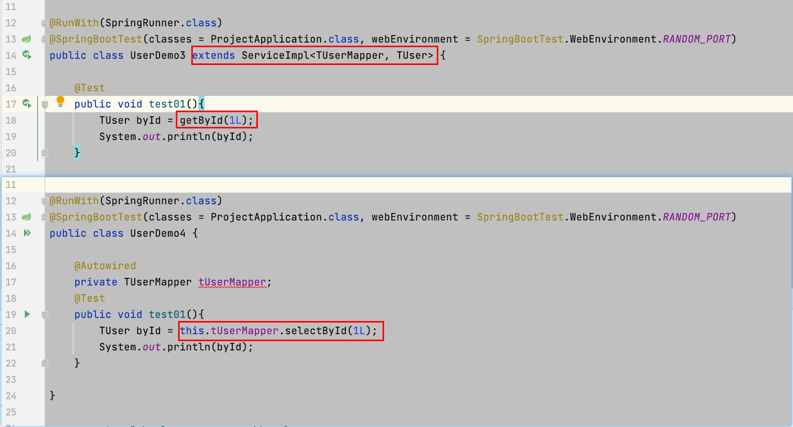
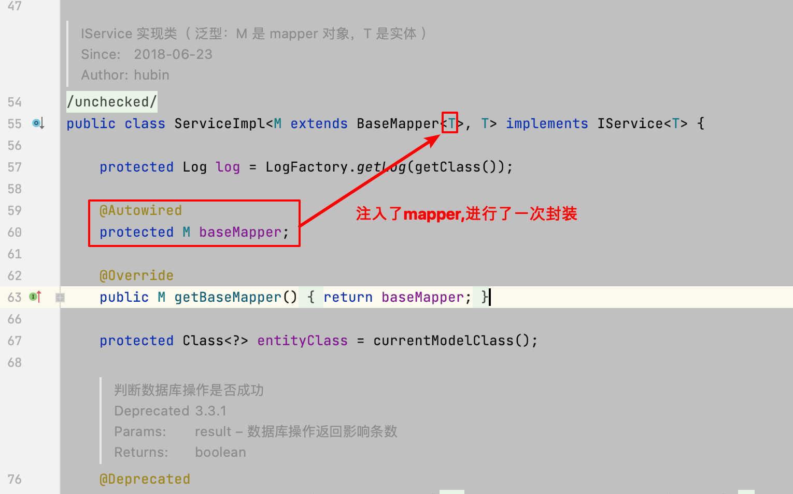

# mp两种调用接口方式

## 两种实现的举例

- 测试的接口

```
public interface TUserMapper extends BaseMapper<TUser> {
}
```

- 通过mapper实现

~~~~
  @RunWith(SpringRunner.class)
  @SpringBootTest(classes = ProjectApplication.class, webEnvironment = SpringBootTest.WebEnvironment.RANDOM_PORT)
  public class UserDemo4 {

      @Autowired
      private TUserMapper tUserMapper;
      @Test
      public void test01(){
          TUser byId = this.tUserMapper.selectById(1L);
          System.out.println(byId);
      }

  }
~~~~

- 通过serviceImpl实现

```
@RunWith(SpringRunner.class)
@SpringBootTest(classes = ProjectApplication.class, webEnvironment = SpringBootTest.WebEnvironment.RANDOM_PORT)
public class UserDemo3 extends ServiceImpl<TUserMapper, TUser> {

    @Test
    public void test01(){
        TUser byId = getById(1L);
        System.out.println(byId);
    }

}
```

两种方法对比



wrapper查询

```
@Test
public void test02(){
    QueryWrapper<TUser> queryWrapper = new QueryWrapper<>();
    queryWrapper.eq("name","Jone");

    List<TUser> list = list(queryWrapper);
    for (TUser sysUser : list) {
        System.out.println(sysUser);
    }
}

```

## 基于lambda的相关操作

比如查询功能

```
public void test03(){
    LambdaQueryWrapper<TUser> wrapper = new LambdaQueryWrapper<TUser>().eq(TUser::getName, "Jone")
            .orderByDesc(TUser::getId);

    List<TUser> list = list(wrapper);
    list.forEach(user -> System.out.println(user));
}
```
##分页查询

```
@RunWith(SpringRunner.class)
@SpringBootTest(classes = ProjectApplication.class, webEnvironment = SpringBootTest.WebEnvironment.RANDOM_PORT)
public class PageDemo extends ServiceImpl<TUserMapper, TUser> {

    @Test
    public void test02(){
        QueryWrapper<TUser> queryWrapper = new QueryWrapper<>();
        queryWrapper.eq("name","Jone");

        IPage page = page(new Page<>(1, 10), queryWrapper);
        page(page, queryWrapper);

        List<TUser> records = page.getRecords();
        long pages = page.getPages();
        long total = page.getTotal();

        records.forEach(System.out::println);
        System.out.println("总页数："+ pages);
        System.out.println("总记录数："+ total);
    }
}

```
## serviceImpl 实现原理

进入源码进行查看




### 分页

- 分页的全局配置（略）

查询分页功能

~~~~
@RunWith(SpringRunner.class)
@SpringBootTest(classes = AppApplication.class ,webEnvironment = SpringBootTest.WebEnvironment.RANDOM_PORT)
public class AttentionDemo extends ServiceImpl<WjAttentionMapper, WjAttention> {
    /**
     * 测试分页的功能
     */
    @Test
    public  void testPage(){

        Long userId = 1L;
        long current = 1L;  // 当前页 默认1
        long pageSize = 10;
        LambdaQueryWrapper<WjAttention> wrapper = new LambdaQueryWrapper<WjAttention>()
                .eq(WjAttention::getUserId, userId)
                .orderByDesc(WjAttention::getId);

        // 分页查询
        Page<WjAttention> page = page(new Page<>(current, pageSize), wrapper);
        PageInfo<WjAttention> attentionPageInfo = PageInfo.get(page, WjAttention.class);
        List<WjAttention> list = attentionPageInfo.getList();
        list.forEach(System.out::println);
    }
}
~~~~

