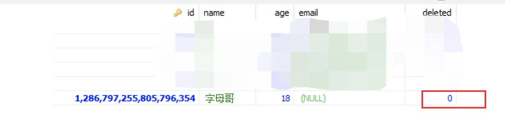
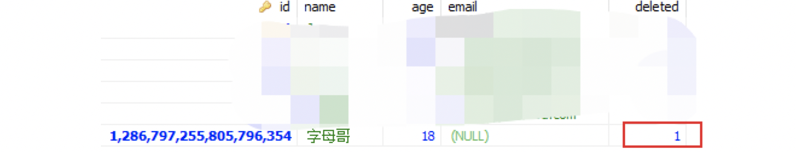
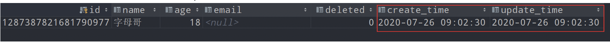
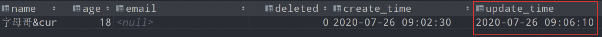

## 物理删除与逻辑删除

- 物理删除：指文件存储所用到的磁存储区域被真正的擦除或清零，这样删除的文件是不可以恢复的，物理删除是计算机处理数据时的一个概念。如果在数据库中直接使用delete、drop删除了表数据，如果没有备份的话，数据就很难恢复了。
- 逻辑删除（软删除）：逻辑删除就是对要被删除的数据打上一个删除标记，通常使用一个deleted字段标示行记录是不是被删除，比如该数据有一个字段deleted，当其值为0表示未删除，值为1表示删除。那么逻辑删除就是将0变成1。在逻辑上是数据是被删除的，但数据本身是依然存在的。

两者的优劣：

- 物理删除一定程度上删除了“无用”的数据，降低了表的数据量，对性能肯定是有好处的；但是如果没有备份的话，数据很难恢复。也无法对历史数据进行数据分析。
- 逻辑删除恢复的话只要修改ideleted等类似的状态标示字段就可以了，但是表的数据量肯定会比物理删除增加了，并且查询时经常要考虑到deleted字段，对索引都会有影响。

所以一张表的数据是否采用逻辑删除，还要根据数据的重要性、数据量、查询性能以及业务需求等因素综合判断。

## 逻辑删除实现

- 首先为需要逻辑删除的表增加一个deleted字段作为逻辑删除字段，并且设置其默认值为0，如下：

```
-- 创建表
DROP TABLE IF EXISTS user;
CREATE TABLE `t_user`
(
    `id`      BIGINT(20) NOT NULL auto_increment COMMENT '主键ID',
    `name`    VARCHAR(30) NULL DEFAULT NULL COMMENT '姓名',
    `age`     INT(11) NULL DEFAULT NULL COMMENT '年龄',
    `email`   VARCHAR(50) NULL DEFAULT NULL COMMENT '邮箱',
    `deleted` TINYINT(4) NOT NULL DEFAULT '0' COMMENT '逻辑删除标记',
    PRIMARY KEY (`id`)
);

-- 增加数据
DELETE
FROM user;
INSERT INTO t_user (id, name, age, email)
VALUES (1, 'Jone', 18, 'test1@baomidou.com'),
       (2, 'Jack', 20, 'test2@baomidou.com'),
       (3, 'Tom', 28, 'test3@baomidou.com'),
       (4, 'Sandy', 21, 'test4@baomidou.com'),
       (5, 'Billie', 24, 'test5@baomidou.com');

```

- 给数据库表对应的实体类字段上加上@TableLogic注解：

~~~~
@Data
@EqualsAndHashCode(callSuper = false)
@Accessors(chain = true)
@TableName("t_user")
public class TUser {
    /**
     * 主键ID
     */
    @TableField(value = "id")
    @TableId(type = IdType.AUTO)
    private Long id;
    /**
     * 姓名
     */
    @TableField(value = "name")
    private String name;
    /**
     * 年龄
     */
    @TableField(value = "age")
    private Integer age;
    /**
     * 邮箱
     */
    @TableField(value = "email")
    private String email;

    /**
     * 逻辑删除标记
     */
    @TableField("DELETED")
    @TableLogic
    private Integer deleted;
}
~~~~

资料来源：：https://blog.csdn.net/weixin_44263023/article/details/111587989 

~~~~
@TableLogic(value=“原值”,delval=“修改值”)
注解参数
　　　　value = “” 未删除的值，默认值为0
　　　　delval = “” 删除后的值，默认值为1
~~~~


>  一般我们创建实体时 会设置一个删除标识字段
>
>  1.当我们调用BaseMapper的deleteById(id)或者调用IService的removeById(id) ,
>  会走Update方法：
>  SQL：Update table set del_flag= 1 where id = 1
>
>  2.当我们调用BaseMapper的查询时,
>  即使你用条件语句进行查询时，始终这个语句会附加where del_flag=0;
>  0 代表未删除;
>  1 代表已删除;

## API使用方法

### 插入一条数据

插入数据的时候，不需要为deleted字段赋值

```
@Test
public void testInsert() {
  User user = new User();
  user.setName("字母哥");
  user.setAge(18);

  int row = userMapper.insert(user);
}

```

deleted采用默认值0（未删除），新插入的数据都是未删除的数据




### 删除一条记录：

执行如下Mybatis Plus API删除操作

```
userMapper.deleteById(1286797255805796354L);

```


查看数据库可以发现这条数据仍然存在，只不过逻辑删除字段值被设置为1：

```
UPDATE user SET deleted=1 WHERE id=? AND deleted=0
```

### 查询一条记录

- 当我们使用MP逻辑删除的功能之后，比如执行查询、修改的方法，MP会为我们自动加上未删除的条件。
  是不会查到被逻辑删除的记录：

```
userMapper.selectList(null);
```

会自动添加过滤条件`WHERE deleted=0`

```
SELECT id,name,age,email,deleted
FROM user 
WHERE deleted=0 
```

- 当我们查询数据时，查询结果不希望包含逻辑删除字段，可以加如下的注解

```
@TableLogic
@TableField(select = false)
private Integer deleted;
```

执行的SQL如下（注意查询结果不包含deleted字段）：

```
SELECT id,name,age,email 
FROM user 
WHERE deleted=0
```

## 全局配置参数

通常在一个比较正规的管理项目中，逻辑删除字段不允许随意命名，所有表的逻辑删除字段使用相同的名称（比如：deleted）。我们可以在application.yml中添加全局配置，这样就不需要在每一个实体类上面都添加 @TableLogic注解了：

> 注意：当全局配置和`@TableLogic`局部配置同时存在，则以实体上注解为准，优先级更高。

```
#全局逻辑删除字段值
mybatis-plus:
  global-config:
    db-config:
      logic-delete-field: deleted

```

默认情况下，逻辑已删除值为1，逻辑未删除值为0。我们也可以在application.yml中进行修改：

```
#逻辑已删除值(默认为 1)
#逻辑未删除值(默认为 0)
mybatis-plus:
  global-config:
    db-config:
      logic-delete-value: 1
      logic-not-delete-value: 0
```

## 填充时间 

资料来源：https://www.kancloud.cn/hanxt/mybatisplus/1835496 

### 分析

需求案例：在插入数据的时候自动填充createTime和updateTime为当前插入数据的时间，在数据更新的时候修改updateTime为修改数据的时间。不需要人为的手动赋值。

- 在数据库表层面需要先添加2个日期类型的字段create_tme和update_time
  
- 使用@TableField注解标记实体类中的哪些字段需要填充：

```
@Data
public class User {
    private Long id;
    private String name;
    private Integer age;
    private String email;

    @TableField(fill = FieldFill.INSERT)
    private Date createTime;
    @TableField(fill = FieldFill.INSERT_UPDATE)
    private Date updateTime;
}
```

FieldFill是一个枚举，用于指定在何种情况下会自动填充，有如下几种可选值：

- DEFAULT：默认不处理
- INSERT：插入时自动填充字段
- UPDATE：更新时自动填充字段
- INSERT_UPDATE：插入和更新时自动填充字段

### 自定义填充默认数值

编写公共字段填充处理器类，该类继承了MetaObjectHandler类，重写 insertFill和updateFill方法，我们在这两个方法中获取需要填充的字段以及默认填充的值。

> - 填充处理器MyMetaObjectHandler在Spring Boot中需要声明@Component或@Bean注入
> - strictInsertFill和strictUpdateFill方法第二个参数写的是实体类里的属性名，不是对应数据库字段名。

```
@Component
public class MyMetaObjectHandler implements MetaObjectHandler {
 
    @Override
    public void insertFill(MetaObject metaObject) {
        this.strictInsertFill(metaObject, "createTime", Date.class, new Date());
        this.strictInsertFill(metaObject, "updateTime", Date.class, new Date());
    }
 
    @Override
    public void updateFill(MetaObject metaObject) {
        this.strictUpdateFill(metaObject, "updateTime", Date.class, new Date());
    }
}
```

如果是3.3.0后面的版本，比如3.3.1.8，也可以改用下面更简单的写法（3.3.0不要用该方法，有bug）

```
@Component
public class MyMetaObjectHandler implements MetaObjectHandler {
 
    @Override
    public void insertFill(MetaObject metaObject) {
        this.fillStrategy(metaObject, "createTime", new Date());
        this.fillStrategy(metaObject, "updateTime", new Date());
    }
 
    @Override
    public void updateFill(MetaObject metaObject) {
        this.fillStrategy(metaObject, "updateTime", new Date());
    }
}
```

在一些比较旧的版本，为填充字段设置值的API如下，3.3.0之后已经不建议使用

```
this.setFieldValByName("createTime",new Date(),metaObject);
 this.setFieldValByName("updateTime",new Date(),metaObject);

```

### 开始测试

- 插入一条数据，注意我们没有为createTime和updateTime赋值

```
@Test
public void testInsert() {
  User user = new User();
  user.setName("字母哥");
  user.setAge(18);

  userMapper.insert(user);
}
```

但是运行的结果是：createTime和updateTime被自动赋值


- 根据Id更新一条数据，注意我们没有为updateTime赋值

```
@Test
public void testUpdate() {
  User user = new User();
  user.setId(1287387821681790977L);
  user.setName("字母哥&curry");
  user.setAge(18);

  userMapper.updateById(user);
}
```

但是运行的结果是：updateTime在执行数据记录修改操作时被自动赋值



## 其他功能

多租户解决方案： https://www.kancloud.cn/hanxt/mybatisplus/1855729 