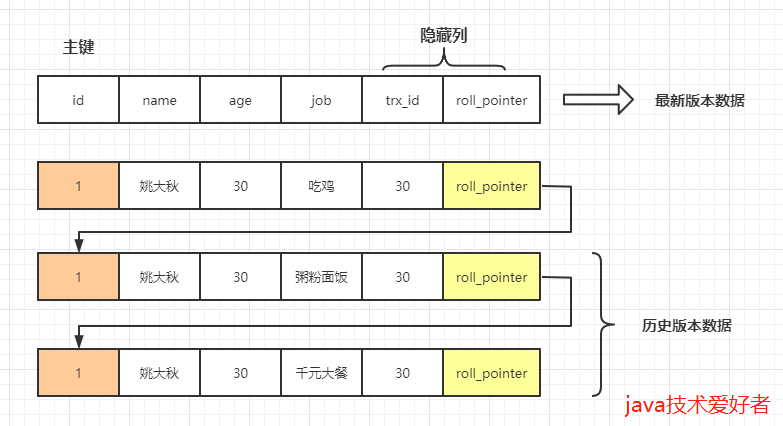
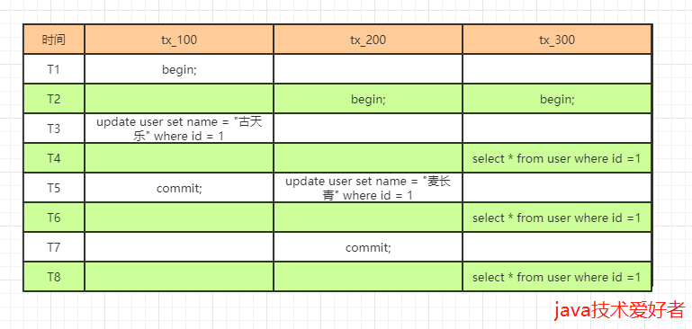
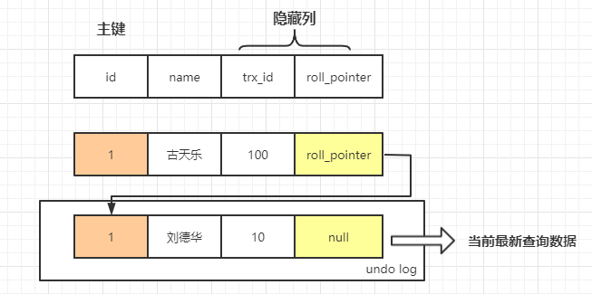
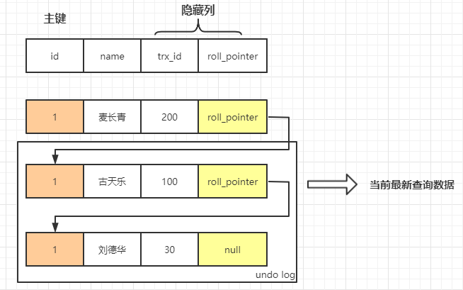
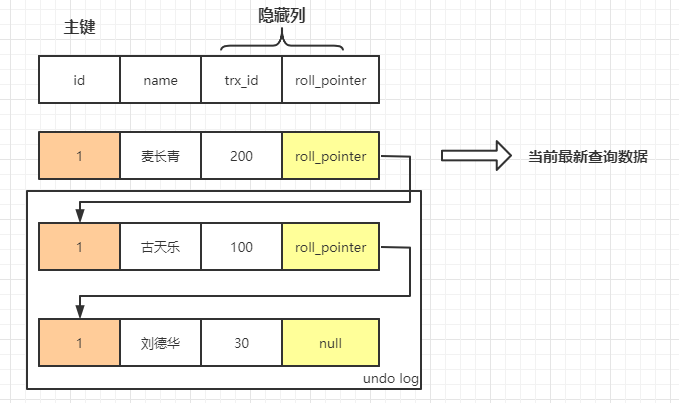
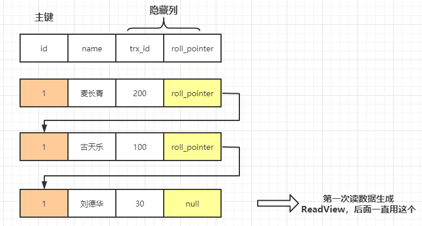

> **文章已收录Github精选，欢迎Star**：https://github.com/yehongzhi/learningSummary

# 前言

无论是上一篇文章讲的事务隔离级别，还是之前讲的undo log日志，其实都涉及到MVCC机制，那么什么是MVCC机制，它的作用是什么，下面就让我们带着问题一起学习吧。

# 什么是MVCC

MVCC全称是多版本并发控制 (Multi-Version Concurrency Control)，只有在InnoDB引擎下存在。MVCC机制的作用其实就是避免同一个数据在不同事务之间的竞争，提高系统的并发性能。

它的特点如下：

- 允许多个版本同时存在，并发执行。
- 不依赖锁机制，性能高。
- 只在读已提交和可重复读的事务隔离级别下工作。

# 为什么使用MVCC

在早期的数据库中，只有读读之间的操作才可以并发执行，读写，写读，写写操作都要阻塞，这样就会导致MySQL的并发性能极差。

采用了MVCC机制后，只有写写之间相互阻塞，其他三种操作都可以并行，这样就可以提高了MySQL的并发性能。

# MVCC机制的原理

在讲解MVCC机制的原理之前首先要介绍几个概念。

## ReadView

ReadView可以理解为数据库中某一个时刻所有未提交事务的快照。ReadView有几个重要的参数：

- m_ids：表示生成ReadView时，当前系统正在活跃的读写事务的事务Id列表。
- min_trx_id：表示生成ReadView时，当前系统中活跃的读写事务的最小事务Id。
- max_trx_id：表示生成ReadView时，当前时间戳InnoDB将在下一次分配的事务id。
- creator_trx_id：当前事务id。

所以当创建ReadView时，可以知道这个时间点上未提交事务的所有信息。

## 隐藏列

InnoDB存储引擎中，它的聚簇索引记录中都包含两个必要的隐藏列，分别是：

- trx_id：事务Id，每次一个事务对某条聚簇索引记录进行改动时，都会把该事务的`事务id`赋值给`trx_id`隐藏列。
- roll_pointer：回滚指针，每次对某条聚簇索引记录进行改动时，都会把旧的版本写入到`undo log`中，然后这个隐藏列就相当于一个指针，可以通过它来找到该记录修改前的信息。

## 事务链

每次对记录进行修改时，都会记录一条undo log信息，每一条undo log信息都会有一个roll_pointer属性(INSERT操作没有这个属性，因为之前没有更早的版本)，可以将这些undo日志都连起来，串成一个链表。事务链如下图一样：

## 原理

我们都知道，MySQL事务隔离级别有四种，分别是读未提交(Read Uncommitted，简称RU)、读已提交(Read Committed，简称RC)、可重复读(Repeatable Read，简称RR)、串行化(Serializable)，只有RC和RR才跟MVCC机制相关，RU和Serializable都不会使用到MVCC机制。因为在读未提交(RU)级别下是直接返回记录上的最新值，Serializable级别下则会对所有读取的行都加锁。

RC和RR隔离级别的实现就是通过版本控制来完成，核心处理逻辑就是**判断所有版本中哪个版本是当前事务可见的处理**，通过什么判断呢？就是上文讲到的ReadView，ReadView包含了当前系统活跃的读写事务的信息，判断的逻辑如下：

- 如果被访问版本的trx_id属性值小于ReadView的最小事务Id，表示该版本的事务在生成 ReadView 前已经提交，所以该版本可以被当前事务访问。
- 如果被访问版本的trx_id属性值大于ReadView的最大事务Id，表示该版本的事务在生成 ReadView 后才生成，所以该版本不可以被当前事务访问。
- 如果被访问版本的trx_id属性值在m_ids列表最小事务Id和最大事务Id之间，那就需要判断一下 trx_id 属性值是不是包含在 m_ids 列表中，如果包含的话，说明创建 ReadView 时生成该版本的事务还是活跃的，所以该版本不可以访问；如果不包含的话，说明创建 ReadView 时生成该版本的事务已经被提交，该版本可以被访问。

我们下面举例说明RC和RR隔离级别的区别，假如有一条user数据，初始值name="刘德华"，然后经过下面的更新，时间点如下：

RC隔离级别的MVCC：

**RC隔离级别的事务在每次查询开始时都会生成一个独立的 ReadView**。

在T4时间点时，版本链如下所示：

在T4时间点的Select语句执行时，当前时间系统正在活跃的事务有trx_id为100和200都未提交，所以此时生成的ReadView的事务列表是[100,200]，因此查询语句会根据当前版本链中小于事务列表中的最大的版本数据，即查询到的是刘德华。

在T6时间点时，版本链如下所示：

在T6时间点的Select语句执行时，当前时间系统正在活跃的事务有trx_id为200未提交，所以此时生成的ReadView的事务列表时[200]，因此查询语句会根据当前版本链中小于事务列表中的最大的版本数据，即查询到的是古天乐。

在T8时间点时，版本链如下所示：

在T6时间点的Select语句执行时，当前时间系统正在活跃的事务都已经提交，所以此时生成的ReadView的事务列表为空，因此查询语句会直接查询当前数据库最新数据，即查询到的是麦长青。

由于每次查询都会生成新的ReadView，所以有可能出现不可重复读的问题。

RR隔离级别的MVCC：

**RR隔离级别的事务在第一次读取数据时生成ReadView，之后的查询都不会再生成，所以一个事务的查询结果每次都是一样的**。

因为三次查询都是在同一个事务tx_300中。

所以在第一次查询，也就是T4时间点时会生成ReadView，事务列表为[100,200]，所以当前可见版本的查询结果为刘德华。

第二次查询，T6时间点不会生成新的ReadView，所以查询结果依然是刘德华。

第三次查询，T8时间一样，不会生成ReadView，沿用T4时间点生成的ReadView，所以查询结果依然是刘德华。

由于在同一个事务中，RR级别的事务在查询中只会生成一个ReadView，所以能解决不可重复读的问题。

# 总结

要理解MVCC机制，关键在于要理解ReadView、隐藏列、事务链三者在其中的作用。还有就是只有RC和RR的隔离级别才会使用MVCC机制，两者最大的区别在于生成ReadView的时机的不同，RC级别生成ReadView的时机是每次查询都会生成新的ReadView，而RR级别是在当前事务第一次查询时生成，并且生成的ReadView会一直沿用到事务提交为止，保证可重复读。

这篇文章就讲到这里了，感谢大家的阅读，希望看完大家能有所收获！

**觉得有用就点个赞吧，你的点赞是我创作的最大动力**~

**我是一个努力让大家记住的程序员。我们下期再见！！！**
