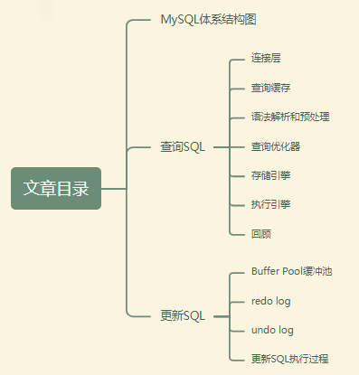
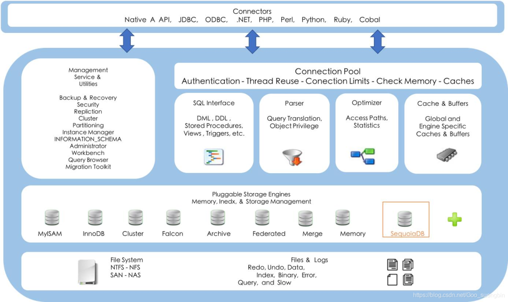
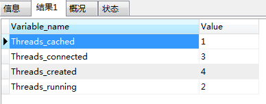
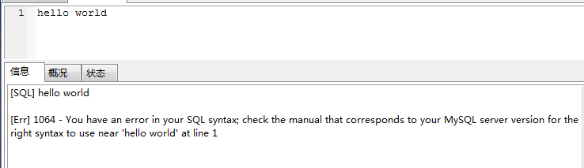
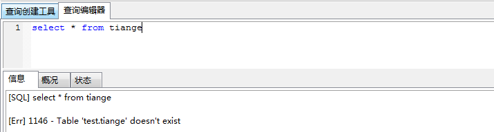
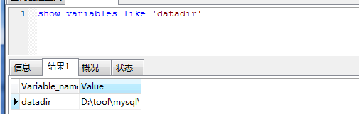
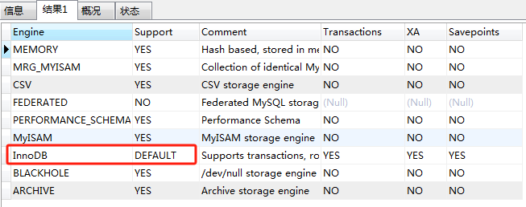
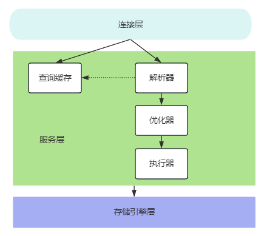
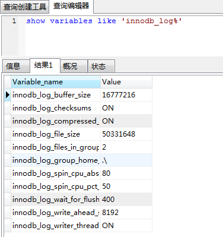
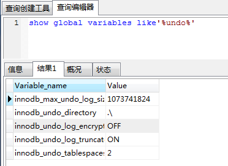

资料来源：<br/>
[一条查询SQL是如何执行的？更新、新增、删除呢？](https://mp.weixin.qq.com/s/ixnp6fwS2qmV2mdYKGKc6Q)<br/>

大部分朋友估计都只知道写sql然后执行，但是并不知道MySQL背后到底是怎么实现的。

八股文中也有这么一道题：**在MySQL中，一条SQL到底是如何执行的？**

我在面试中，也喜欢问这个问题，粗略的统计90%的朋友都是背八股文的，因为他们的回答大同小异。

这道题想得到高分，真没那么容易，但是看完本文，希望下次面试你能拿到一个高分，而不是背统一的八股文。

本文目录：



下面我们先来看看MySQL体系结构图：

## MySQL体系结构图

图片来自网络

也许，看到图中那么多英文，你心里也有被劝退。其实，也没那么害怕。

## 查询SQL

### 连接层

MySQL服务监听端口**默认是3306**（某某人面试中被面试官问过，由于天天背八股文，八股文中基本上没有这个题，所以面试中居然回答不上来，平时都在使用MySQL的话，这个肯定知道的）。

客户端会先连接到数据库上，这时候首先遇到的就是**连接器**。连接器负责跟客户端建立连接、获取权限、维持和管理连接。

连接命令：`mysql ‐h host[数据库地址] ‐u root[用户] ‐p root[密码] ‐P 3306`；连接命令中的MySQL是客户端工具，用来跟服务端建立连接。连接器就要开始认证客户端的身份，这个时候用的就是输入的用户名和密码。如果用户名或密码不对，就会返回"Access denied for user"的错误，然后客户端程序结束执行。如果用户名密码认证通过，连接器会到权限表里面查出客户端拥有的权限。之后，这个连接里面的权限判断逻辑，都将依赖于此时读到的权限。这就意味着，一个用户成功建立连接后，即使你用管理员账号对这个用户的权限做了修改，也不会影响已经存在连接的权限。修改完成后，只有再新建的连接才会使用新的权限设置。

我们的客户端连接MySQL服务端有很多种方式：

- 同步
- 异步
- 长链接
- 短连接
- TCP
- Unix Socket
- ...

> 由于异步编程相对比较复杂，而且容易导致数据混乱问题，所以，我们基本上用的都是同步方式。
>
> 长链接可以理解为连接一直不断开，一个客户端用完了，另外的其他客户端可以接着用，所以我们通常都会使用长链接。短连接就可以理解为用一次就关闭掉。
>
> 我们的Java代码中都是采用TCP方式，但是如果你在Unix环境中使用命令方式，那就基本上是用Unix Socket方式。

MySQL服务端有专门处理连接的的模块，同时，在连接时需要校验账号以及权限。

那么，我们如何知道MySQL当前有多少个连接呢？

请使用下面命令，即可知道：

```
show  global  status  like  'Thread%' ;
```

比如我的`MySQL`的当前连接情况：



这四个分别表示什么含义呢？

| 字段              | 含义                                   |
| :---------------- | :------------------------------------- |
| Threads_cached    | 缓存中的线程连接数。                   |
| Threads_connected | 当前打开的连接数。                     |
| Threads_created   | 为处理连接创建的线程数。               |
| Threads_running   | 非睡眠状态的连接数，通常指并发连接数。 |

**问题：为什么连接数是查看线程?客户端的连接和服务端的线程有什么关系?**

客户端每产生一个连接或者一个会话session，在MySQL服务端就会创建一个线程来处理。

反过来，如果要干点会话，那就直接kill掉。

既然是分配线程的话，一直长期保持连接肯定会消耗服务端资源，所以，MySQL会把那些长时间不活跃的连接断开。

比如我们是使用JDBC连接MySQL数据库。

到底多久超时呢？我们可以使用命令：

```
show global variables like 'wait_timeout'
show global variables like 'interactive_timeout'
```

会发现，这两个的默认值都是28800，单位是秒，换算成小时就是8个小时。

既然连接消耗资源，**MySQL 服务允许的最大连接数(也就是并发数)默认是多少呢?**

在5.7以及8.0.22版本中默认是151个，最大可以设置成100000（10w）。

> 这也是一个高频面试题：**MySQL 服务允许的最大连接数(也就是并发数)默认是多少呢?**
>
> 看到这里了，是不是也有答案了。

很多朋友估计不知道如何查询自己的MySQL是什么版本？

我们可以直接使用命令：

```
select VERSION();
```

**如何修改MySQL服务最大连接数？**

要修改MySQL服务的最大连接数，有两种主要方法：

第一种是通过修改配置文件的方式。首先，需要进入MySQL的安装目录，然后打开`MySQL`的配置文件`my.ini`或`my.cnf`。在文件中查找`max_connections=100`这一行，并将其修改为`max_connections=1000`。如果找不到该参数，可以直接添加一行`max_connections=1000`。最后，保存并退出配置文件。重启MySQL服务后，新的设置就会生效。

另一种方法是通过命令行进行修改。首先，登录到MySQL的命令行界面，然后使用命令`show variables like 'max_connections';`查看当前的最大连接数。接着，使用命令`set global max_connections=1000;`将最大连接数设置为所需的值。这种方法虽然可以立即看到效果，但是更改的配置在MySQL服务重启后将失效。

以上两种方法都可以实现对MySQL最大连接数的修改，**推荐使用修改配置文件的方法，因为这种方式修改的效果是永久的。**

我们在使用参数进行修改MySQL相关数据时，需要注意session和global的区别。

因为在MySQL中的参数(变量)分为 **session** **和** **global** 级别，分别是在当前会话中生效和全局生效，但是并不是每个参数都有两个级别。

比如 **max_connections** **就只有全局级别。**

**当没有带参数的时候，默认是** **session** **级别，包括查询和修改。**

比如修改了一个参数以后，在本窗口查询已经生效，但是其他窗口不生效：

```
show VARIABLES like 'autocommit' ;
set autocommit =on:
```

所以，如果只是临时修改，建议修改 session 级别。如果需要在其他会话中生效，必须显式地加上 global参数。

以上 就是MySQL客户端和服务端的连接，连接建立好了之后又会做什么呢？

### 查询缓存

和我们很多系统一样，MySQL也有缓存的说法，MySQL的查询缓存，或Query Cache，是其缓存机制的一种。从早期的版本到较新的版本，MySQL的查询缓存功能及其相关配置有所变化。

在早期版本中，例如MySQL 5.1，Query Cache的查询发生在MySQL接收到客户端的查询请求、查询权限验证之后和查询SQL解析之前。这意味着，当MySQL接收到客户端的查询SQL后，它会首先进行权限验证，然后尝试通过Query Cache来查找结果，而不需要经过Optimizer模块进行执行计划的分析优化。

但是，对于查询缓存的控制和管理，MySQL提供的配置参数相对较少。除了能够开启或关闭查询缓存外，用户还可以设置缓存的大小。但值得注意的是，查询缓存的效果很大程度上取决于缓存的命中率。只有当查询能够命中缓存时，性能才会有所改善。

随着版本的更新，MySQL的查询缓存功能也有所调整和优化。例如，在MySQL 8.0中，与查询缓存相关的配置和参数可能有所不同。因此，当使用新版本的MySQL时，建议查阅官方文档以获取最新的配置信息和使用建议。

总的来说，MySQL的不同版本在查询缓存方面可能存在一些差异，这主要体现在缓存的工作机制、配置选项和性能表现上。为了获得最佳的性能，建议根据实际情况选择合适的缓存策略和配置参数。

> **为什么 MySQL 不推荐使用它自带的缓存呢?**
>
> 主要是因为 MySQL  自帶的缓存的应用场景有限，第一个是它要求 SQL 语句必须一模一样，中间多一个空格，字母大小写不同都被认为是不同的的 SQL。

也可以使用命令你的MySQL的缓存情况：

```
show variables like 'query_cache%'
```

所以缓存这一块，我门还是交给 ORM  框架(比如 MyBatis 默认开启了一级缓存)，或者独立的缓存服务，比如 Redis 来处理更合适。

> 现在很多八股文中，基本上都把MySQL的查询缓存直接给省略掉了，其实这是一个不太严谨的哈，面试中最好是把这块都讲讲。

连接建立，如果没有缓存就跳过，接下来我们继续。

### 语法解析和预处理

我们随便输入一个，比如hello world，看看会发生什么？



MySQL是怎么知道我们输入的不对呢？

这个就是 MySQL 的 Parser 解析器和 Preprocessor  预处理模块。

这一步主要做的事情是对语句基于SQL 语法进行词法和语法分析和语义的解析。

词法分析就是把一个完整的 SQL 语句打碎成一个个的单词。

比如一个简单的 SQL 语句：

```
select user_name from t_user where id=10086
```

它会打碎成8个符号，每个符号是什么类型，从哪里开始到哪里结束。

语法分析会对 SQL 做一些语法检查，比如单引号有没有闭合 然后根据 MySQL 定义的语法规则，根据 SQL语句生成一个数据结构。这个数据结构我们把它叫做解析树 (select  lex)。

比如一条查询SQL：

```
select name from user_info where id = 1 and age >20
```

词法语法分析是一个非常基础的功能， Java 的编译器、百度搜索引擎如果要识别语句，必须也要有词法语法分析功能。

任何数据库的中间件，要解析 SQL 完成路由功能，也必须要有词法和语法分析功能， 比如 Mycat,Sharding-JDBC     (用到了 Druid    Parser)。在市面上也有很多的开源的词法解析的工具(比如 LEX,Yacc)。

问题：如果我写了一个词法和语法都正确的 SQL,  但是表名或者字段不存在，会在哪里报错?是在数据库的执行层还是解析器?

比如：

```
select * from tiange
```



我想了想，似乎解析器可以分析语法，但是它怎么知道数据库里面有什么表，表里面有什么字段呢?

实际上还是在解析的时候报错，解析SQL的环节里面有个**预处理器**。

它会检查生成的解析树，解决解析器无法解析的语义。比如，它会检查表和列名是否存在，检查名字和别名，保证没有歧义。同时，预处理之后得到一个新的解析树。

> 预处理的一个显著特点是它能够有效防止SQL注入攻击。例如，用户可以在查询中使用变量，而预处理器会在将变量插入到SQL语句中之前对其进行转义，从而确保了SQL语句的安全性。此外，预处理还能提高查询的性能。因为预处理器会对SQL语句进行缓存，当相同的查询再次被发送到服务器时，服务器可以直接从缓存中获取已编译好的SQL语句，而无需再次对其进行解析和编译。

到这里我们已经对SQL解析成一颗树了，现在就看直接执行SQL吗？

显然不是，MySQL会对咱们的SQL进行一个优化，即查询优化器。

### 查询优化器

查询优化器的目的就是根据解析树生成不同的执行计划 (Execution   Plan), 然后选 择一种最优的执行计划， MySQL  里面使用的是基于开销 (cost) 的优化器，那种执行计划开销最小，就用哪种。

我们也可以使用命令查看查询的开销：

```
show status like  'last_query_cost'
```

那优化器到底给我们做了什么？

下面举两个例子：

1 、当我们对多张表进行关联查询的时候，以哪个表的数据作为基准表。

2 、当我们一条SQL中，如果有多个索引可以使用的时候，到底选择哪个所以？

优化器通常会对如下几种常见进行优化：

- 子查询优化
- 等价谓词重写
- 条件优化
- 外连接消除
- 嵌套连接消除
- 连接的消除
- 语义优化

尽管他可以对我们的SQL进行优化，我们也别总是指望它能优化我们一条垃圾SQL，不然要DBA干啥，不然我们学那么多SQL优化有什么作用。

MySQL  提供了一个执行计划的工具。我们在 SQL语句前面加上 EXPLAIN，就可以看到执行计划的信息。

比如：

```
EXPLAIN select name from user_info where id = 1 and age >20
```

如果要得到详细的信息，还可以用`FORMAT=JSON`，或者开启`optimizer trace`。

```
EXPLAIN FORMAT=JSON select name from user_info where id = 1 and age >20
```

得到了执行计划，是不是我们的SQL就能执行了？

我们的数据到底放在哪里？执行计划在哪里执行？谁来执行？哈哈哈哈 都是问题。

### 存储引擎

我们可以通过下面的命令来查找我们的数据到底保存在哪里的；

```
show variables like 'datadir' 
```

比如我本地数据库：



进入到目录中：

以上都是数据库文件夹，我们可以进入文件夹里看看。

比如：充电桩项目的数据库charge-station


不同的存储引擎存放数据的方式不一样，产生的文件也不一样，innodb  是 1个，而 memory  没有， myisam  是两个。

> 觉得怀疑的，自己可以试试，建表用不同存储引擎生成的文件个数。

我们不指定存储引擎时，建一张user_info表，查看建表语句，发现给我们已经知道了`ENGINE=InnoDB`。

```
CREATE TABLE `user_info` (
  `id` int NOT NULL AUTO_INCREMENT,
  `name` varchar(255) DEFAULT NULL,
  `gender` tinyint DEFAULT NULL,
  `phone` varchar(11) DEFAULT NULL,
  PRIMARY KEY (`id`)
) ENGINE=InnoDB DEFAULT CHARSET=utf8;
```

也就是说，我们在没有指定存储引擎时，会使用到数据库的默认存储引擎。

> MySQL5.5版本之前，默认存储引擎是MyISAM，而在5.5.版本后默认存储引擎是InnoDB

我么可以使用命令查看所有存储引擎：

```
show engines
```



因为我的MySQL版本是8.0+，所以可以看到上面的表格中`InnoDB`是默认的。

MySQL存储引擎主要有两大类：

- 事务安全表：InnoDB、BDB。
- 非事务安全表：MyISAM、MEMORY、MERGE、EXAMPLE、NDB Cluster、ARCHIVE、CSV、BLACKHOLE、FEDERATED等。

下面来说说常见的4种存储引擎。

#### MyISAM

官方定义：

> These tables have a small footprint.Table-level locking limits the performance in read/write workloads,so it is often used in read-only or read-mostly workloads in Web and data warehousing configurations

应用范围比较小。表级锁定限制了读/写的性能，因此在 Web  和数据仓库配置中，它通常用于只读或以读为主的工作。

MyISAM数据表在磁盘存储成3个文件，其文件名都和表名相同，扩展名分别是：

(1)`.frm`：存储数据表结构定义。

(2)`.MYD`：存储表数据。

(3)`.MYI`：存储表索引。

**特点**：

- 支持表级别的锁(插入和更新会锁表)。不支持事务。
- 拥有较高的插入 (insert) 和查询 (select) 速度。
- 存储了表的行数(count 速度更快)。

> 怎么快速向数据库插入100万条数据?
>
> 我们有一种办法是先用MyISAM  插入数据，然后修改存储引擎为 InnoDB  的操作。

**适合**：只读之类的数据分析的项目。

#### InnoDB

官方定义：

> The default storage engine in MySQL 5.7.InnoDB is a transaction-safe(**ACID compliant**)storage engine for MySQL that has commit,rollback,and crash-recovery capabilities to protect user data.InnoDB **row-level locking**(without escalation to coarser granularity locks)and Oracle-style consistent nonlocking reads increase multi-user concurrency and performance. InnoDB stores user data in clustered indexes to reduce l/O for common queries based on primary keys.To maintain data integrity,InnoDB also supports FOREIGN KEY referential-integrity constraints.

InnoDB存储引擎是MySQL 5.7版本 中的默认存储引擎。InnoDB是一个事务安全(与ACID 兼容)的 MySQL存储引擎，它具有提交、回滚和崩溃恢复功能来保护用户数据。InnoDB  行级锁(不升级 为更粗粒度的锁)和 Oracle 风格的一致非锁读提高了多用户并发性和性能。InnoDB 将 用户数据存储在聚集索引中，以减少基于主键的常见查询的 I/O 。为了保持数据完整性，InnoDB 还支持外键引用完整性约束。

InnoDB的数据文件由表的存储方式决定。

(1)共享表空间文件：由参数`innodb_data_home_dir`和`innodb_data_file_path`定义，用于存放数据词典和日志等。

(2)`.frm`：存放表结构定义。

(3)`.idb`：使用多表空间存储方式时，用于存放表数据和索引，若使用共享表空间存储则无此文件。

**特点**：

- 支持事务，支持外键，因此数据的完整性、 一致性更高。
- 支持行级别的锁和表级别的锁。
- 支持读写并发，写不阻塞读 (`MVCC`)。
- 特殊的索引存放方式，可以减少 IO, 提升查询效率。

**适合**：经常更新的表，存在并发读写或者有事务处理的业务系统。

小插曲：

> InnoDB  本来是 InnobaseOy  公司开发的，它和 MySQLAB  公司合作开源了InnoDB的代码。但是没想到 MySQL  的竞争对手 Oracle 把 InnobaseOy  收购了。
>
> 后 来 2008 年Sun 公司(开发 Java 语言的 Sun)  收购了 MySQLAB，2009年 Sun 公司 又被 Oracle 收购了，所以 MySQL和InnoDB又是一家了。有人觉得 MySQL 越来越像Oracle,  其实也是这个原因

#### Memory

官方定义：

> Stores all data in RAM,for fast access in environments that require quick lookups of non-critical data.This engine was formerly known as the HEAP engine.Its use cases are decreasing;InnoDB with its buffer pool memory area provides a general-purpose and durable  way  to  keep most or all data in memory,and NDBCLUSTER provides fast key-value lookups for huge distributed data sets.

将所有数据存储在 RAM  中，以便在需要快速查找非关键数据的环境中快速访问。这 个引擎以前被称为堆引擎。其使用案例正在减少；InnoDB  及其缓冲池内存区域提供了一 种通用、持久的方法来将大部分或所有数据保存在内存中，而ndbcluster   为大型分布式数据集提供了快速的键值查找。

每个MEMORY表只对应一个`.frm`磁盘文件，用于存储表的结构定义，表数据存放在内存中。默认使用HASH索引，而不是BTREE索引。

**特点**：

把数据放在内存里面，读写的速度很快，但是数据库重启或者崩溃，数据会全部消失。只适合做临时表，将表中的数据存储到内存中。

#### CSV

官方定义：

> lts tables are really text files with comma-separated values.CSV tables let you import or dump data in CSV format,to exchange data with scripts and applications that read and write that same format.Because CSV tables are not indexed,you typically keep the data in InnoDB tables during normal operation,and only use CSV tables during the import or export stage. ~

它的表实际上是带有逗号分隔值的文本文件。csv表允许以csv 格式导入或转储数据， 以便与读写相同格式的脚本和应用程序交换数据。因为 csv 表没有索引，所以通常在正常操作期间将数据保存在 innodb 表中，并且只在导入或导出阶段使用csv 表。

特点：不允许空行，不支持索引。格式通用，可以直接编辑，适合在不同数据库之间导入导出。

#### 自定义存储引擎

每个存储引擎都有自己的特点，可能这些存储引擎也不满足你的业务场景，于是，你也可以自定义存储引擎。

如何自定义存储引擎，可以参考官网：

> https://dev.mysgl.com/doc/internals/en/custom-engine.html

`show engine innodb status`命令是MySQL提供的一个用于查看InnoDB引擎运行状态的工具，它是最常用的存储引擎之一。这个命令返回大量关于InnoDB存储引擎的详细信息，包括但不限于：

- InnoDB缓冲池的使用情况
- 锁定等待的数据和锁定的数量
- 打开的表和正在执行的操作
- InnoDB数据和日志文件的大小
- 内存的使用情况等

这些信息对于系统的性能分析和问题诊断非常有帮助。例如，可以通过此命令来分析死锁的情况，或者查看InnoDB内存使用情况。

> 需要注意的是，由于MySQL不同版本采用的InnoDB引擎版本不同，所以显示的信息可能会有所不同。

以上就是数据是如何存储的，以及以什么形式存储。接下来我们就应该看看到底是谁来执行？

### 执行引擎

执行引擎，它利用存储引擎提供的相应的API 来完成操作。为什么我们修改了表的存储引擎，操作方式不需要做任何改变?因为不同功能的存储引擎实现的 API 是相同的，最后把数据返回给客户端

### 回顾



回答文章开头，面试官：一条查询SQL在MySQL中是如何执行的？

如果是仅仅背八股文就这么回答：

> 1.通过连接器跟客户端建立连接
>
> 2.通过查询缓存查询之前是否有查询过该sql
>
> - 有则直接返回结果
> - 没有则执行第三步
>
> 3.通过分析器分析该 sql 的语义是否正确，包括格式，表等等
>
> 4.通过优化器优化该语句 ，比如选择索引，join 表的连接顺序
>
> 5.验证权限，验证是否有该表的查询权限
>
> - 没有则返回无权限的错误
> - 有则执行第六步
>
> 6.通过执行器调用存储引擎执行该 sql，然后返回执行结果

但是，想拿高分，推荐把文章里的一些东西适当穿插到咱们的回答中，显得咱们不是背八股文。

以上就是一条查询SQL在MySQL中的执行过程。

下面来聊聊一句更新、删除、新增的执行过程。

其实，看过`MyBatis`源码的朋友都知道，最后只有query和update两种，所以，我们可以把更新、删除和新增归纳为一种update。

## 更新SQL

其实，更新SQL和查询SQL执行流程基本一样，不同的是拿到符合条件的数据后的一些操作。

### Buffer Pool缓冲池

首先，对于InnoDB  存储引擎来说，数据都是放在磁盘上的，存储引擎要操作数据，必须先把磁盘里面的数据加载到内存里面才可以操作。

这里就有个问题，是不是我们需要的数据多大，我们就一次从磁盘加载多少数据到内存呢?

比如我要读6个字节。

磁盘l/O 的读写相对于内存的操作来说是很慢的。如果我们需要的数据分散在磁盘的不同的地方，那就意味着会产生很多次的l/O 操作。

所以，无论是操作系统也好，还是存储引擎也好，都有一个预读取的概念。也就是说，当磁盘上的一块数据被读取的时候，很有可能它附近的位置也会马上被读取到，这个就叫做局部性原理。那么这样，我们干脆每次多读取一点，而不是用多少读多少。

InnoDB 设定了一个存储引擎从磁盘读取数据到内存的最小的单位，叫做页。操作系统也有页的概念。

**操作系统的页大小一般是4K, 而 在InnoDB  里面，这个最小的单位默认是16KB大小。**

如果要修改这个值的大小，需要清空数据重新初始化服务。

> 举个例子，你去烧烤店跟老板说，老板，来一个生蚝。他根本不卖，懒得给你烤。
>
> 老板给卖给你生蚝，就是一打一打地卖。

**我们要操作的数据就在这样的页里面，数据所在的页叫数据页。**

这里有一个问题，操作数据的时候，每次都要从磁盘读取到内存(再返回给 Server)，有没有什么办法可以提高效率?

说直白点还是缓存的思想。把读取过的数据页缓存起来。

InnoDB 设计了一个内存的缓冲区。读取数据的时候，先判断是不是在这个内存区域 里面，如果是，就直接读取，然后操作，不用再次从磁盘加载。如果不是，读取后就写到这个内存的缓冲区。

这个内存区域有个专属的名字，叫 **Buffer Pool**。

Buffer Pool主要分为3个部分：Buffer  Pool、Change Buffer、Adaptive HashIndex,  另外还有一个 (redo)log buffer。

Buffer Poll相关命令：

```
SHOW VARIABLES like '%innodb_buffer_pool%' ;
SHOW STATUS LIKE '%innodb_buffer_pool%';
show variables like 'innodb_read_ahead_threshold';
show variables like'innodb_random_read_ahead';
SHOW VARIABLES LIKE   'innodb_change_buffer_max_size';
SHOW  VARIABLES  LIKE  'innodb_log_buffer_size';
SHOW VARIABLES LIKE  'innodb_flush_log_at_trx_commit';
```

修改数据的时候，也是先写入到 buffer pool，而不是直接写到磁盘。内存的数据页和磁盘数据不一致的时候，我们把它叫做脏页。

**那脏页什么时候才同步到磁盘呢?**

InnoDB 里面有专门的后台线程把 Buffer Pool 的数据写入到磁盘，每隔一段时间就一次性地把多个修改写入磁盘，这个动作就叫做刷脏。

总结一下：**Buffer Pool的作用是为了提高读写的效率**。

> 所以，在回答一句更新SQL的执行过程，这个Buffer Pool一定要讲。

我们继续来看一个问题：因为刷脏不是实时的，如果 Buffer Pool里面的脏页还没有刷入磁盘时，数据库宕机或者重启，这些数据就会丢失。那怎么办呢?

所以内存的数据必须要有一个持久化的措施。

为了避免这个问题， InnoDB  把所有对页面的修改操作专门写入一个日志文件，即 **redo log**。

### redo log

如果有未同步到磁盘的数据，数据库在启动的时候，会从这个日志文件进行恢复操作 ( 实 现 crash-safe)。 我们说的事务的ACID 里 面D (持久性),就是用它来实现的，这个日志文件就是磁盘的 **redo log** (叫做**重做日志**)。

#### redo log默认大小是多少

redo log 位于`/var/lib/mysql/` 目录下的` ib_logfile0` 和` ib_logfile1`， 默认2个文件，每个48M。

我们可以通过命令来查看数据存储相关的信息：

```
show variables like 'innodb_log%
```



参数解释：

- innodb_log_file_size：InnoDB日志文件的大小（单位为字节）。
- innodb_log_files_in_group：InnoDB日志文件组中的文件数量。
- innodb_flush_method：InnoDB的刷新方法，可以是O_DIRECT、O_DSYNC或O_FILESYSTEM。
- innodb_flush_log_at_trx_commit：是否在事务提交时刷新InnoDB日志。
- innodb_flush_log_at_trx_start：是否在事务开始时刷新InnoDB日志。
- innodb_log_buffer_size：InnoDB日志缓冲区的大小（单位为字节）。
- innodb_log_group_size：InnoDB日志文件组的大小（单位为字节）。
- innodb_log_write_ahead_size：InnoDB预写日志的大小（单位为字节）。
- innodb_sync_array_size：InnoDB同步数组的大小。
- innodb_sync_dir：InnoDB同步目录的路径。
- innodb_sync_method：InnoDB的同步方法，可以是FSYNC或FDATASYNC。
- innodb_undo_directory：InnoDB撤销日志的目录路径。
- innodb_undo_logs：InnoDB撤销日志的数量。
- innodb_undo_tablespaces：InnoDB撤销表空间的数量。

通过查看这些变量的值，可以了解InnoDB存储引擎的配置和状态，从而更好地进行性能调优和故障排查。

#### redo log有什么用？

在MySQL实例出现故障或宕机后，重启时，InnoDB存储引擎会使用redo log进行数据恢复，以保证数据的**持久性**和完整性。此外，redo log也负责再写入操作，恢复提交事务修改的页操作，其主要目的是保证事务的持久性。

当执行增删改SQL语句时，这些操作都是针对一个表中的某些数据进行的。在这种情况下，首先必须找到这个表对应的表空间，然后在表空间中找到对应的数据页。如果数据页在Buffer Pool中，就直接在Buffer Pool中更新；否则，从硬盘中加载数据页到Buffer Pool中，然后再进行更新。

> 这里可以得知，MySQL的事务四大特性中持久性是通过redo log来保证的。

#### 这个 redo  log 有什么特点?

1、redo log 是 InnoDB 存储引擎实现的，并不是所有存储引擎都有。支持崩溃恢复是 InnoDB  的一个特性。

2、redo log 不是记录数据页更新之后的状态，而是记录的是“在某个数据页上做了什么修改”。属于物理日志。3、redolog  的大小是固定的，前面的内容会被覆盖， 一旦写满，就会触发 buffer   pool到磁盘的同步，以便腾出空间记录后面的修改。

除了redo log 之外，还有一个跟修改有关的日志，叫做 undo log。

redo log 和 undo log  与事务密切相关，统称为事务日志。

### undo log

`undo log`(撤销日志或回滚日志)记录了事务发生之前的数据状态，分为 `insert undo log `和` update undo log`。如果修改数据时出现异常，可以用`undo log `来实现回滚操作(保持原子性)。

> 这里可以得知，MySQL的事务四大特性中原子性是通过undo log来保证的。

可以理解为 `undo log` 记录的是反向的操作，比如 insert 会记录 `delete`、`update`会记录 ，`update` 原来的值，跟`redo log` 记录在哪个物理页面做了什么操作不同，所以叫做逻辑格式的日志。

我们可以通过下面命令来查出undo相关的信息：

```
show global variables like'%undo%'
```



参数解释：

- innodb_max_undo_log_size ：用于设置单个undo日志文件的最大大小。该参数的单位为字节。
- innodb_undo_directory ：定义了InnoDB存储引擎的撤销日志目录路径。该参数用于指定撤销日志文件的存储位置，默认值为“./”。
- innodb_undo_logs：定义了InnoDB存储引擎需要保留的撤销日志文件数量。该参数用于设置InnoDB存储引擎需要保留多少个撤销日志文件，以便在系统崩溃时进行恢复操作。默认值为128。
- innodb_undo_tablespaces：定义了InnoDB存储引擎需要保留的撤销表空间的数量。该参数用于设置InnoDB存储引擎需要保留多少个撤销表空间，以便在系统崩溃时进行恢复操作。默认值为0。
- innodb_undo_log_encrypt ：用于设置是否对undo日志文件进行加密。
- innodb_undo_log_truncate：用于设置是否在执行事务回滚操作时截断undo日志文件。

### 更新SQL执行过程

假设有如下一条更新SQL：

```
update user_info set name ='tinage' where id=1;
```

除了连接验证、语法解析、优化器等处理以外，还有以下步骤：

- 事务开始，从内存 (buffer pool) 或磁盘(data file)取到包含这条数据的数据页，返回给 Server 的执行器；
- Server 的执行器修改数据页的这一行数据的值为` tiange`
- 记录 `name=tiange` 到 undo  log
- 记 录 `name=tiange`到 redo  log
- 调用存储引擎接口，记录数据页到Buffer Pool(修改 `name=tiange`)
- 事务提交

其实，这里忽略一个日志文件bin log文件。

bin log 以事件的形式记录了所有的 DDL 和 DML 语句(因为它记录的是操作而不是数据值，属于逻 辑日志),可以用来做**主从复制**和**数据恢复**。跟 redo log 不一样，它的文件内容是可以追加的，没有固定大小限制。

在开启了 bin log  功能的情况下，我们可以把 bin log  导出成 SQL 语句，把所有的操作重放一遍，来实现数据的恢复。

bin log  的另一个功能就是用来实现主从复制，它的原理就是从服务器读取主服务器的bin log，然后执行一遍。

又回答上面的更新语句：

```
update user_info set name ='tinage' where id=1;
```

1、先查询到这条数据，如果有缓存，也会用到缓存。

2、把name改成tinage，然后调用引擎的 API 接口，写入这一行数据到内存， 同时记录redo log。这时redo log进入prepare状态，然后告诉执行器，执行完成了，可以随时提交。

3、执行器收到通知后记录 binlog, 然后调用存储引擎接口，设置redo log为commit状态。

4、更新完成。

> 你是否发现这里好像有两阶段提交？
>
> 两阶段提交（`Two-Phase Commit，2PC`）是一种在分布式环境下保证所有节点进行事务提交并保持一致性的算法。这种算法通过引入一个协调者（Coordinator）来统一掌控所有参与者（Participant）的操作结果，并指示它们是否要把操作结果进行真正的提交（commit）或者回滚。
>
> 具体的流程是这样的：两阶段提交将分布式事务分为两个阶段，分别为准备阶段和提交阶段。在准备阶段，协调者向所有参与者发送prepare请求与事务内容，询问是否可以准备事务提交，并等待参与者的响应。参与者执行事务中包含的操作，并记录undo日志（用于回滚）和redo日志（用于重放），但不真正提交。参与者向协调者返回事务操作的执行结果，执行成功返回yes，否则返回no。
>
> 在提交阶段，协调者根据参与者的响应来决定是否需要真正地执行事务。如果所有的参与者都回应同意提交，那么协调者就会指示所有的参与者提交事务，否则协调者就会指示所有的参与者回滚事务。

下面自己来个结论：

在崩溃恢复时，判断事务是否需要提交：

1、bin log无记录，redo log无记录：在redo log写之前 crash, 恢复操作：回滚事务

2、bin log无记录， redo log状态 prepare:  在 binlog写完之前的 crash,  恢复操作：回滚事务

3、bin log有记录， redo log状态 prepare:  在 binlog 写完提交事务之前的 crash,恢复操作：提交事务

4、bin log有记录， redo log状态 commit:  正常完成的事务，不需要恢复

> 在面试中，如果回答上面bin log和redo log关系时可以参考此回答一下，但是关于崩溃回复时上面的四种场景记得讲出来哦。

好了，今天就分享到这里，如果有点点帮助，记得点赞、收藏、分享，谢啦！