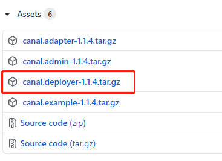
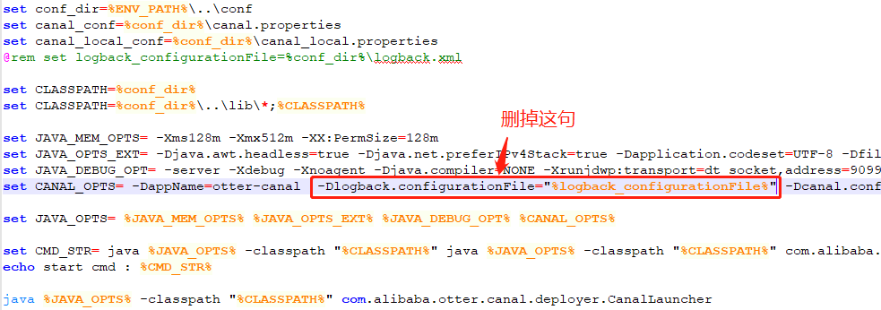
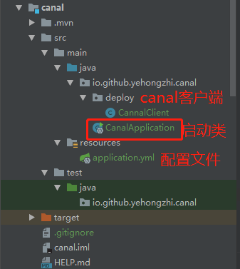
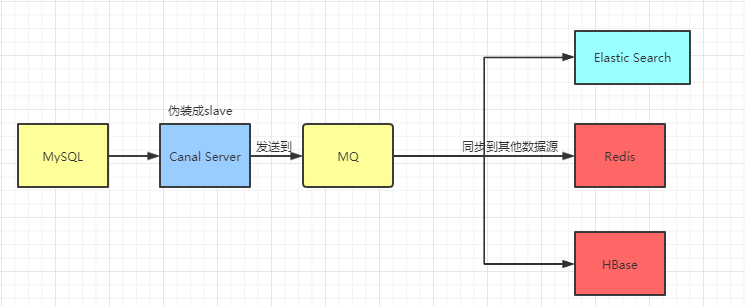

# 思维导图


> 本文章已收录到个人博客网站(我爱B站)：me.lovebilibili.com

# 前言

我们都知道一个系统最重要的是数据，数据是保存在数据库里。但是很多时候不单止要保存在数据库中，还要同步保存到Elastic Search、HBase、Redis等等。

这时我注意到阿里开源的框架**Canal**，他可以很方便地**同步数据库的增量数据到其他的存储应用**。所以在这里总结一下，分享给各位读者参考~

# 一、什么是canal

我们先看官网的介绍

> canal，译意为水道/管道/沟渠，主要用途是基于 **MySQL 数据库增量日志解析**，提供**增量数据订阅和消费**。

这句介绍有几个关键字：**增量日志，增量数据订阅和消费**。

这里我们可以简单地把canal理解为一个用来**同步增量数据的一个工具**。

接下来我们看一张官网提供的示意图：


canal的工作原理就是**把自己伪装成MySQL slave，模拟MySQL slave的交互协议向MySQL Mater发送 dump协议，MySQL mater收到canal发送过来的dump请求，开始推送binary log给canal，然后canal解析binary log，再发送到存储目的地**，比如MySQL，Kafka，Elastic Search等等。

# 二、canal能做什么

以下参考[canal官网](https://github.com/alibaba/canal)。

与其问canal能做什么，不如说数据同步有什么作用。

但是canal的数据同步**不是全量的，而是增量**。基于binary log增量订阅和消费，canal可以做：

- 数据库镜像
- 数据库实时备份
- 索引构建和实时维护
- 业务cache(缓存)刷新
- 带业务逻辑的增量数据处理

# 三、如何搭建canal

## 3.1 首先有一个MySQL服务器

当前的 canal 支持源端 MySQL 版本包括 5.1.x , 5.5.x , 5.6.x , 5.7.x , 8.0.x

我的Linux服务器安装的MySQL服务器是5.7版本。

MySQL的安装这里就不演示了，比较简单，网上也有很多教程。

然后在MySQL中需要创建一个用户，并授权：

```sql
-- 使用命令登录：mysql -u root -p
-- 创建用户 用户名：canal 密码：Canal@123456
create user 'canal'@'%' identified by 'Canal@123456';
-- 授权 *.*表示所有库
grant SELECT, REPLICATION SLAVE, REPLICATION CLIENT on *.* to 'canal'@'%' identified by 'Canal@123456';
```

下一步在MySQL配置文件my.cnf设置如下信息：

```yml
[mysqld]
# 打开binlog
log-bin=mysql-bin
# 选择ROW(行)模式
binlog-format=ROW
# 配置MySQL replaction需要定义，不要和canal的slaveId重复
server_id=1
```

改了配置文件之后，重启MySQL，使用命令查看是否打开binlog模式：


查看binlog日志文件列表：


查看当前正在写入的binlog文件：


MySQL服务器这边就搞定了，很简单。

## 3.2 安装canal

去官网下载页面进行下载：https://github.com/alibaba/canal/releases

我这里下载的是1.1.4的版本：


解压**canal.deployer-1.1.4.tar.gz**，我们可以看到里面有四个文件夹：


接着打开配置文件conf/example/instance.properties，配置信息如下：

```properties
## mysql serverId , v1.0.26+ will autoGen
## v1.0.26版本后会自动生成slaveId，所以可以不用配置
# canal.instance.mysql.slaveId=0

# 数据库地址
canal.instance.master.address=127.0.0.1:3306
# binlog日志名称
canal.instance.master.journal.name=mysql-bin.000001
# mysql主库链接时起始的binlog偏移量
canal.instance.master.position=154
# mysql主库链接时起始的binlog的时间戳
canal.instance.master.timestamp=
canal.instance.master.gtid=

# username/password
# 在MySQL服务器授权的账号密码
canal.instance.dbUsername=canal
canal.instance.dbPassword=Canal@123456
# 字符集
canal.instance.connectionCharset = UTF-8
# enable druid Decrypt database password
canal.instance.enableDruid=false

# table regex .*\\..*表示监听所有表 也可以写具体的表名，用，隔开
canal.instance.filter.regex=.*\\..*
# mysql 数据解析表的黑名单，多个表用，隔开
canal.instance.filter.black.regex=
```

我这里用的是win10系统，所以在bin目录下找到startup.bat启动：

启动就报错，坑呀：


要修改一下启动的脚本startup.bat：



然后再启动脚本：


这就启动成功了。

# Java客户端操作

首先引入maven依赖：

```xml
<dependency>
    <groupId>com.alibaba.otter</groupId>
    <artifactId>canal.client</artifactId>
    <version>1.1.4</version>
</dependency>
```

然后创建一个canal项目，使用SpringBoot构建，如图所示：



在CannalClient类使用Spring Bean的生命周期函数afterPropertiesSet()：

```java
@Component
public class CannalClient implements InitializingBean {

    private final static int BATCH_SIZE = 1000;

    @Override
    public void afterPropertiesSet() throws Exception {
        // 创建链接
        CanalConnector connector = CanalConnectors.newSingleConnector(new InetSocketAddress("127.0.0.1", 11111), "example", "", "");
        try {
            //打开连接
            connector.connect();
            //订阅数据库表,全部表
            connector.subscribe(".*\\..*");
            //回滚到未进行ack的地方，下次fetch的时候，可以从最后一个没有ack的地方开始拿
            connector.rollback();
            while (true) {
                // 获取指定数量的数据
                Message message = connector.getWithoutAck(BATCH_SIZE);
                //获取批量ID
                long batchId = message.getId();
                //获取批量的数量
                int size = message.getEntries().size();
                //如果没有数据
                if (batchId == -1 || size == 0) {
                    try {
                        //线程休眠2秒
                        Thread.sleep(2000);
                    } catch (InterruptedException e) {
                        e.printStackTrace();
                    }
                } else {
                    //如果有数据,处理数据
                    printEntry(message.getEntries());
                }
                //进行 batch id 的确认。确认之后，小于等于此 batchId 的 Message 都会被确认。
                connector.ack(batchId);
            }
        } catch (Exception e) {
            e.printStackTrace();
        } finally {
            connector.disconnect();
        }
    }

    /**
     * 打印canal server解析binlog获得的实体类信息
     */
    private static void printEntry(List<Entry> entrys) {
        for (Entry entry : entrys) {
            if (entry.getEntryType() == EntryType.TRANSACTIONBEGIN || entry.getEntryType() == EntryType.TRANSACTIONEND) {
                //开启/关闭事务的实体类型，跳过
                continue;
            }
            //RowChange对象，包含了一行数据变化的所有特征
            //比如isDdl 是否是ddl变更操作 sql 具体的ddl sql beforeColumns afterColumns 变更前后的数据字段等等
            RowChange rowChage;
            try {
                rowChage = RowChange.parseFrom(entry.getStoreValue());
            } catch (Exception e) {
                throw new RuntimeException("ERROR ## parser of eromanga-event has an error , data:" + entry.toString(), e);
            }
            //获取操作类型：insert/update/delete类型
            EventType eventType = rowChage.getEventType();
            //打印Header信息
            System.out.println(String.format("================》; binlog[%s:%s] , name[%s,%s] , eventType : %s",
                    entry.getHeader().getLogfileName(), entry.getHeader().getLogfileOffset(),
                    entry.getHeader().getSchemaName(), entry.getHeader().getTableName(),
                    eventType));
            //判断是否是DDL语句
            if (rowChage.getIsDdl()) {
                System.out.println("================》;isDdl: true,sql:" + rowChage.getSql());
            }
            //获取RowChange对象里的每一行数据，打印出来
            for (RowData rowData : rowChage.getRowDatasList()) {
                //如果是删除语句
                if (eventType == EventType.DELETE) {
                    printColumn(rowData.getBeforeColumnsList());
                    //如果是新增语句
                } else if (eventType == EventType.INSERT) {
                    printColumn(rowData.getAfterColumnsList());
                    //如果是更新的语句
                } else {
                    //变更前的数据
                    System.out.println("------->; before");
                    printColumn(rowData.getBeforeColumnsList());
                    //变更后的数据
                    System.out.println("------->; after");
                    printColumn(rowData.getAfterColumnsList());
                }
            }
        }
    }

    private static void printColumn(List<Column> columns) {
        for (Column column : columns) {
            System.out.println(column.getName() + " : " + column.getValue() + "    update=" + column.getUpdated());
        }
    }
}
```

以上就完成了Java客户端的代码。这里不做具体的处理，仅仅是打印，先有个直观的感受。

最后我们开始测试，首先启动MySQL、Canal Server，还有刚刚写的Spring Boot项目。然后创建表：

```sql
CREATE TABLE `tb_commodity_info` (
  `id` varchar(32) NOT NULL,
  `commodity_name` varchar(512) DEFAULT NULL COMMENT '商品名称',
  `commodity_price` varchar(36) DEFAULT '0' COMMENT '商品价格',
  `number` int(10) DEFAULT '0' COMMENT '商品数量',
  `description` varchar(2048) DEFAULT '' COMMENT '商品描述',
  PRIMARY KEY (`id`)
) ENGINE=InnoDB DEFAULT CHARSET=utf8mb4 COMMENT='商品信息表';
```

然后我们在控制台就可以看到如下信息：


如果新增一条数据到表中：

```sql
INSERT INTO tb_commodity_info VALUES('3e71a81fd80711eaaed600163e046cc3','叉烧包','3.99',3,'又大又香的叉烧包，老人小孩都喜欢');
```

控制台可以看到如下信息：


# 总结

canal的好处在于**对业务代码没有侵入**，因为是**基于监听binlog日志去进行同步数据的**。实时性也能做到准实时，其实是很多企业一种比较常见的数据同步的方案。

通过上面的学习之后，我们应该都明白canal是什么，它的原理，还有用法。实际上这仅仅只是入门，因为实际项目中我们不是这样玩的...

实际项目我们是**配置MQ模式，配合RocketMQ或者Kafka，canal会把数据发送到MQ的topic中，然后通过消息队列的消费者进行处理**。



Canal的部署也是支持集群的，需要配合ZooKeeper进行集群管理。

Canal还有一个简单的Web管理界面。

下一篇就讲一下**集群部署Canal，配合使用Kafka，同步数据到Redis**。

参考资料：[Canal官网](https://github.com/alibaba/canal)

## 絮叨

上面所有例子的代码都上传Github了：

> https://github.com/yehongzhi/mall

**如果你觉得这篇文章对你有用，点个赞吧**~

**你的点赞是我创作的最大动力**~