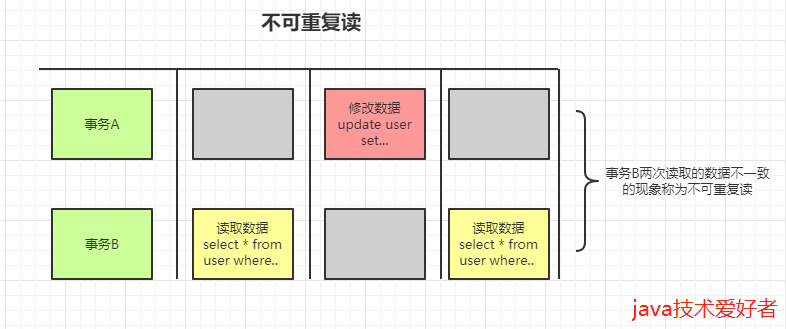
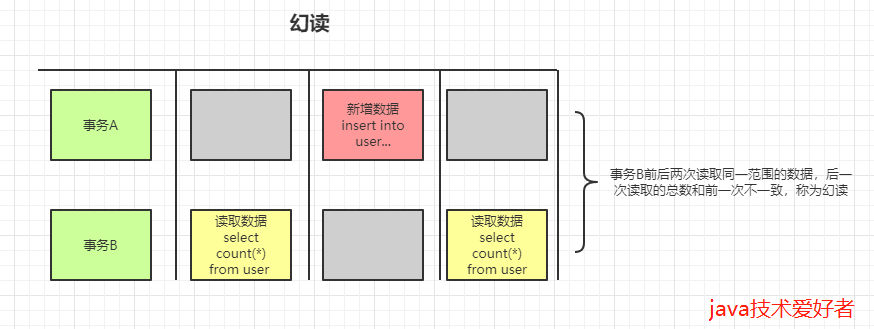
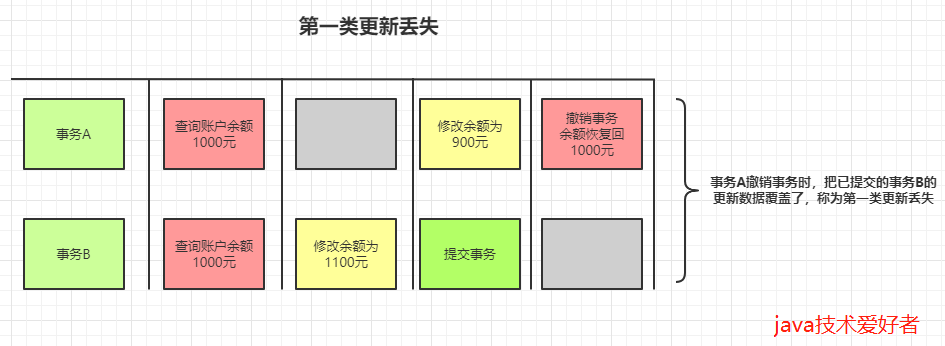
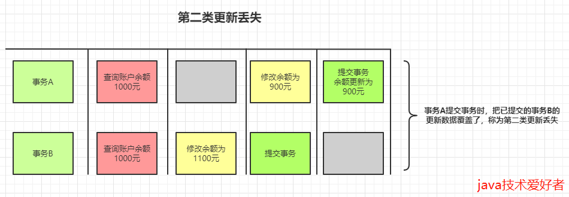

> **文章已收录Github精选，欢迎Star**：https://github.com/yehongzhi/learningSummary

# 脏读、不可重复读、幻读

在现代关系型数据库中，事务机制是非常重要的，假如在多个事务并发操作数据库时，如果没有有效的机制进行避免就会导致出现脏读，不可重复读，幻读。

## 脏读

1、在事务A执行过程中，事务A对数据资源进行了修改，事务B读取了事务A修改后的数据。

2、由于某些原因，事务A并没有完成提交，发生了RollBack操作，则事务B读取的数据就是脏数据。

这种读取到另一个事务未提交的数据的现象就是脏读(Dirty Read)。

## 不可重复读

事务B读取了两次数据资源，在这两次读取的过程中事务A修改了数据，导致事务B在这两次读取出来的数据不一致。

这种在同一个事务中，前后两次读取的数据不一致的现象就是不可重复读(Nonrepeatable Read)。

## 幻读

事务B前后两次读取同一个范围的数据，在事务B两次读取的过程中事务A新增了数据，导致事务B后一次读取到前一次查询没有看到的行。

幻读和不可重复读有些类似，但是幻读强调的是集合的增减，而不是单条数据的更新。

## 第一类更新丢失

事务A和事务B都对数据进行更新，但是事务A由于某种原因事务回滚了，把已经提交的事务B的更新数据给覆盖了。这种现象就是第一类更新丢失。

## 第二类更新丢失

其实跟第一类更新丢失有点类似，也是两个事务同时对数据进行更新，但是事务A的更新把已提交的事务B的更新数据给覆盖了。这种现象就是第二类更新丢失。

# 事务隔离级别

为了解决以上的问题，主流的关系型数据库都会提供四种事务的隔离级别。事务隔离级别从低到高分别是：读未提交、读已提交、可重复读、串行化。事务隔离级别等级越高，越能保证数据的一致性和完整性，但是执行效率也越低。所以在设置数据库的事务隔离级别时需要做一下权衡，**MySQL默认是可重复读的级别**。

## 读未提交

读未提交(Read Uncommitted)，是最低的隔离级别，所有的事务都可以看到其他未提交的事务的执行结果。只能防止第一类更新丢失，不能解决脏读，可重复读，幻读，所以很少应用于实际项目。

## 读已提交

读已提交(Read Committed)， 在该隔离级别下，一个事务的更新操作结果只有在**该事务提交之后，另一个事务才可能读取到同一笔数据更新后的结果**。可以防止脏读和第一类更新丢失，但是不能解决可重复读和幻读的问题。

## 可重复读

可重复读(Repeatable Read)，MySQL默认的隔离级别。在该隔离级别下，一个事务多次读同一个数据，在这个事务还没结束时，其他事务不能访问该数据(包括了读写)，这样就可以在同一个事务内两次读到的数据是一样的。可以防止脏读、不可重复读、第一类更新丢失、第二类更新丢失的问题，不过还是会出现幻读。

## 串行化

串行化(Serializable)，这是最高的隔离级别。它要求事务序列化执行，事务只能一个接着一个地执行，不能并发执行。在这个级别，可以解决上面提到的所有并发问题，但可能导致大量的超时现象和锁竞争，通常不会用这个隔离级别。

# 总结

下面我们对事务的隔离级别和对并发问题的解决情况，请看下图：

这篇文章就讲到这里了，感谢大家的阅读，希望看完大家能有所收获！

