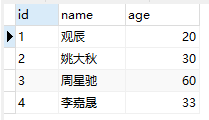
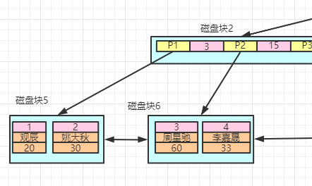

> **文章已收录Github精选，欢迎Star**：https://github.com/yehongzhi/learningSummary

# 前言

我们都知道当查询数据库变慢时，需要建索引去优化。但是只知道索引能优化显然是不够的，我们更应该知道索引的原理，因为不是加了索引就一定会提升性能。那么接下来就一起探索MYSQL索引的原理吧。

# 什么是索引

索引其实是一种能高效帮助MYSQL获取数据的数据结构，通常保存在磁盘文件中，好比一本书的目录，能加快数据库的查询速度。除此之外，索引是有序的，所以也能提高数据的排序效率。

通常MYSQL的索引包括聚簇索引，覆盖索引，复合索引，唯一索引，普通索引，通常底层是B+树的数据结构。

总结一下，索引的优势在于：

- 提高查询效率。
- 降低数据排序的成本。

缺点在于：

- 索引会占用磁盘空间。
- 索引会降低更新表的效率。因为在更新数据时，要额外维护索引文件。

# 索引的类型

- 聚簇索引

索引列的值必须是唯一的，并且不能为空，一个表只能有一个聚簇索引。

- 唯一索引

索引列的值是唯一的，值可以为空。

- 普通索引

没有什么限制，允许在定义索引的列中插入重复值和空值。

- 复合索引

也叫组合索引，用户可以在多个列上组合建立索引，遵循“最左匹配原则”，在条件允许的情况下使用复合索引可以替代多个单列索引的使用。

# 索引的数据结构

我们都知道索引的底层数据结构采用的是B+树，但是在讲B+树之前，要先知道B树，因为B+树是在B树上面进行改进优化的。

首先讲一下B树的特点：

- B树的每个节点都存储了多个元素，每个内节点都有多个分支。
- 节点中元素包含键值和数据，节点中的键值从小到大排序。
- 父节点的数据不会出现在子节点中。
- 所有的叶子节点都在同一层，叶节点具有相同的深度。


在上面的B树中，假如我们要找值等于18的数据，查找路径就是磁盘块1->磁盘块3->磁盘块8。

过程如下：

第一次磁盘IO：首先加载磁盘块1到内存中，在内存中遍历比较，因为17<18<50，所以走中间P2，定位到磁盘块3。

第二次磁盘IO：加载磁盘块3到内存，依然是遍历比较，18<25，所以走左边P1，定位到磁盘块8。

第三次磁盘IO：加载磁盘块8到内存，在内存中遍历，18=18，找到18，取出data。

如图所示：


如果data存储的是行数据，直接返回，如果存的是磁盘地址则根据磁盘地址到磁盘中取出数据。可以看出B树的查询效率是很高的。

> B树存在着什么问题，需要改进优化呢？

第一个问题：B树在范围查询时，性能并不理想。假如要查询13到30之间的数据，查询到13后又要回到根节点再去查询后面的数据，就会产生多次的查询遍历。

第二个问题：因为非叶子节点和叶子节点都会存储数据，所以占用的空间大，一个页可存储的数据量就会变少，树的高度就会变高，磁盘的IO次数就会变多。

基于以上两个问题，就出现了B树的升级版，B+树。

B+树与B树最大的区别在于两点：

- B+树只有叶子节点存储数据，非叶子节点只存储键值。而B树的非叶子节点和叶子节点都会存储数据。
- B+树的最底层的叶子节点会形成一个双向有序链表，而B树不会。

如图所示：


> B+树的等值查询过程是怎么样的？

如果在B+树中进行等值查询，比如查询等于13的数据。

查询路径为：磁盘块1->磁盘块2->磁盘块6。

第一次IO：加载磁盘块1，在内存中遍历比较，13<17，走左边，找到磁盘块2。

第二次IO：加载磁盘块2，在内存中遍历比较，10<13<15，走中间，找到磁盘块6。

第三次IO：加载磁盘块6，依次遍历，找到13=13，取出data。

所以B+树在等值查询的效率是很高的。

> B+树的范围查询过程又是怎么样呢？

比如我们要进行范围查询，查询大于5并且小于15的数据。

查询路径为：磁盘块1->磁盘块2->磁盘块5->磁盘块6。

第一次IO：加载磁盘块1，比较得出5<17，然后走左边，找到磁盘块2。

第二次IO：加载磁盘块2，比较5<10，然后还是走左边，找到磁盘块5。

第三次IO：加载磁盘块5，然后找大于5的数据。

第四次IO：由于最底层是有序的双向链表，所以继续往右遍历即可，直到不符合小于15的数据为止。

过程如图所示：


所以在范围查询的时候，是不需要像B树一样，再回到根节点，这就是底层采用双向链表的好处。

所以B+树的优势在于，能**保证等值查询和范围查询的快速查找**。

# InnoDB索引

我们常用的MySQL存储引擎一般是InnoDB，所以接下来讲讲几种不同的索引的底层数据结构，以及查找过程。

## 聚簇索引

前面讲过，每个InnoDB表有且仅有一个聚簇索引。除此之外，聚簇索引在表的创建有以下几点规则：

- 在表中，如果定义了主键，InnoDB会将主键索引作为聚簇索引。
- 如果没有定义主键，则会选择第一个不为NULL的唯一索引列作为聚簇索引。
- 如果以上两个都没有。InnoDB 会使用一个6 字节长整型的隐式字段 ROWID字段构建聚簇索引。该ROWID字段会在插入新行时自动递增。

除了聚簇索引之外的索引都称为非聚簇索引，区别在于，聚簇索引的叶子节点存储的数据是整行数据，而非聚簇索引存储的是该行的主键值。

比如有一张user表，如图所示：



底层的数据结构就像这样：



当我们用主键值去查询的时候，查询效率是很快的，因为可以直接返回数据。


## 普通索引

也就是用得最多的一种索引，比如我要为user表的age列创建索引，SQL语句可以这样写：

```sql
CREATE INDEX INDEX_USER_AGE ON `user`(age);
```

普通索引属于非聚簇索引，所以叶子节点存储的是主键值，底层的数据结构大概长这个样子：


比如要查询age=33的数据，那么首先查到磁盘块7的age=33的数据，获取到主键值，主键值为4。

接着再通过主键值等于4，查询到该行的数据。所以总得来说，底层会进行两次查询。

这种先通过查询主键值，再通过主键值查询到数据的过程就叫做回表查询。

## 覆盖索引

既然上面提到了回表查询，那么自然而然会想到，有没有什么办法能避免回表查询呢？答案肯定是有的，那就是使用覆盖索引。

覆盖索引不是一种索引的类型，而是一种使用索引的方式。假设你需要查询的列是建立了索引，查询的结果在索引列上就能获取，那就可以用覆盖索引。

比如上面的例子，我们通过age=33查询，我需要查询的结果就只要age这一列，那就可以用到覆盖索引，如图所示：


使用到覆盖索引的话，就能避免回表查询，所以在写SQL语句时尽量不要写`SELECT *`。

# 总结

这篇文章主要讲的是索引的类型，索引的数据结构，以及InnoDB表中常用的几种索引。当然，除了上述讲的这些之外，还有很多关于索引的知识，比如索引失效的场景，索引创建的原则等等，由于篇幅过长，留着以后再讲。

那么这篇文章就写到这里了，感谢大家的阅读。

