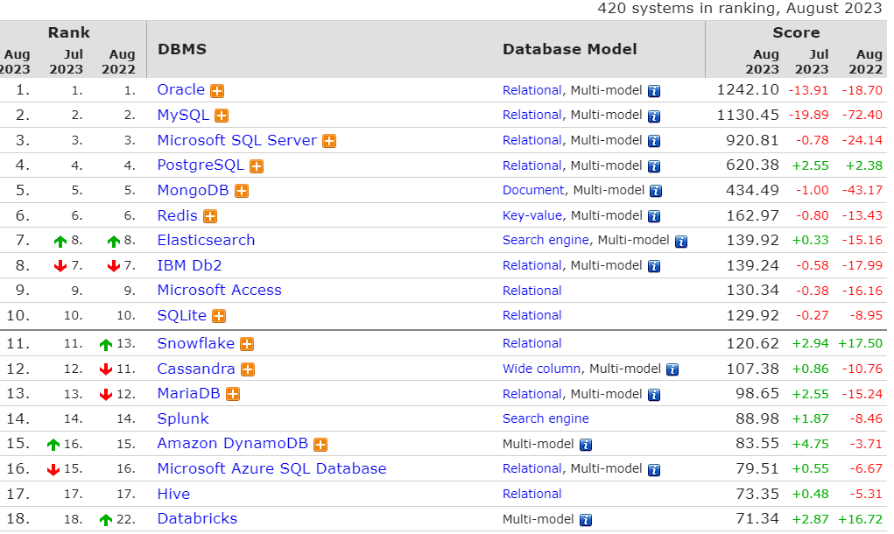
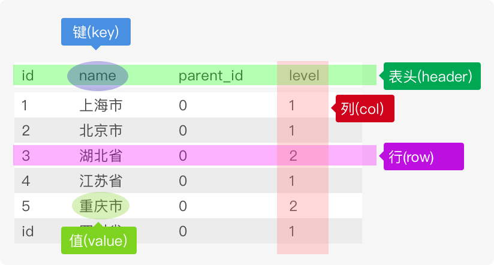

# 数据库排名

https://db-engines.com/en/ranking




# 数据库基础

数据库(Database，DB)是按照数据结构来组织、存储和管理数据的建立在计算机存储设备上的仓库。

简单来说是本身可视为电子化的文件柜——存储电子文件的处所，用户可以对文件中的数据进行新增、截取、更新、删除等操作。数据管理不再仅仅是存储和管理数据，而转变成用户所需要的各种数据管理的方式。数据库有很多种类型，从最简单的存储有各种数据的表格到能够进行海量数据存储的大型数据库系统都在各个方面得到了广泛的应用。

## 什么是数据库

> 人们通常用数据库这个术语来代表他们使用的数据库软件。这是不正确的，它是引起混淆的根源。确切地说，数据库软件应称为`DBMS`(数据库管理系统)。数据库是通过 `DBMS` 创建和操纵的容器。数据库可以是保存在硬设备上的文件，但也可以不是。在很大程度上说，数据库究竟是文件还是别的什么东西并不重要，因为你并不直接访问数据库；你使用的是`DBMS`，它替你访问数据库。

数据库指的是以一定方式储存在一起、能为多个用户共享、具有尽可能小的冗余度、与应用程序彼此独立的数据集合。简单来说可视为电子化的文件柜——存储电子文件的处所，用户可以对文件中的数据运行新增、截取、更新、删除等操作。

RDBMS即关系数据库管理系统(Relational Database Management System)的特点：

1. 数据以表格的形式出现
2. 每行为各种记录名称
3. 每列为记录名称所对应的数据域
4. 许多的行和列组成一张表单
5. 若干的表单组成database

## 数据库分类

数据库的分类可多了去了，在维基百科上面有下面这些数据库，并粗略的分了个类别。一看这里面的学问大了去了，还是先搬一些代表性的吧，长长见识，要深入了解各种概念推荐看《数据库系统概论》。

### 关系数据库

_（英语：Relational database），是创建在关系模型基础上的数据库，借助于集合代数等数学概念和方法来处理数据库中的数据。现实世界中的各种实体以及实体之间的各种联系均用关系模型来表示。关系模型是由埃德加·科德于1970年首先提出的，并配合“科德十二定律”。现如今虽然对此模型有一些批评意见，但它还是数据存储的传统标准。标准数据查询语言SQL就是一种基于关系数据库的语言，这种语言执行对关系数据库中数据的检索和操作。_

- MySQL
  - MariaDB（MySQL的代替品，英文维基百科从MySQL转向MariaDB）
  - Percona Server（MySQL的代替品）
- PostgreSQL
- Microsoft Access
- Google Fusion Tables
- SQL Server
- FileMaker
- Oracle
- Sybase
- dBASE
- Clipper
- FoxPro

几乎所有的数据库管理系统都配备了一个开放式数据库连接（ODBC）驱动程序，令各个数据库之间得以互相集成。

### 非关系型数据库（NoSQL）

_NoSQL一词最早出现于1998年，是Carlo Strozzi开发的一个轻量、开源、不提供SQL功能的关系数据库。当代典型的关系数据库在一些数据敏感的应用中表现了糟糕的性能，例如为巨量文档创建索引、高流量网站的网页服务，以及发送流式媒体。关系型数据库的典型实现主要被调整用于执行规模小而读写频繁，或者大批量极少写访问的事务。_

#### Key/value最终一致性存储

- Apache Cassandra（为Facebook所使用）：高度可扩展
- Dynamo
- Hibari
- Project Voldemort
- Riak 

#### Key/value硬盘存储

- LevelDB（Google）
- BigTable
- MemcacheDB
- Tokyo Cabinet
- Tuple space
- TreapDB

#### Key/value RAM存储

- Oracle Coherence
- memcached
- Citrusleaf database
- Velocity
- **Redis**
- Tuple space

#### Key/value基于Paxos算法的存储

- Keyspace

## 数据库模型

数据库模型描述了在数据库中结构化和操纵数据的方法，模型的结构部分规定了数据如何被描述（例如树、表等）。数据库模型的分类如下：

- 对象模型
- 层次模型（轻量级数据访问协议）
- 网状模型（大型数据储存）
- 关系模型
- 面向对象模型
- 半结构化模型
- 平面模型（表格模型，一般在形式上是一个二维数组。如表格模型数据Excel)

### 架构

_数据库的架构可以大致区分为三个概括层次：内层、概念层和外层。_

- 内层：最接近实际存储体，亦即有关数据的实际存储方式。
- 外层：最接近用户，即有关个别用户观看数据的方式。
- 概念层：介于两者之间的间接层。

### 数据库索引

数据索引的观念由来已久，像是一本书前面几页都有目录，目录也算是索引的一种，只是它的分类较广，例如车牌、身份证字号、条码等，都是一个索引的号码，当我们看到号码时，可以从号码中看出其中的端倪，若是要找的人、车或物品，也只要提供相关的号码，即可迅速查到正确的人事物。

### 数据库操作：事务

事务（transaction）是用户定义的一个数据库操作序列，这些操作要么全做，要么全不做，是一个不可分区的工作单位。 

## 数据表

关系数据库没有数据表，关键字、主键、索引等也就无从谈起，数据表是关系数据库中一个非常重要的对象，是其它对象的基础，也是一系列二维数组的集合，用来存储、操作数据的逻辑结构。根据信息的分类情况。一个数据库中可能包含若干个数据表，每张表是由行和列组成，记录一条数据数据表就增加一行，每一列是由字段名和字段数据集合组成，列被称之为字段，每一列还有自己的多个属性，例如是否允许为空、默认值、长度、类型、存储编码、注释等



**数据类型**

在定义数据字段的类型对你的数据库的优化非常重要，数据类型决定了数据在计算机中的存储格式，代表不同的信息类型，大致可以分为：数值、日期/时间和字符串(字符)类型，字符串类型又包括二进制类型。

上图中每一列就是一个字段，每个字段都有自己的类型，例如`name`列为字符串类型，`level` 列为数字类型。

## 关系键

_关系键是关系数据库的重要组成部分。关系键是一个表中的一个或几个属性，用来标识该表的每一行或与另一个表产生联系。一列(或一组列)，其值能够唯一区分表中每个行。_

### 主键

主键（primary key或unique key），又称主码，数据库表中对储存数据对象予以唯一和完整标识的数据列或属性的组合。一个数据列只能有一个主键，且主键的取值不能缺失，即不能为空值（Null）。unique 可空，可以在一个表里的一个或多个字段定义；primary key 不可空不可重复，在一个表里可以定义联合主键；unique索引和primary索引区别:

1. primary key = unique + not null
2. 唯一约束和主键一样都是约束的范畴，而且都可以作为外键的参考，不同的是，一张表只能有一个主键
3. 主键和唯一约束的创建需要依靠索引，如果在创建主键或唯一约束的时候没有已经建好的索引可以使用的话，Oracle会自动建立一个唯一的索引。

表中的任何列都可以作为主键，只要它满足以下条件: 

- unique 就是唯一，当你需要限定你的某个表字段每个值都唯一，没有重复值时使用。
- 任意两行都不具有相同的主键值；
- 每个行都必须具有一个主键值(主键列不允许NULL值)。

除MySQL强制实施的规则外，应该坚持的几个普遍认可的最好习惯为:

- 不更新主键列中的值；
- 不重用主键列的值；
- 不在主键列中使用可能会更改的值。(例如，如果使用一个名字作为主键以标识某个供应商，当该供应商合并和更改其名字时，必须更改这个主键。)

### 超键

超键（superkey），有的文献称“超码”，是在数据库关系模式设计中能够唯一标示多元组（即“行”）的属性集。包含所有属性的集叫做明显（平凡）超键。

### 候选键

在关系模型中，候选键或候选码（candidate key）是某个关系变量的一组属性所组成的集合，它需要同时满足下列两个条件：

- 这个属性集合始终能够确保在关系中能唯一标识元组
- 在这个属性集合中找不出真子集能够满足条件

满足第一个条件的属性集合称为超键，因此我们也可以把候选键定义为“最小超键”，也就是不含有多余属性的超键。

候选键的重要性是它们能够在关系中唯一标识出不同的元组，因此超键也是在设计数据库模式时需要指定的最重要的约束之一。由于在关系模型中，每个关系都是一个集合（没有重复的元素），所以每个关系都至少有一个候选键（因为所有属性组合必然是个超键）。但是在某些关系型数据库中表也能代表多重集，所以在每个关系中都显式地定义至少一个候选键是一条很重要的设计原则。数据库管理系统通常都需要将每个关系中的某个候选键定义为主键，亦即这个候选键是区分不同元组时首选的识别方式，例如外键通常就是引用主键而非其他候选键。

### 外键

外键（foreign key，台湾译作外来键），又称外部键。其实在关系数据库中，每个数据表都是由关系来连系彼此的关系，父数据表（Parent Entity）的主键（primary key）会放在另一个数据表，当做属性以创建彼此的关系，而这个属性就是外键。

比如，学生跟老师之间是教学的关系，学生数据表会有个属性叫指导老师（FK），而这个值就是对应到老师数据表的老师代号（PK），学生的指导老师就是外键。

### 代理键

在关系型数据库设计中，代理键是在当数据表中的候选键都不适合当主键时，例如数据太长，或是意义层面太多，就会请一个无意义的但唯一的字段来代为作主键。

代理键是：

- Surrogate (1) – Hall, Owlett and Codd (1976)
  一个代理键值确定了外部世界的一个实体。代理键值是数据库生成的，从来不显示给用户或应用程序看。
- Surrogate (2) – Wieringa and De Jonge (1991)
  一个代理键值确定了数据库中的一个对象。代理键值是数据库生成的，用户或应用程序看不到它。

在实践中，代理键值通常是个自动递增的数字。在Sybase或SQL Server，用identity column标识代理键，PostgreSQL里用serial，Oracle里用SEQUENCE，在MySQL里用一个标记有AUTO_INCREMENT的字段。

### 自然键

自然键与代理键相反，它是在自然生活中唯一确定一个事物的标识。身份证号就是一个自然键，用于确定一个人。

# 数据库技术构成

数据库技术的出现是为了更加有效的管理和存取大量的数据资源。简单的来讲，数据库技术主要包括数据库系统，SQL语言，数据库访问技术。

## 数据库系统

数据库系统有3个主要的组成部分。

### 数据库

_数据库（Database System）：用于存储数据的地方。_

### 数据库管理系统

_数据库管理系统（Database Management System，DBMS）：用户管理数据库的软件。_

### 数据库应用程序

_数据库应用程序（Database Application）：为了提高数据库系统的处理能力所使用的管理数据库的软件补充。_

## SQL语言

SQL，(Structured Query Language)即结构化查询语言，数据库管理系统专门通过SQL语言来管理数据库中的数据，与数据库通信。

### SQL的优点:

- SQL不是某个特定数据库供应商专有的语言。几乎所有重要的DBMS都支持SQL，所以，学习此语言使你几乎能与所有数据库打交道。
- SQL简单易学。它的语句全都是由描述性很强的英语单词组成，而且这些单词的数目不多。
- SQL尽管看上去很简单，但它实际上是一种强有力的语言，灵活使用其语言元素，可以进行非常复杂和高级的数据库操作。

> **DBMS专用的SQL**：SQL不是一种专利语言，而且存在一个标准委员会，他们试图定义可供所有DBMS使用的SQL语法，但事实上任意两个DBMS实现的SQL都不完全相同。本书讲授的SQL是专门针对MySQL的，虽然书中所讲授的多数语法也适用于其他DBMS，但不要认为这些SQL语法是完全可移植的。

### SQL为数据库管理系统提供的功能

SQL语言是一种数据库查询和程序设计语言，其主要用于存取数据、查询数据、更新数据和管理数据库系统。具体的，SQL分为4个部分，这里只是大概整理一下，详细的后面我会在SQL相关中仔细整理。

- 数据定义语言（Data Definition Language，DDL）：DROP、CREATE、ALTER等语句；数据库定义语言。主要用于定义数据库、表、视图、索引和触发器等。CREATE语句主要用于创建数据库、创建表、创建视图。ALTER语句主要用于修改表的定义，修改视图的定义。DROP语句主要用于删除数据库、删除表和删除视图等。
- 数据操作语言（Data Manipulation Language，DML）：INSERT、UPDATE、DELETE语句；数据库操作语言。主要用于插入数据，更新数据，删除数据。INSERT语句用于插入数据，UPDATE语句用于更新数据，DELETE语句用于删除数据。
- 数据查询语言（Data Query Language，DQL）：SELECT语句。主要用于查询数据。
- 数据控制语言（Data Control Language，DCL）：数据库控制语言。主要用于控制用户的访问权限。其中GRANT语句用于给用户增加权限，REVOKE语句用于收回用户的权限。

数据库管理系统通过这些SQL语句可以操作数据库中的数据，在应用程序中，也可以通过SQL语句来操作数据。来几个 SQL 语句的例子，这条语句声明创建一个叫 user 的表：

```sql
CREATE TABLE `user` (
  `id`     int(100) unsigned NOT NULL AUTO_INCREMENT,
  `name`   varchar(32) NOT NULL DEFAULT '' COMMENT '姓名',
  `sex`    tinyint(32) NOT NULL DEFAULT 0  COMMENT '性别：0,保密；1,男；2,女',
  `mobile` varchar(20) NOT NULL DEFAULT '' COMMENT '手机',
  PRIMARY KEY (`id`)
);
```

这张表包含 4 个字段，分别为 id、name、sex、mobile，其中 id 定义为表的主键，并且只能为正数的自增长字段。并且字段 sex 有默认值 0，每个 COMMENT 后面均为字段注释。

表定义好了，我们可以向这张表插入数据，下面这条语句是在 user 表中插入一条数据记录：

```sql
INSERT INTO `user` SET name="张三",sex=1,mobile=13811772277;
INSERT INTO `user` VALUES (18,'王小二',0,12322224);
```

上面两条语句执行完之后，user 表中就会相对应增加一行新记录，第一条该记录中 id 是自增长的，部分字段有初始默认值，所以只需插入部分值也是可以插入成功的。第二条是必须按顺序填写对应的值，表中的id 字段比较特殊，所以插入 id 值的时候必须比表中最后一条数据的 id 值大，否则会报错。

插入数据之后我们再使用 SELECT 查询语句获取刚才插入的数据，如下：

```sql 
mysql> SELECT * FROM `user`;

-- +----+-----------+-----+-------------+
-- | id | name      | sex | mobile      |
-- +----+-----------+-----+-------------+
-- |  1 | 张三      |   1 | 13811772277 |
-- | 19 | 王小二    |   0 | 12322224    |
-- +----+-----------+-----+-------------+
```

上面几条 SQL 语句的例子，大家看了之后会有一个印象，知道 SQL 语句语法是什么样子，后面有大量的 SQL 语句知识帮助你学习 SQL 语法，玩好 MySQL。

## 数据库访问技术

这个`数据库访问技术` 小弟认为这个是一个学术性的研究词汇，我在维基百科各种百科对这个词汇要么没有，要么就一句话解释，不知道谁想出的这个词汇，在下甚是佩服，初步了解到这个是个什么技术呢？

不同的程序设计语言会有各自不同的数据库访问方法，这个访问方法称之为一种技术，程序语言通过这些技术，执行 SQL 语句，进行数据库的管理。下面搜集了一些主要的数据库访问技术

### ODBC

Open Database Connectivity(ODBC，开放数据库互连)，提供了一种标准的API（应用程序编程接口）方法来访问数据库管理系统（DBMS）。这些API利用SQL来完成其大部分任务。ODBC本身也提供了对SQL语言的支持，用户可以直接将SQL语句送给ODBC。ODBC的设计者们努力使它具有最大的独立性和开放性：与具体的编程语言无关，与具体的数据库系统无关，与具体的操作系统无关。

### ADO

微软公司的 ActiveX Data Objects（ADO）是一个用于访问数据源的COM组件，作为高层的编程界面层。ADO是在OLE DB之上，包含了很多层次化的COM对象与集合（Collections，也是一类对象，在其里面包含了其他层级对象）。允许开发人员编写访问数据的代码而不用关心数据源是如何实现与访问驱动的，而只用关心到数据库的连接。访问数据库的时候，关于SQL的知识不是必要的，但是特定数据库支持的SQL命令仍可以通过ADO中的命令对象（Command）来执行。

### MDAC

Microsoft Data Access Components（MDAC）是微软专门为数据访问功能而发展的应用程序开发接口，做为微软的统一化数据访问（Universal Data Access; UDA）解决方案的核心组成，最初的版本在1996年8月发表。目前其组成组件有ODBC，OLE DB以及ADO，其中ADO是在Visual Basic上唯一的数据访问管道，而OLE DB则是基于COM之上，供C/C++访问与提供数据的接口，ODBC则是统一化的数据访问API。

### JDBC

Java Database Connectivity（JDBC，Java数据库连接）是Java语言中用来规范客户端程序如何来访问数据库的应用程序接口，提供了诸如查询和更新数据库中数据的方法。JDBC也是Sun Microsystems的商标。JDBC是面向关系型数据库的。

