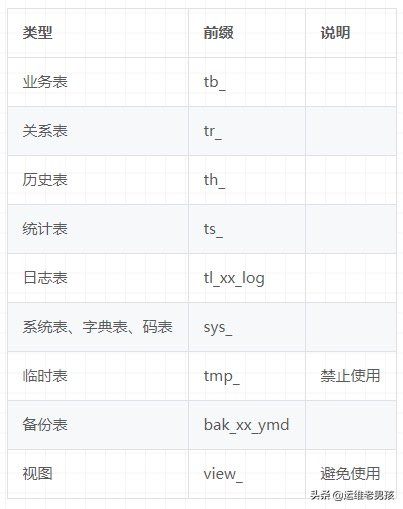

资料来源： 

[熬夜肝了 | 值得收藏！一篇数据库规范，你应该用得上](https://www.toutiao.com/article/7079617028516069891/?app=news_article&timestamp=1648381446&use_new_style=1&req_id=202203271944050101500981710D9A3976&group_id=7079617028516069891&wxshare_count=1&tt_from=weixin&utm_source=weixin&utm_medium=toutiao_android&utm_campaign=client_share&share_token=b9f549b0-172a-4892-b687-92a9318b27a9) 

## 数据库规范

### 数据库命名规范

采用小写字母、数字（通常不需要）和下划线组成。禁止使用’-’，命名简洁、含义明确。

### 表命名

- 根据业务类型不同，采用不同的前缀，小写字母、下划线组成
- 长度控制在30个字符以内
- 推荐的命名规则




### 引擎

使用默认Innodb引擎（5.5以后默认）

支持事务、支持行级锁、更好的恢复性、高并发下性能更好。

### 字符集

- 数据库和表的字符集统一,尽量使用UTF8（根据业务需求）
- 兼容性更好，统一字符集可以避免由于字符集转换产生的乱码，不同的字符集进行比较前需要进行转换会造成索引失效
- UTF8和UTF8MB4字段进行关联，会导致索引失效
- 除非特殊情况，禁止建表指定字符集（采用库默认字符集），降低出现字符集不统一导致性能问题的风险。
- 无特殊要求，禁止指定表COLLATE -----
- COLLATE主要的作用是排序的规则以及检索的规则，utf8字符集默认的是 utf8_general_ci ，utf8mb4字符集默认的是utf8mb4_general_ci，结尾的ci意思是不区分大小写。
- COLLATE会影响到ORDER BY语句的顺序，会影响到WHERE条件中大于小于号筛选出来的结果，会影响**DISTINCT**、**GROUP BY**、**HAVING**语句的查询结果。比如：select * from test where name like 'A%',在 utf8_bin字符集下，是无法检索出 ‘abc’字段的，并且排序的情况下Abc和abc所在的顺序是不一致的。
- 慎重选择row_format（行记录格式）
- Barracuda: 新的文件格式。它支持InnoDB的所有行格式，包括新的行格式：**COMPRESSED** 和 **DYNAMIC**
- 在 msyql 5.7.9 及以后版本，默认行格式由innodb_default_row_format变量决定，它的默认值是**DYNAMIC**
- db默认的innodb_file_format 为 Barracuda，默认的innodb_default_row_format为 dynamic；其中COMPRESSED 压缩比经测试最大也就 1/2，但读取和写入会有额外cpu开销，并且申请内存是按照解压后的原大小申请，在高并发情况下容易导致性能问题。
- Dynamic行格式，列存储是否放到off-page页，主要取决于行大小，他会把行中最长的一列放到off-page，直到数据页能存放下两行。TEXT或BLOB列<=40bytes时总是存在于数据页。这种方式可以避免compact那样把太多的大列值放到B-tree Node（数据页中只存放20个字节的指针，实际的数据存放在Off Page中，之前的Compact 和 Redundant 两种格式会存放768个字前缀字节）。
- Compressed物理结构上与Dynamic类似，Compressed行记录格式的另一个功能就是存储在其中的行数据会以zlib的算法进行压缩，因此对于BLOB、TEXT、VARCHAR这类大长度数据能够进行有效的存储（减少40%，但对CPU要求更高）。


### 字段设计

- 所有表和字段都需要添加注释，使用comment从句添加表和列的备注 从一开始就进行数据字典的维护

- 尽量控制单表数据量的大小，建议控制在500万以内

- 500万并不是MySQL数据库的限制，过大会造成修改表结构，备份，恢复都会有很大的问题，可以用历史数据归档（应用于日志数据），分库分表（应用于业务数据）等手段来控制数据量大小

- 谨慎使用MySQL分区表

- 分区表在物理上表现为多个文件，在逻辑上表现为一个表。谨慎选择分区键，跨分区查询效率可能更低，另外，对于表结构维护，分区表的维护造成的开销更集中，建议采用物理分表的方式管理大数据

- 建议将大字段，访问频度低的字段拆分到单独的表中存储，分离冷热数据，尽量做到冷热数据分离，减小表的宽度

- MySQL限制每个表最多存储4096列，并且每一行数据的大小不能超过65535字节。为减少磁盘IO,保证热数据的内存缓存命中率（表越宽，把表装载进内存缓冲池时所占用的内存也就越大,也会消耗更多的IO），更有效的利用缓存，避免读入无用的冷数据，经常一起使用的列放到一个表中（避免更多的关联操作）。对于非常用字段，建议采用扩展表的方式进行分表。

- 注意：每一行数据的65535字节中，utf8字符集下，varchar每一个长度占用3个字节，utf8mb4字符集下，每一个长度占用4个字节

- 尽量不在表中建立预留字段

- 预留字段的命名很难做到见名识义，预留字段无法确认存储的数据类型，所以无法选择合适的类型。对预留字段类型的修改，会对表进行锁

- 禁止使用外键约束

- 外键使得表之间相互耦合，影响update/delete等SQL性能，有可能造成死锁，高并发情况下容易成为数据库瓶颈。建议在业务端实现。

  ### 数据库字段设计规范

  - 关于数据长度
  - 够用前提下，越短越好，这样能够消耗更少的存储空间；因排序申请的内存大小和字段长度有关，需要进行排序时，长度小的字段消耗更少的内存空间；优先选择符合存储需要的最小的数据类型
  - 禁止使用TEXT/BLOB类型，禁止在数据库中存储图片，文件等大的二进制数据
  - 通常文件很大，会短时间内造成数据量快速增长，数据库进行数据库读取时，通常会进行大量的随机IO操作，文件很大时，IO操作很耗时。通常存储于文件服务器，数据库只存储文件地址信息
  - 避免使用ENUM(枚举)类型
  - 修改ENUM值需要使用ALTER语句;ENUM类型的ORDER BY操作效率低，需要额外操作；禁止使用数值作为ENUM的枚举值
  - 尽可能把所有列定义为NOT NULL
  - 索引NULL列需要额外的空间来保存，所以要占用更多的空间
  - 进行比较和计算时要对NULL值做特别的处理
  - NULL只能采用IS NULL或者IS NOT NULL，而在=/!=/in/not in时很容易造成查询结果与设计逻辑不符
  - 使用TIMESTAMP（4个字节）或DATETIME类型（5个字节）存储时间
  - 网上很多博客都说DATETIME是8个字节，其实在5.6.4版本一上就减少到5个字节

  ```
  longlong TIME_to_longlong_datetime_packed(const MYSQL_TIME &my_time) {
   longlong ymd = ((my_time.year * 13 + my_time.month) << 5) | my_time.day;
   longlong hms = (my_time.hour << 12) | (my_time.minute << 6) | my_time.second;
   longlong tmp = my_packed_time_make(((ymd << 17) | hms), my_time.second_part);
   assert(!check_datetime_range(my_time)); /* Make sure no overflow */
   return my_time.neg ? -tmp : tmp;
  }
  根据上述算法，计算极限时间 9999-12-31 23:59:59
         时间各部分依次是 year-month-day hour:minute:second

  1. 计算 longlong ymd
     year*13 + month = 9999*13 + 12 = 129999
     将 129999 左移 5 位，再与 31 进行或运算
         ‬0000 0000 0011 1111 0111 1001 111[0 0000]   --- 129999 左移 5 位 （年*13 + 月）
         0000 0000 0000 0000 0000 0000 ‭0001 1111‬     ---  31 （日）
       = ‬0000 0000 0011 1111 0111 1001 1111 1111     ---  得出 longlong ymd 低位，极限有         22 位
      
  2. 计算 longlong hms
      将 hour 左移 12 位，与 minute 左移 6 位，再与 second 进行或运算
      0001 0111 [0000 0000 0000]   ---   23 左移 12 位 （时）
                1110 11‬[00 0000]   ---   59 左移 6 位 （分）
                        11 1011    ---   59 （秒）
     = 0001 0111 1110 1111 1011    ---   得出 longlong hms 的低位，极限有 17 位

  3. 计算 longlong tmp
       ymd 右移 17 位，与 hms 进行或运算，这样刚好存到 39 位。（至此，再加上 1 位标识位，也           就刚好 40 位，为 5 字节了）
       再使用 my_packed_time_make(）函数，将 ymd 与 小数秒部分 连起来。
  ```

  - TIMESTAMP存储的时间范围：1970-01-01 00:00:01 ~ 2038-01-19-03:14:07。
  - TIMESTAMP占用4字节和INT相同，但比INT可读性高
  - 超出TIMESTAMP取值范围的使用DATETIME类型存储。
  - 同财务相关的金额类数据{设计使用小数}必须使用decimal类型
  - Decimal类型为精准浮点数，在计算时不会丢失精度。
  - 同一意义的字段定义必须相同
  - 同一意义的字段定义包括字段类型和长度范围必须相同
  - 增加字段时禁止指定after
  - VARCHAR(N)，N尽可能小
  - 如果N<256时会使用一个字节来存储长度，如果N>=256则使用两个字节来存储长度。
  - 数值型字段，default值建议选用0

### 索引设计规范

- 创建表一定要有主键（PRIMARY KEY），推荐使用雪花或梨花。
- 不要使用UUID、MD5、HASH、字符串列作为主键（无法保证数据的顺序增长）。
- 限制每张表上的索引数量
- 索引并不是越多越好！索引可以提高效率同样可以降低效率。索引可以增加查询效率，但同样也会降低插入和更新的效率，甚至有些情况下会降低查询效率。因为mysql优化器在选择如何优化查询时，会根据统一信息，对每一个可以用到的索引来进行评估，以生成出一个最好的执行计划，如果同时有很多个索引都可以用于查询，就会**增加mysql优化器生成执行计划的时间**，同样会降低查询性能。
- 区分度最高的放在联合索引的最左侧（区分度=列中不同值的数量/列的总行数）；
- 尽量把字段长度小的列放在联合索引的最左侧（因为字段长度越小，一页能存储的数据量越大，IO性能也就越好）；
- 使用最频繁的列放到联合索引的左侧（这样可以比较少的建立一些索引）。
- 避免建立冗余索引和重复索引---因为这样会增加查询优化器生成执行计划的时间。
- 重复索引示例：primary key(id)、index(id)、unique index(id)
- 冗余索引示例：index(a,b,c)、index(a,b)、index(a)
- 优先考虑覆盖索引
- 对于频繁的查询优先考虑使用覆盖索引。覆盖索引就是包含了所有查询字段(where,select,ordery by,group by包含的字段)的索引
- 覆盖索引的好处：1.可以把随机IO变成顺序IO加快查询效率；2.能够避免回表查询，提升查询效率
- 一定要在表与表之间的关联键上建立索引

### sql开发规划

- 建议使用预编译语句进行数据库操作
- 预编译语句可以重复使用这些计划，减少SQL编译所需要的时间，还可以解决动态SQL所带来的SQL注入的问题；只传参数，比传递SQL语句更高效；相同语句可以一次解析，多次使用，提高处理效率。
- 在实际生产环境中，如MyBatis等ORM框架大量使用了预编译语句，最终底层调用都会走到MySQL驱动里，从驱动中了解相关实现细节有助于更好地理解预编译语句
- 就像我们熟悉的#{}是经过预编译的，是安全的；${}是未经过预编译的，仅仅是取变量的值，是非安全的，存在SQL注入
- MySQL驱动里对于server预编译的情况维护了两个**基于LinkedHashMap使用LRU策略的cache**，分别是serverSideStatementCheckCache用于缓存sql语句是否可以由服务端来缓存以及serverSideStatementCache用于缓存服务端预编译sql语句，这两个缓存的大小由**prepStmtCacheSize**参数控制。
- 避免数据类型的隐式转换
- 隐式转换会导致索引失效。如：select name,phone from customer where id = '111';
- 充分利用表上已经存在的索引
- 避免使用双%号的查询条件
- 如a like '%123%'，（如果无前置%,只有后置%，是可以用到列上的索引的）。
- 一个SQL只能利用到复合索引中的一列进行范围查询
- 如：有 a,b,c列的联合索引，在查询条件中有a列的范围查询，则在b,c列上的索引将不会被用到，在定义联合索引时，如果a列要用到范围查找的话，就要把a列放到联合索引的右侧。
- WHERE从句中禁止对列进行函数转换和计算
- 不推荐：where date(create_time)=20190101
- 推荐：where create_time >= 20190101 and create_time < 20190102
- 在明显不会有重复值时使用**UNION ALL**而不是UNION
- UNION会把两个结果集的所有数据放到临时表中后再进行去重和排序操作
- UNION ALL不会再对结果集进行去重和排序操作
- 拆分复杂的大SQL为多个小SQL
- SQL 性能优化的目标:至少要达到 range 级别，要求是 ref 级别，如果可以是 consts 最好。
- 不要使用 count(列名)或 count(常量)来替代 count(*)，count(*)就是 SQL92 定义 的标准统计行数的语法，跟数据库无关，跟 NULL 和非 NULL 无关。

